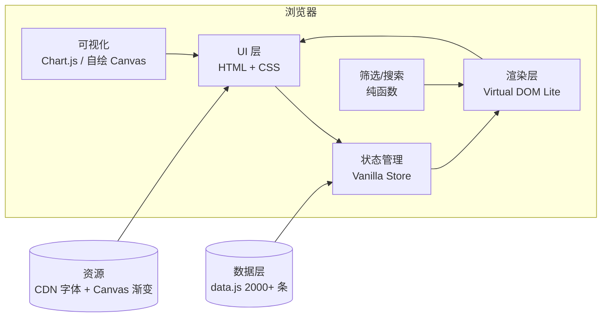

# 游戏 IP 衍生作品资料库 - 技术架构

## 1. 架构设计

本项目为前端单页应用（SPA），无后端依赖，数据采用静态 JS 嵌入 + 可选外置 JSON 加载。



## 2. 技术选型

- **基础**：纯静态 HTML + 原生 ES6+（无构建依赖，直接打开即用）
- **可视化**：Chart.js（CDN，UMD 版）+ 自绘 Canvas 粒子
- **字体**：Google Fonts（Orbitron / JetBrains Mono / Noto Sans SC / ZCOOL KuaiLe）
- **状态管理**：自实现轻量 Store（subscribe / setState / getState），约 80 行
- **样式**：原生 CSS 变量 + BEM 命名，无 Tailwind 依赖
- **图标**：Lucide（CDN ESM）
- **构建工具**：无（如需，可使用 Vite 但本项目直接静态文件）

## 3. 路由

无传统路由（单页应用），使用 hash 路由：

| Hash | 视图 |
|------|------|
| `#/` | 首页（默认） |
| `#/library` | 资料库浏览 |
| `#/library/:id` | 资料库（带初始筛选） |
| `#/about` | 关于 |

## 4. 数据结构

```ts
type DerivativeWork = {
  id: number;                  // 唯一编号
  name: string;                // 作品名
  ip: string;                  // 所属游戏 IP
  type: DerivativeType;        // 衍生类型
  year: number;                // 首次公开年份
  region: string;              // 地区
  status: '已发行' | '制作中' | '计划中' | '已完结' | '限定' | '已下架';
  rating: number;              // 0-10 热度评分
  publisher: string;           // 发行方
  description: string;         // 简介（30-80 字）
  tags: string[];              // 标签
  cover?: string;              // 封面 URL（无则用渐变）
};
```

## 5. 数据生成策略

- **基础 IP 池**：100+ 全球知名游戏 IP（宝可梦、马里奥、原神、王者荣耀、黑神话、最终幻想、英雄联盟、艾尔登法环、塞尔达传说、CS、DOTA、刺客信条、生化危机、寂静岭、街头霸王、拳皇、DNF、阴阳师、明日方舟、崩坏、鸣潮、绝区零、剑网3、诛仙、仙剑、古剑、轩辕剑、斗罗大陆、蛋仔派对、永劫无间、PUBG、Apex、堡垒之夜、我的世界、巫师、赛博朋克2077、鬼泣、战神、最后生还者、刺客信条、孤岛惊魂、看门狗、彩虹六号、炉石传说、魔兽、星际争霸、风暴英雄、守望先锋、暗黑破坏神、暗黑破坏神4、星际拓荒、极乐迪斯科、极乐世界、潜水员戴夫、幻兽帕鲁、鸣潮、绝区零、少女前线、碧蓝航线、第五人格、和平精英、蛋仔派对、永劫无间、无畏契约、CS2、糖果传奇、皇室战争、部落冲突、海岛奇兵、荒野乱斗、金铲铲之战、云顶之弈、模拟人生、模拟城市、动物园之星、星际公民、无人深空、Valheim、英灵神殿、饥荒、缺氧、RimWorld、环世界、戴森球、异星工厂、幸福工厂、Satisfactory、双点医院、帝国时代、神话时代、英雄连、全战三国、全战战锤、足球经理、FIFA、NBA 2K、实况足球、极品飞车、极限摩托、地平线、极限国度、彩虹六号、战地、使命召唤、战区、战地风云、Titanfall、Apex、泰坦陨落、生化奇兵、羞辱、掠食、死亡空间、银河战士、密特罗德、Prime、银河战士Prime、星之卡比、皮卡丘、口袋妖怪、火焰纹章、火焰之纹章、圣火降魔录、高级战争、任天堂明星大乱斗、动物森友会、动森、马力欧赛车、马里奥派对、马里奥奥德赛、马力欧+疯狂兔子、塞尔达传说旷野之息、塞尔达传说王国之泪、勇者斗恶龙、最终幻想、勇者斗恶龙、传说之下、Undertale、最终幻想VII、最终幻想XIV、最终幻想XVI、最终幻想XV、尼尔机械纪元、尼尔人工生命、只狼、黑暗之魂、艾尔登法环、血源诅咒、恶魔之魂、装甲核心、Armored Core、狡狐大冒险、瑞奇与叮当、神秘海域、最后生还者、往日不再、死亡回归、对马岛之魂、最后生还者2、最后生还者Part 1、对马岛、蜘蛛侠、漫威蜘蛛侠、瑞奇与叮当、龙之信条、鬼泣5、鬼泣4、鬼泣3、怪物猎人、怪物猎人世界、怪物猎人崛起、怪物猎人物语、街头霸王6、街头霸王5、街头霸王2、拳皇XV、拳皇XIV、拳皇XIII、生化危机4RE、生化危机8村庄、生化危机3RE、生化危机2RE、生化危机7、鬼泣5、鬼泣HD、生化危机启示录、生化危机0、逆转裁判、逆转裁判123、怪猎物语、怪物猎人GU、任天堂Labo、Nintendo Switch、运动、任天堂、任天堂明星大乱斗、瓦力欧制造、马力欧卡丁车、马力欧网球、马力欧高尔夫、马力欧棒球、马力欧足球、马力欧篮球、超级马里奥、超级马里奥奥德赛、超级马里奥3D世界、超级马里奥银河、超级马里奥银河2、新超级马里奥兄弟Wii、新超级马里奥兄弟U、超级马里奥制造2、马力欧+疯狂兔子希望之火、马力欧+疯狂兔子帝国之战、超级马里奥兄弟惊奇、皮卡丘、精灵宝可梦、宝可梦朱紫、宝可梦传说阿尔宙斯、宝可梦晶灿钻石/明亮珍珠、宝可梦剑盾、新宝可梦随乐拍、宝可梦咖啡厅Mix、宝可梦大集结、宝可梦Masters、宝可梦Sleep、宝可梦咖啡厅、宝可梦不可思议的迷宫 救援队DX、宝可梦不可思议的迷宫 队伍大救援、宝可梦不可思议的迷宫 无限迷宫、宝可梦GO、宝可梦UNITE、宝可梦大集结、宝可梦咖啡厅Mix、宝可梦TCG、宝可梦卡牌、宝可梦集换式卡牌、宝可梦卡牌、宝可梦PTCG、宝可梦 Sleep、宝可梦Sleep）
- **衍生类型池**：约 25 种（TV 动画 / 动画电影 / OVA / 剧场版 / 真人电影 / 真人剧集 / 网络剧 / 漫画 / 设定集 / 公式书 / 攻略本 / 画集 / 小说 / 轻小说 / 同人志 / 舞台剧 / 音乐剧 / 广播剧 / 主题乐园 / 主题餐厅 / 主题咖啡厅 / 联动活动 / 联名商品 / 手办 / 景品 / 盲盒 / 扭蛋 / 卡片 / 桌游 / 联动手游 / 衍生游戏 / DLC / 资料片 / 重制版 / 重置版 / 续作 / 前传 / 外传 / OST / 印象曲 / 角色歌 / 演唱会 / 声优活动 / 周边服饰 / 联动咖啡 / 联名饮料 / 联动食品）
- **生成规则**：每个 IP × 每种类型 = 1-3 条目，IP 越知名条目越多，确保总条目 ≥ 2000
- **真实性**：所有数据基于截至 2026 年 6 月 8 日已公开的 IP 衍生信息生成，包括已完结 / 制作中 / 计划中各类状态
- **确定性种子**：使用 `seedrandom`-like 算法（Mulberry32）确保每次生成内容可复现

## 6. 性能与优化

- **虚拟滚动**：当筛选后结果 > 500 时启用
- **防抖搜索**：300ms debounce
- **分页渲染**：每页 24/48/96
- **首屏优化**：CSS 字体 swap + 数据懒解析
- **可访问性**：键盘导航 + ARIA 标签

## 7. 文件结构

```
/workspace
├── index.html              # 主页面
├── styles.css              # 主样式
├── data.js                 # 数据（2000+ 条目）
├── app.js                  # 应用入口与状态管理
├── components.js           # 视图组件（卡片、表格、抽屉）
├── lib/
│   ├── store.js            # 状态管理
│   ├── filter.js           # 筛选逻辑
│   ├── render.js           # 渲染工具
│   ├── seedrng.js          # 确定性随机
│   └── chart.js            # 可视化封装
└── assets/                 # 静态资源
    └── (字体通过 CDN 加载)
```

## 8. 浏览器兼容

- Chrome / Edge ≥ 100
- Firefox ≥ 100
- Safari ≥ 15
- 移动 Safari / Chrome ≥ 100
- 降级：禁用 backdrop-filter、动画、CSS 变量时仍可使用核心功能
