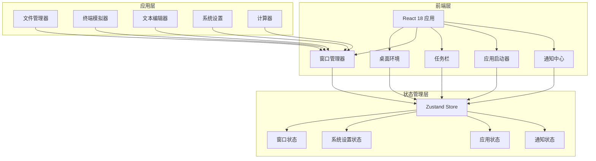
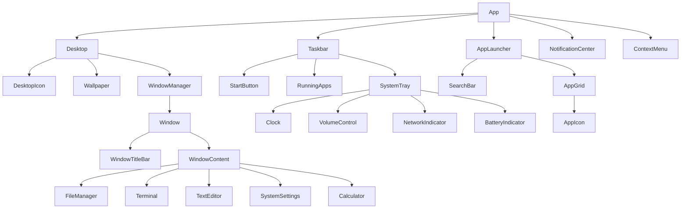

## 1. 架构设计



## 2. 技术说明

- **前端框架**：React@18 + TypeScript
- **构建工具**：Vite
- **样式方案**：Tailwind CSS@3 + CSS Modules（毛玻璃等特殊效果）
- **状态管理**：Zustand
- **图标库**：lucide-react
- **动画库**：framer-motion
- **初始化工具**：vite-init（react-ts 模板）
- **后端**：无（纯前端概念演示，数据使用 Mock）
- **数据库**：无（使用 localStorage 持久化用户设置）

## 3. 路由定义

| 路由 | 用途 |
|------|------|
| / | 桌面环境主界面（包含所有 OS 组件） |

> ConceptOS 为单页应用，所有 OS 组件在同一页面内通过状态管理控制显示/隐藏，无需多路由。

## 4. 状态管理设计

### 4.1 窗口状态 Store

```typescript
interface WindowState {
  id: string
  appId: string
  title: string
  position: { x: number; y: number }
  size: { width: number; height: number }
  isMinimized: boolean
  isMaximized: boolean
  zIndex: number
}

interface WindowStore {
  windows: WindowState[]
  activeWindowId: string | null
  nextZIndex: number
  openWindow: (appId: string) => void
  closeWindow: (id: string) => void
  minimizeWindow: (id: string) => void
  maximizeWindow: (id: string) => void
  focusWindow: (id: string) => void
  moveWindow: (id: string, position: { x: number; y: number }) => void
  resizeWindow: (id: string, size: { width: number; height: number }) => void
}
```

### 4.2 系统设置 Store

```typescript
interface SystemSettings {
  theme: 'light' | 'dark' | 'auto'
  wallpaper: string
  scale: number
  volume: number
  brightness: number
  doNotDisturb: boolean
}

interface SettingsStore {
  settings: SystemSettings
  updateSettings: (partial: Partial<SystemSettings>) => void
}
```

### 4.3 通知 Store

```typescript
interface Notification {
  id: string
  title: string
  content: string
  timestamp: number
  read: boolean
}

interface NotificationStore {
  notifications: Notification[]
  addNotification: (notification: Omit<Notification, 'id' | 'timestamp' | 'read'>) => void
  removeNotification: (id: string) => void
  clearAll: () => void
  markAsRead: (id: string) => void
}
```

## 5. 组件架构



## 6. 文件结构

```
src/
├── components/
│   ├── desktop/
│   │   ├── Desktop.tsx
│   │   ├── DesktopIcon.tsx
│   │   ├── Wallpaper.tsx
│   │   └── ContextMenu.tsx
│   ├── taskbar/
│   │   ├── Taskbar.tsx
│   │   ├── StartButton.tsx
│   │   ├── RunningApps.tsx
│   │   └── SystemTray.tsx
│   ├── window/
│   │   ├── WindowManager.tsx
│   │   ├── Window.tsx
│   │   └── WindowTitleBar.tsx
│   ├── launcher/
│   │   ├── AppLauncher.tsx
│   │   ├── SearchBar.tsx
│   │   └── AppGrid.tsx
│   ├── notifications/
│   │   └── NotificationCenter.tsx
│   └── apps/
│       ├── FileManager.tsx
│       ├── Terminal.tsx
│       ├── TextEditor.tsx
│       ├── SystemSettings.tsx
│       └── Calculator.tsx
├── stores/
│   ├── useWindowStore.ts
│   ├── useSettingsStore.ts
│   └── useNotificationStore.ts
├── hooks/
│   ├── useDrag.ts
│   ├── useResize.ts
│   └── useClock.ts
├── utils/
│   ├── apps.ts
│   └── mockData.ts
├── types/
│   └── index.ts
├── App.tsx
├── main.tsx
└── index.css
```

## 7. 关键技术实现

### 7.1 窗口拖拽

使用自定义 `useDrag` Hook，监听 `mousedown/mousemove/mouseup` 事件，实时更新窗口位置状态。

### 7.2 窗口缩放

使用自定义 `useResize` Hook，在窗口四角和四边放置不可见的缩放手柄，拖拽时实时更新窗口尺寸。

### 7.3 窗口层级管理

通过 Zustand Store 维护 `nextZIndex` 计数器，每次点击窗口时递增并赋值给目标窗口，确保最近交互的窗口始终在最上层。

### 7.4 毛玻璃效果

使用 Tailwind CSS 的 `backdrop-blur` 工具类配合半透明背景色实现毛玻璃效果，同时使用 CSS `backdrop-filter` 属性作为增强。

### 7.5 主题切换

通过 CSS 变量定义主题色，Zustand Store 管理当前主题状态，切换时更新 `document.documentElement` 的 class 和 CSS 变量值。

### 7.6 终端模拟器

维护命令历史数组和当前输出数组，解析用户输入命令并返回模拟输出。支持命令包括：`ls`、`cd`、`clear`、`help`、`date`、`echo`、`whoami`、`pwd`、`cat`。
