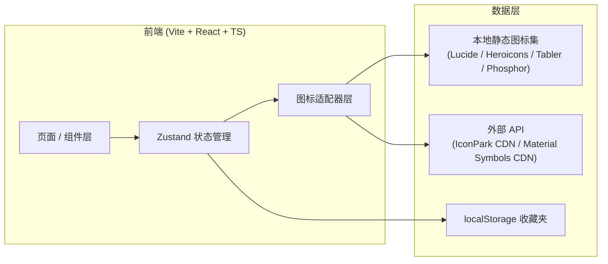
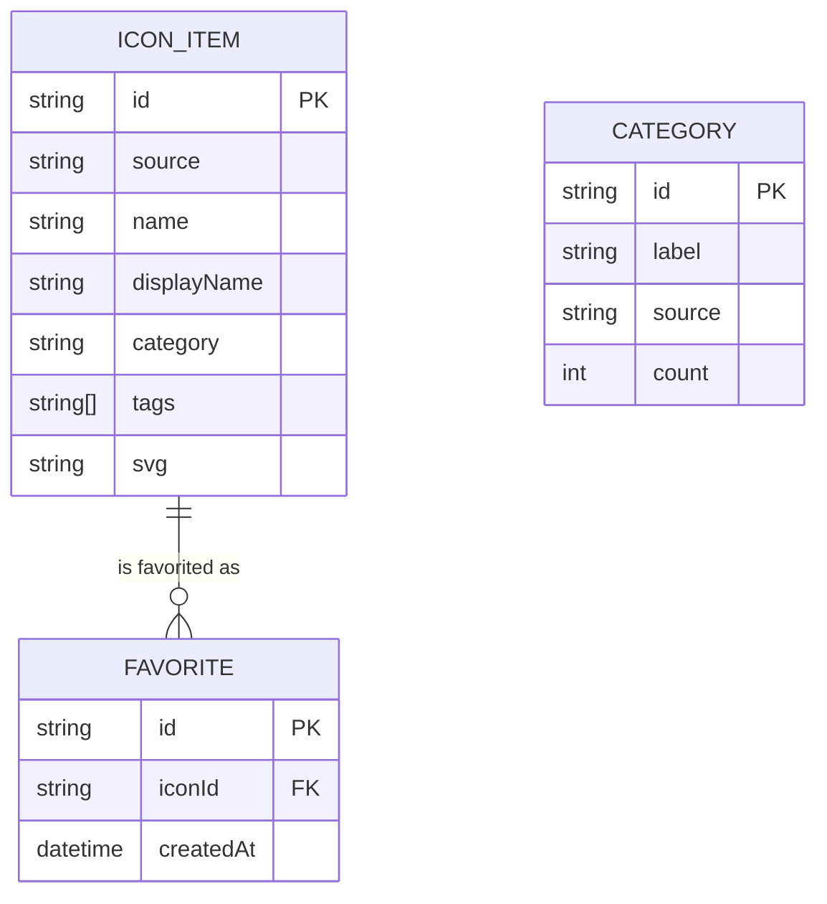

# 技术架构 - 图海 (IconGalaxy)

## 1. 架构设计



## 2. 技术栈说明

- **前端**：React 18 + TypeScript + Vite
- **样式**：Tailwind CSS 3（设计系统统一在 `tailwind.config.js`）
- **状态管理**：Zustand（仅 `favorites` 与 `activeSource` 两个 store）
- **路由**：react-router-dom v6（页面：`/` 与 `/favorites`）
- **图标数据源**（聚合策略）：
  1. **Lucide / Heroicons / Tabler / Phosphor** —— 走本地静态 JSON 索引 + 动态 import SVG（首选离线，离线即用、零网络）
  2. **IconPark** —— 通过 ByteDance 公开 CDN `@icon-park/react` 包
  3. **Material Symbols** —— Google Fonts CDN 字体形式加载
  4. **Iconfont（阿里）** —— 内置精选前 200 个 + 搜索时调用其官方 JSON API
- **图标使用**：所有内联 UI 图标使用 `lucide-react`
- **后端**：无（纯前端 SPA；后续如需服务端聚合可平滑接入 Express）
- **包管理器**：pnpm（若不可用则 npm）

## 3. 路由定义

| 路由 | 用途 |
|------|------|
| `/` | 首页 / 探索页（聚合图标网格 + 搜索 + 分类） |
| `/favorites` | 收藏夹页（localStorage 持久化） |
| `/compare` | 跨源对比页（同一关键词在 4 个图源的可视化对比） |

## 4. API 定义

本项目无后端，对外"API"指前端封装的数据访问层：

```ts
// src/api/iconSource.ts
export type IconItem = {
  id: string;          // 唯一 id，源_名称 形式
  name: string;        // 原始名（kebab-case）
  displayName: string; // 展示名
  source: IconSource;  // 'lucide' | 'heroicons' | ...
  category: string;
  tags: string[];
  svg: string;         // 内联 SVG 字符串
};

export interface IconAdapter {
  source: IconSource;
  list(category?: string): Promise<IconItem[]>;
  search(keyword: string): Promise<IconItem[]>;
  get(id: string): Promise<IconItem | null>;
}
```

## 5. 状态管理

```ts
// src/store/favorites.ts
import { create } from 'zustand';
import { persist } from 'zustand/middleware';

type FavoritesStore = {
  ids: string[];
  toggle: (id: string) => void;
  has: (id: string) => boolean;
};
```

```ts
// src/store/explorer.ts
type ExplorerStore = {
  activeSource: IconSource;
  activeCategory: string;
  keyword: string;
  setSource: (s: IconSource) => void;
  setCategory: (c: string) => void;
  setKeyword: (k: string) => void;
};
```

## 6. 数据模型

### 6.1 客户端静态索引



### 6.2 初始化数据
- `src/data/lucide.json` —— Lucide 全量（≥1000 条，按分类预聚合）
- `src/data/heroicons.json` —— Heroicons 实心 + 描边共约 600 条
- `src/data/tabler.json` —— Tabler 精选 800 条
- `src/data/phosphor.json` —— Phosphor 精选 600 条
- `src/data/iconpark-seed.json` —— 种子前 200 条
- `src/data/categories.json` —— 统一分类索引

## 7. 关键文件结构

```
src/
├── api/                 # 图标适配器
│   ├── types.ts
│   ├── lucide.ts
│   ├── heroicons.ts
│   ├── tabler.ts
│   ├── phosphor.ts
│   ├── iconpark.ts
│   └── material.ts
├── store/
│   ├── favorites.ts
│   └── explorer.ts
├── data/                # 静态图标 JSON 索引
├── components/
│   ├── Header.tsx
│   ├── SourceTabs.tsx
│   ├── CategorySidebar.tsx
│   ├── IconGrid.tsx
│   ├── IconCard.tsx
│   ├── IconDetailModal.tsx
│   ├── SearchBar.tsx
│   └── Toast.tsx
├── pages/
│   ├── Home.tsx
│   ├── Favorites.tsx
│   └── Compare.tsx
├── hooks/
│   ├── useIcons.ts
│   └── useDebounce.ts
├── utils/
│   ├── copy.ts
│   └── download.ts
├── App.tsx
├── main.tsx
└── index.css
```

## 8. 性能与可访问性

- 网格用 CSS `content-visibility: auto` 减少渲染开销
- 搜索 `useDebounce` 200ms，避免输入卡顿
- 所有按钮 / 卡片支持键盘 focus（`focus-visible` 描边）
- ARIA：`grid` 角色、`dialog` 模态、aria-label 命名
- SVG 注入前用 `DOMPurify` 过滤
