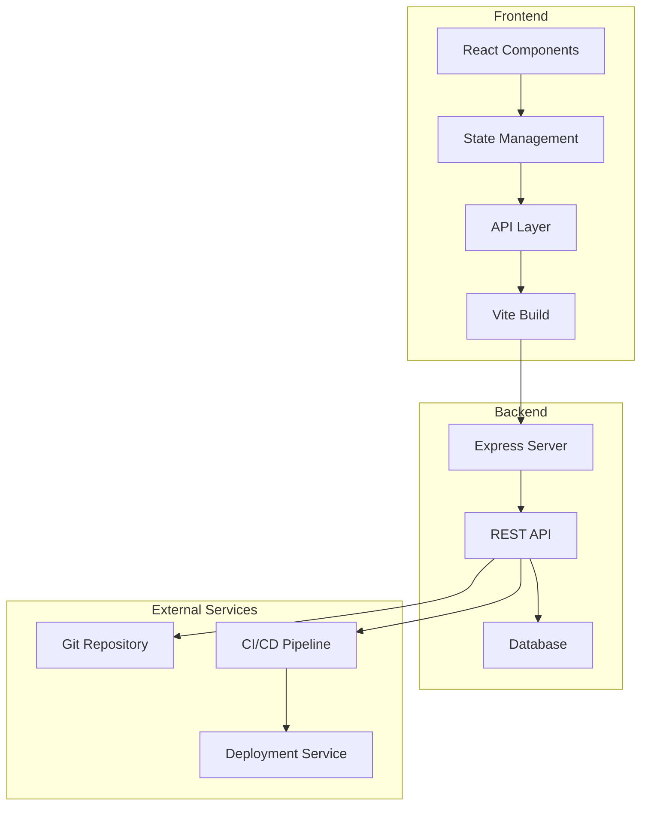
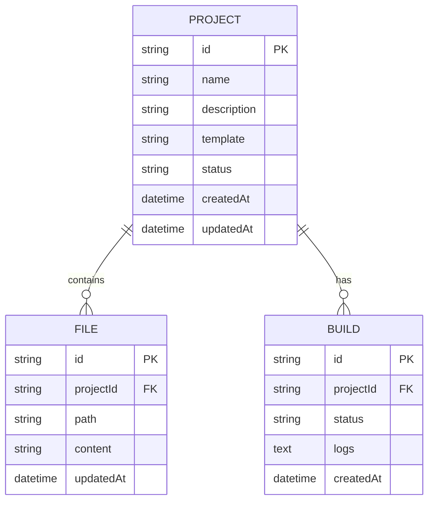

## 1. 架构设计



## 2. 技术描述

- **前端框架**: React@18 + TypeScript
- **构建工具**: Vite@6
- **样式方案**: TailwindCSS@3
- **状态管理**: React Context + Zustand
- **路由**: React Router@6
- **图标库**: Lucide React
- **后端**: Express@4 (可选，用于API服务)
- **数据库**: SQLite (本地开发) / PostgreSQL (生产环境)
- **代码编辑器**: Monaco Editor

## 3. 路由定义

| 路由 | 用途 | 组件 |
|------|------|------|
| `/` | 仪表板首页 | Dashboard |
| `/projects` | 项目列表页 | ProjectList |
| `/projects/:id` | 项目详情/编辑器 | ProjectEditor |
| `/tools` | 工具中心 | ToolCenter |
| `/settings` | 设置页面 | Settings |

## 4. API定义

### 4.1 项目相关API

**GET /api/projects**
- 描述：获取项目列表
- 响应：`{ projects: Project[], total: number }`

**POST /api/projects**
- 描述：创建新项目
- 请求：`{ name: string, description: string, template: string }`
- 响应：`{ project: Project }`

**GET /api/projects/:id**
- 描述：获取项目详情
- 响应：`{ project: Project, files: File[] }`

**PUT /api/projects/:id**
- 描述：更新项目
- 请求：`{ name?: string, description?: string }`
- 响应：`{ project: Project }`

**DELETE /api/projects/:id**
- 描述：删除项目
- 响应：`{ success: boolean }`

### 4.2 代码文件API

**GET /api/projects/:id/files**
- 描述：获取项目文件列表
- 响应：`{ files: File[] }`

**GET /api/projects/:id/files/:path**
- 描述：获取文件内容
- 响应：`{ content: string }`

**PUT /api/projects/:id/files/:path**
- 描述：更新文件内容
- 请求：`{ content: string }`
- 响应：`{ success: boolean }`

### 4.3 构建相关API

**POST /api/projects/:id/build**
- 描述：触发项目构建
- 响应：`{ buildId: string, status: 'building' }`

**GET /api/projects/:id/build/:buildId**
- 描述：获取构建状态
- 响应：`{ status: 'success' | 'failed', logs: string[] }`

## 5. 数据模型

### 5.1 数据模型定义



### 5.2 类型定义

```typescript
interface Project {
  id: string;
  name: string;
  description: string;
  template: 'react' | 'vue' | 'vanilla' | 'svelte';
  status: 'active' | 'archived';
  createdAt: Date;
  updatedAt: Date;
}

interface File {
  id: string;
  projectId: string;
  path: string;
  content: string;
  updatedAt: Date;
}

interface Build {
  id: string;
  projectId: string;
  status: 'building' | 'success' | 'failed';
  logs: string[];
  createdAt: Date;
}
```

## 6. 目录结构

```
src/
├── components/          # 公共组件
│   ├── Layout/          # 布局组件
│   ├── Dashboard/       # 仪表板组件
│   ├── Project/         # 项目相关组件
│   └── Tools/           # 工具中心组件
├── pages/               # 页面组件
│   ├── Dashboard.tsx
│   ├── ProjectList.tsx
│   ├── ProjectEditor.tsx
│   ├── ToolCenter.tsx
│   └── Settings.tsx
├── hooks/               # 自定义hooks
├── store/               # 状态管理
├── api/                 # API层
├── types/               # 类型定义
├── utils/               # 工具函数
└── App.tsx              # 主应用入口
```