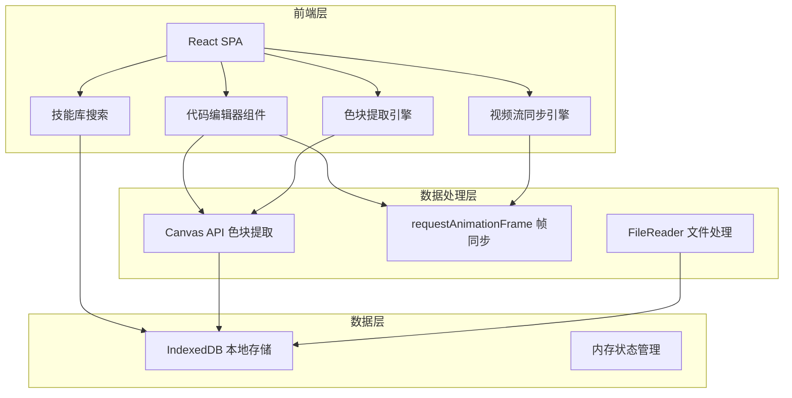
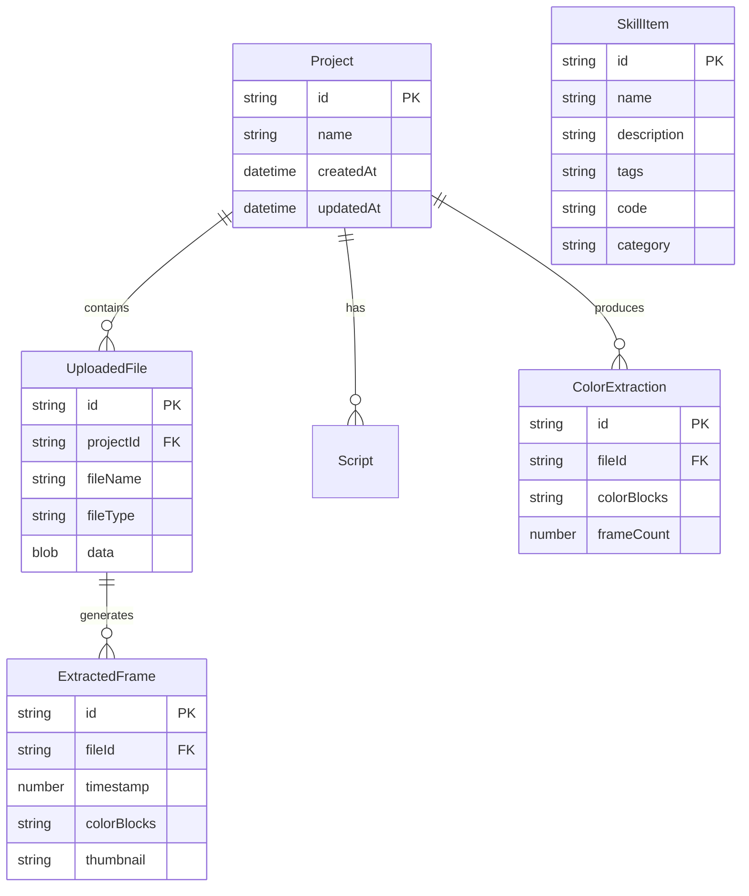

## 1. 架构设计



## 2. 技术说明

- 前端：React@18 + Tailwind CSS@3 + Vite
- 初始化工具：Vite
- 后端：无（纯前端应用，所有计算在浏览器端完成）
- 数据库：IndexedDB（本地持久化素材与脚本）
- 核心依赖：
  - Monaco Editor（代码编辑器）
  - Canvas API（色块提取与图像处理）
  - Video + Canvas（视频流帧提取与同步）

## 3. 路由定义

| 路由 | 用途 |
|------|------|
| / | 工作台主页面，包含编辑器、上传、预览面板 |
| /skills | 技能库页面，搜索开源工具链与脚本模板 |

## 4. API定义

无后端API，所有数据在浏览器本地处理。

### 4.1 核心模块接口

```typescript
interface ColorBlock {
  hex: string
  rgb: [number, number, number]
  percentage: number
}

interface ExtractedFrame {
  timestamp: number
  colorBlocks: ColorBlock[]
  thumbnail: string
}

interface SkillItem {
  id: string
  name: string
  description: string
  tags: string[]
  code: string
  category: 'toolchain' | 'template' | 'snippet'
}

interface ProjectState {
  scripts: string
  uploadedFiles: File[]
  extractedColors: ColorBlock[]
  frameTimeline: ExtractedFrame[]
  videoSyncEnabled: boolean
  captureFrequency: number
}
```

## 5. 服务器架构图

不适用（纯前端应用）

## 6. 数据模型

### 6.1 数据模型定义



### 6.2 数据定义语言

使用 IndexedDB，对象存储定义：

- `projects`：keyPath = 'id', indexes = ['createdAt']
- `files`：keyPath = 'id', indexes = ['projectId', 'fileType']
- `extractions`：keyPath = 'id', indexes = ['fileId']
- `frames`：keyPath = 'id', indexes = ['fileId', 'timestamp']
- `skills`：keyPath = 'id', indexes = ['category', 'tags']
