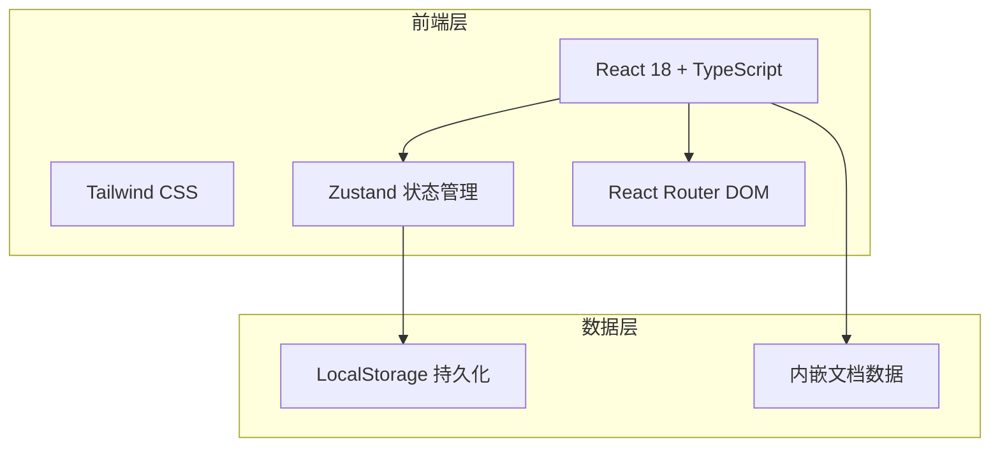
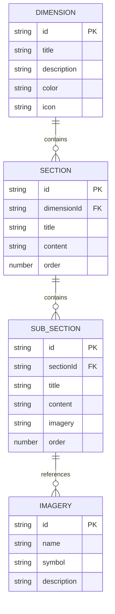

## 1. 架构设计



纯前端架构，无后端服务。文档数据内嵌于前端代码中，用户编辑内容持久化至 LocalStorage。

## 2. 技术说明

- **前端**：React@18 + Tailwind CSS@3 + Vite
- **初始化工具**：vite-init
- **后端**：无
- **数据库**：无（使用 LocalStorage + 内嵌 JSON 数据）
- **状态管理**：Zustand
- **路由**：React Router DOM v6
- **图标**：lucide-react
- **Markdown渲染**：react-markdown + remark-gfm

## 3. 路由定义

| 路由 | 用途 |
|------|------|
| `/` | 框架图主页，展示未央宫散文五维解析交互式结构图 |
| `/editor/:nodeId` | 单项文档编辑器，编辑指定节点的Markdown内容 |

## 4. API定义

无后端API。数据通过内嵌JSON和LocalStorage管理。

## 5. 服务器架构图

不适用

## 6. 数据模型

### 6.1 数据模型定义



### 6.2 数据定义

核心数据结构以 TypeScript 接口定义：

```typescript
interface Dimension {
  id: string;
  title: string;
  description: string;
  color: string;
  icon: string;
  sections: Section[];
}

interface Section {
  id: string;
  title: string;
  content: string;
  timeMarker?: string;
  spaceScene?: string;
  coreFigure?: string;
  materialImagery?: string;
  subSections?: SubSection[];
}

interface SubSection {
  id: string;
  title: string;
  content: string;
  imagery?: string;
}

interface EditorState {
  activeNodeId: string | null;
  editContent: string;
  isDirty: boolean;
  lastSaved: string | null;
}
```

初始数据包含五个维度：
1. 编年体的空间化叙事（7个时间节点）
2. 意象系统：土、血、火、金属的四重奏（4个子意象）
3. 感官考古学：气、味、声、触（4种感官）
4. 时间意识：影子、地图与未完成的谶语（3组意象）
5. 语言风格：文言气脉与现代叙事的熔铸（2个层面）
