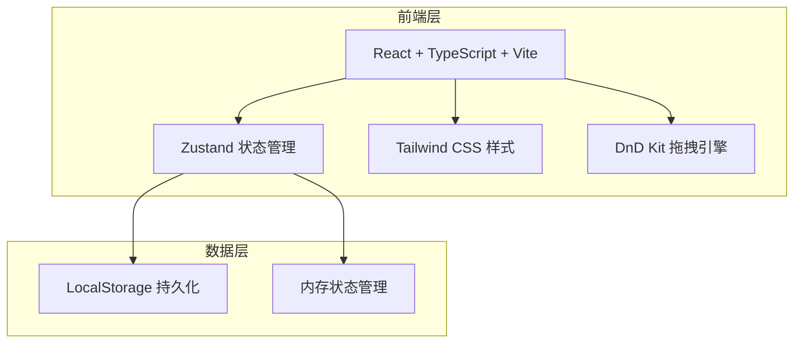
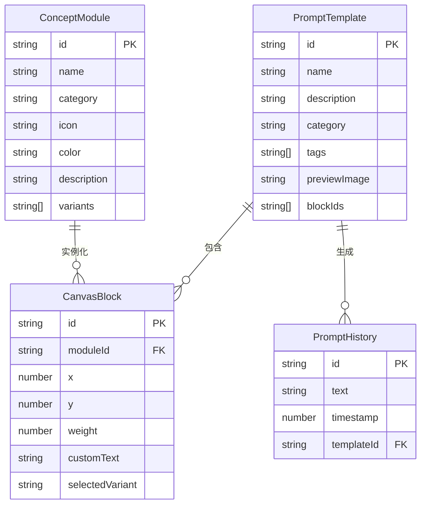

## 1. 架构设计



## 2. 技术说明
- 前端：React@18 + TypeScript + Tailwind CSS@3 + Vite
- 初始化工具：vite-init
- 后端：无（纯前端应用）
- 数据库：无（使用 LocalStorage 持久化 + 内存状态）
- 拖拽引擎：@dnd-kit/core + @dnd-kit/sortable
- 状态管理：Zustand

## 3. 路由定义
| 路由 | 用途 |
|------|------|
| / | 工作台页面，概念画布和提示词编辑主界面 |
| /templates | 模板库页面，浏览和使用预设模板 |

## 4. API定义
- 无后端API，所有数据在客户端处理

## 5. 服务器架构图
- 不适用（纯前端应用）

## 6. 数据模型

### 6.1 数据模型定义



### 6.2 数据定义语言

```typescript
interface ConceptModule {
  id: string;
  name: string;
  category: 'subject' | 'style' | 'scene' | 'mood' | 'technique' | 'custom';
  icon: string;
  color: string;
  description: string;
  variants: string[];
}

interface CanvasBlock {
  id: string;
  moduleId: string;
  x: number;
  y: number;
  weight: number;
  customText: string;
  selectedVariant: string;
}

interface PromptTemplate {
  id: string;
  name: string;
  description: string;
  category: string;
  tags: string[];
  previewImage: string;
  blocks: CanvasBlock[];
}

interface PromptHistory {
  id: string;
  text: string;
  timestamp: number;
  templateId?: string;
}
```
