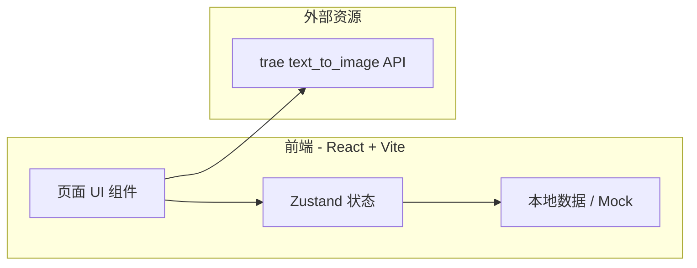
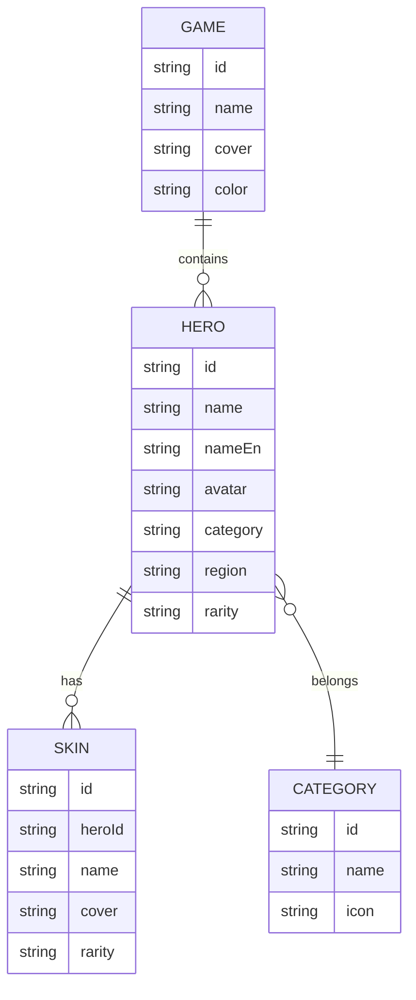

# 技术架构文档

## 1. 架构设计



## 2. 技术说明
- 前端：React 18 + TypeScript + Vite + TailwindCSS 3
- 路由：react-router-dom v6
- 状态管理：Zustand
- 图标：lucide-react
- 初始化工具：vite-init（react-ts 模板）
- 后端：无（纯前端，数据使用 mock JSON）
- 图片：占位符 + text_to_image 生成的风格化封面

## 3. 路由定义
| 路由 | 用途 |
|------|------|
| `/` | 首页（Hero 画廊 + 游戏入口 + 分类） |
| `/game/:gameId` | 游戏专题页（角色网格 + 筛选） |
| `/category/:cat` | 分类聚合页（按职业/类型） |
| `/favorites` | 本地收藏页 |

## 4. API 定义
无后端 API。仅使用以下外部端点生成占位图：
- `https://trae-api-cn.mchost.guru/api/ide/v1/text_to_image?prompt={prompt}&image_size={size}`

## 5. 数据模型

### 5.1 模型定义



### 5.2 数据初始化
- 预置 8 款流行游戏
- 预置王者荣耀 30+ 角色与 60+ 皮肤
- 预置原神、英雄联盟、CS2、我的世界、永劫无间等 6 款游戏的代表角色

## 6. 目录结构
```
src/
  components/    通用组件
  pages/         路由页面
  hooks/         自定义 hooks
  store/         Zustand store
  data/          mock 数据
  utils/         工具函数
  assets/        静态资源
```

## 7. 性能与体验
- 首屏 < 2s（Vite 构建 + 路由级分包）
- 图片懒加载 + 骨架屏
- 滚动驱动动画（IntersectionObserver）
- localStorage 持久化收藏
