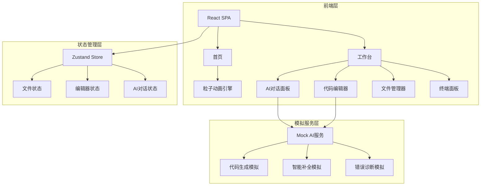
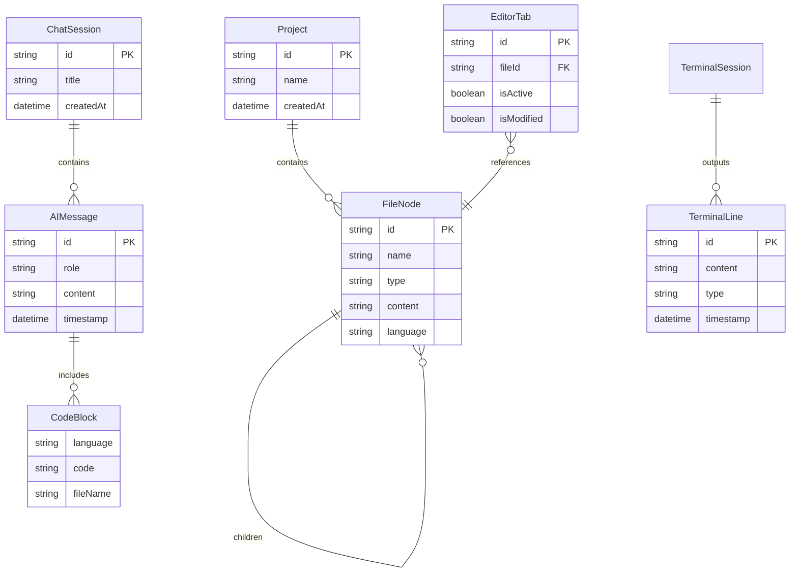

## 1. 架构设计



## 2. 技术说明

- **前端框架**：React@18 + TypeScript + Vite
- **样式方案**：Tailwind CSS@3 + CSS Modules（复杂动画）
- **状态管理**：Zustand（轻量级，适合IDE类应用的状态管理）
- **代码编辑器**：Monaco Editor（VS Code同款编辑器内核）
- **动画库**：Framer Motion（页面过渡与微交互）
- **粒子效果**：tsparticles（首页代码雨效果）
- **图标库**：Lucide React（线性描边风格图标）
- **初始化工具**：Vite
- **后端**：无（纯前端，AI功能使用模拟数据）
- **数据库**：无（使用本地状态和localStorage持久化）

## 3. 路由定义

| 路由 | 用途 |
|------|------|
| `/` | 首页 — 品牌展示与功能介绍 |
| `/workspace` | 工作台 — 代码编辑器+AI对话+文件管理+终端 |

## 4. API定义

无真实后端API。所有AI交互通过前端Mock服务模拟：

```typescript
interface AIMessage {
  id: string;
  role: "user" | "assistant";
  content: string;
  timestamp: number;
  codeBlocks?: CodeBlock[];
}

interface CodeBlock {
  language: string;
  code: string;
  fileName?: string;
}

interface AICompletion {
  text: string;
  range: { startLine: number; endLine: number };
  confidence: number;
}

interface FileNode {
  id: string;
  name: string;
  type: "file" | "folder";
  children?: FileNode[];
  content?: string;
  language?: string;
}

interface TerminalLine {
  id: string;
  content: string;
  type: "output" | "error" | "info" | "ai-suggestion";
  timestamp: number;
}
```

## 5. 服务器架构图

不适用 — 纯前端项目，无后端服务。

## 6. 数据模型

### 6.1 数据模型定义



### 6.2 数据定义语言

本项目使用前端状态管理 + localStorage持久化，无需数据库DDL。初始数据结构：

```typescript
const defaultProject: Project = {
  id: "default",
  name: "NexusCode Project",
  createdAt: Date.now(),
};

const defaultFiles: FileNode[] = [
  {
    id: "root",
    name: "src",
    type: "folder",
    children: [
      { id: "index", name: "index.js", type: "file", language: "javascript", content: "// Welcome to NexusCode\nconsole.log('Hello, AI!');\n" },
      { id: "app", name: "App.jsx", type: "file", language: "javascript", content: "function App() {\n  return <div>Hello World</div>;\n}\n" },
      { id: "styles", name: "styles.css", type: "file", language: "css", content: "body {\n  margin: 0;\n  font-family: sans-serif;\n}\n" },
    ],
  },
  {
    id: "pkg",
    name: "package.json",
    type: "file",
    language: "json",
    content: '{\n  "name": "nexuscode-project",\n  "version": "1.0.0"\n}\n',
  },
  {
    id: "readme",
    name: "README.md",
    type: "file",
    language: "markdown",
    content: "# NexusCode Project\n\nBuilt with AI assistance.\n",
  },
];
```
