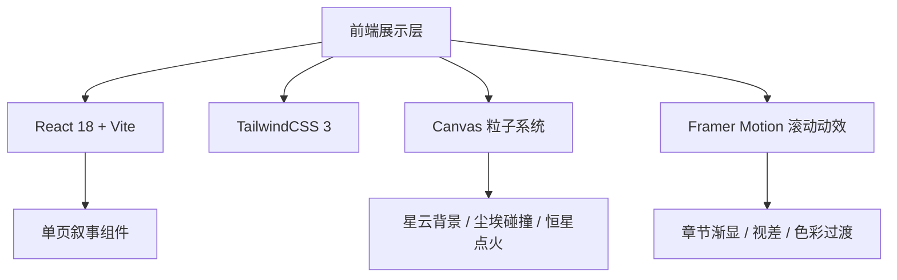

## 1. 架构设计



## 2. 技术说明
- 前端：React@18 + tailwindcss@3 + vite
- 初始化工具：vite-init（react-ts 模板）
- 动效库：framer-motion（滚动触发与渐显）
- 图形：原生 Canvas 2D 实现星云粒子、尘埃碰撞、恒星点火效果（轻量，无需Three.js）
- 字体：Google Fonts（Cormorant Garamond、Noto Serif SC、JetBrains Mono）
- 后端：无
- 数据库：无（纯静态内容）

## 3. 路由定义
| 路由 | 用途 |
|-------|---------|
| / | 单页叙事主页，包含全部章节 |

## 4. 组件结构
```
src/
├── App.tsx                    # 主入口，组合所有章节
├── main.tsx                   # Vite 入口
├── index.css                  # 全局样式 + Tailwind
├── components/
│   ├── StarfieldCanvas.tsx    # 全局背景星云粒子系统
│   ├── HeroSection.tsx        # 开场Hero
│   ├── ChapterSection.tsx     # 通用章节容器（序号+标题+正文）
│   ├── DustCollision.tsx      # 章节三：尘埃碰撞动画
│   ├── StarIgnition.tsx       # 章节四：恒星点火动画
│   ├── MagmaSea.tsx           # 终章：岩浆海背景
│   └── Footer.tsx             # 页脚
├── data/
│   └── chapters.ts            # 章节文本内容数据
└── hooks/
    └── useScrollReveal.ts     # 滚动渐显hook
```

## 5. 性能考量
- Canvas粒子数量根据设备性能动态调整（桌面约200-400粒子，移动端约80-150）
- 使用 requestAnimationFrame 驱动动画
- 滚动监听使用 Intersection Observer 替代scroll事件
- 字体使用 font-display: swap 避免阻塞渲染
