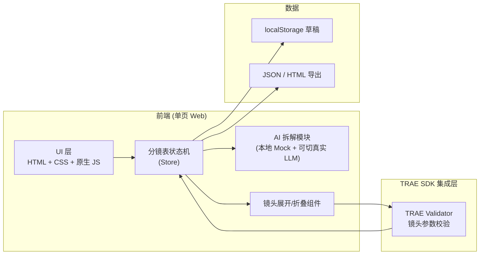
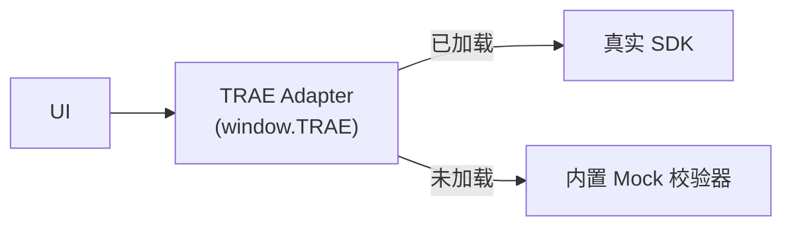
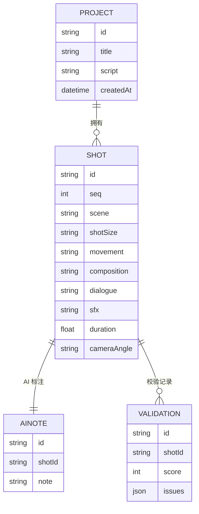

# 技术架构 · 分镜表 AI 镜头设计工作台

## 1. 架构设计



> 本方案最小化外部依赖。TRAE SDK 校验通过 `window.TRAE` 适配层调用；当 SDK 不可用时自动降级为内置启发式校验（保证 demo 体验一致）。

## 2. 技术描述

- **前端**：纯静态站点（HTML + CSS + ES Modules），无构建步骤即可运行；通过 Vite 提供本地开发/HMR（可选）。
- **样式**：原生 CSS 变量 + Grid/Flex；不使用 Tailwind 以保持单文件可移植。
- **AI 拆解**：内置规则化的"段落→镜头"分镜器（按句号/换行/场景标记切片），并预留 `realLLM` 接口可在未来切换为真实大模型调用。
- **TRAE SDK 校验**：通过 `window.TRAE.validateShot(shot)` 调用，校验维度：
  - 景别多样性（避免连续 ≥3 镜同景别）
  - 轴线一致性（左右越界提示）
  - 时长合理区间（0.5s–15s）
  - 必填字段（对白/景别/运镜）
- **持久化**：localStorage 草稿；导出为 JSON 与可分享 HTML。
- **运行约束**：单页 + 离线可用；目标体积 < 60KB（gzip 前）。

## 3. 路由定义

| 路由 | 用途 |
|------|------|
| `/`（默认） | 分镜表工作台（单页应用，所有交互在一个页面内） |

> 不需要多路由，避免破坏"监视器"沉浸感。

## 4. API 定义（TRAE SDK 适配层）

```ts
interface Shot {
  id: string;
  seq: number;
  scene: string;          // 场景
  shotSize: ShotSize;     // 'ECU' | 'CU' | 'MS' | 'WS' | 'EWS'
  movement: Movement;     // 'static' | 'pan' | 'tilt' | 'dolly' | 'track' | 'crane' | 'handheld'
  composition: string;    // 自由文本
  dialogue?: string;
  sfx?: string;
  duration: number;       // 秒
  cameraAngle: string;    // 平视/俯拍/仰拍
  aiNote?: string;
}

interface ValidateResult {
  ok: boolean;
  score: number;          // 0-100
  issues: { level: 'info'|'warn'|'error'; field?: string; msg: string }[];
  suggestions: string[];
}

interface TRAE_SDK {
  validateShot(prev: Shot | null, current: Shot, next: Shot | null): Promise<ValidateResult>;
  suggestShot(partial: Partial<Shot>): Promise<Partial<Shot>>;
}
```

## 5. 服务端架构

无独立后端；TRAE SDK 通过浏览器内适配层调用（开发态使用本地 mock，发布态切换到真实 SDK 端点）。



## 6. 数据模型

### 6.1 ER 图



### 6.2 初始化数据 / Mock 脚本

```json
{
  "title": "咖啡馆 30s 短片",
  "script": "清晨。主角推门走进一家老式咖啡馆。\n柜台后咖啡师抬头微笑，递出温热的马克杯。\n特写：杯中拉花缓缓散开。\n主角抿一口，望向窗外。\n镜头拉远，街道车流模糊。",
  "shots": [
    { "id":"s1","seq":1,"scene":"咖啡馆·门外","shotSize":"WS","movement":"dolly","composition":"主体居中，玻璃门反射晨光","dialogue":"","sfx":"门铃叮咚","duration":3,"cameraAngle":"平视" },
    { "id":"s2","seq":2,"scene":"咖啡馆·柜台","shotSize":"MS","movement":"static","composition":"过肩构图，咖啡师偏右","dialogue":"老样子？","sfx":"蒸汽嘶嘶","duration":2.5,"cameraAngle":"平视" },
    { "id":"s3","seq":3,"scene":"咖啡馆·特写","shotSize":"ECU","movement":"static","composition":"俯拍 45°，拉花居中","dialogue":"","sfx":"环境白噪","duration":2,"cameraAngle":"俯拍" },
    { "id":"s4","seq":4,"scene":"咖啡馆·窗边","shotSize":"CU","movement":"static","composition":"主角侧脸，三分法右线","dialogue":"","sfx":"轻爵士","duration":3,"cameraAngle":"平视" },
    { "id":"s5","seq":5,"scene":"街道外景","shotSize":"EWS","movement":"crane","composition":"街道斜线，主体在前景中下","dialogue":"","sfx":"车流远景","duration":4,"cameraAngle":"平视" }
  ]
}
```
