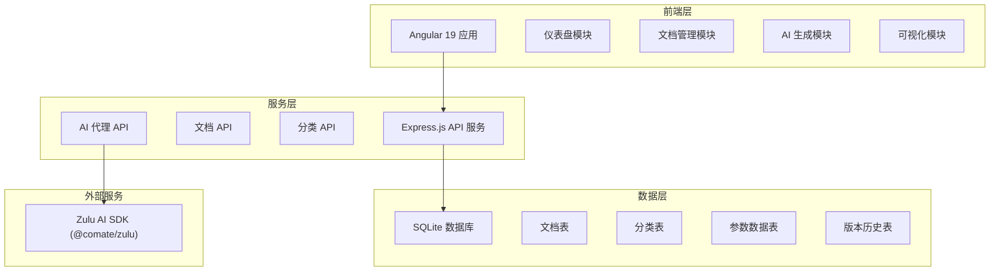
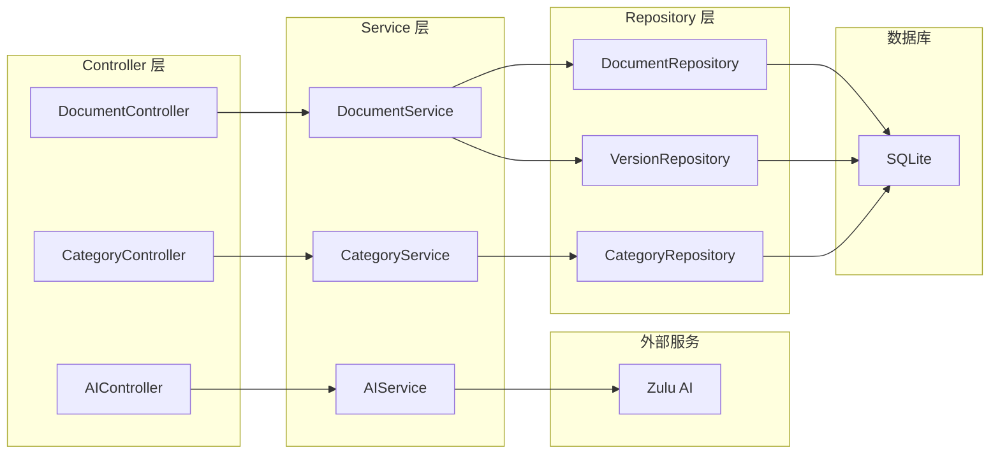
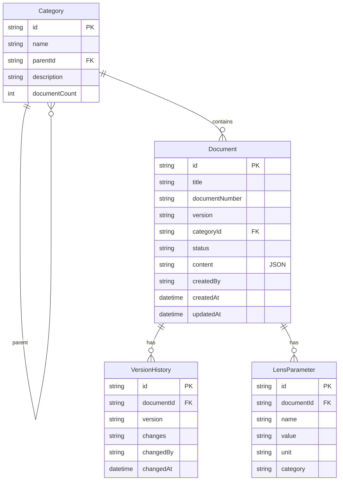

## 1. 架构设计



## 2. 技术说明

- **前端**: Angular 19 + TypeScript + Tailwind CSS + Angular Router + Angular Signals
- **初始化工具**: Angular CLI (`ng new`)
- **后端**: Express@4 + TypeScript (ESM)
- **数据库**: SQLite (better-sqlite3)，使用 mock 数据进行初始开发
- **AI 集成**: @comate/zulu (Zulu AI CLI/SDK) 通过后端代理调用
- **可视化**: Chart.js + ng2-charts 用于 MTF 曲线、畸变图等图表渲染
- **状态管理**: Angular Signals + RxJS

## 3. 路由定义

| 路由 | 用途 |
|------|------|
| `/dashboard` | 仪表盘，展示文档概览和快捷操作 |
| `/documents` | 标准文档列表，筛选、搜索、批量操作 |
| `/documents/:id` | 标准文档详情，可视化展示和编辑 |
| `/documents/new` | 手动创建新标准文档 |
| `/ai-generator` | AI 页面生成器，对话式创建文档 |
| `/visualization/:id` | 参数可视化页面，图表展示 |
| `/settings` | 系统设置（分类管理、模板管理等） |

## 4. API 定义

### 4.1 文档 API

```typescript
interface StandardDocument {
  id: string;
  title: string;
  documentNumber: string;
  version: string;
  categoryId: string;
  status: "draft" | "review" | "published" | "archived";
  content: DocumentContent;
  createdBy: string;
  createdAt: string;
  updatedAt: string;
}

interface DocumentContent {
  summary: string;
  parameters: LensParameter[];
  testConditions: TestCondition[];
  notes: string;
}

interface LensParameter {
  name: string;
  value: number | string;
  unit: string;
  category: "optical" | "mechanical" | "environmental";
}

interface TestCondition {
  name: string;
  value: string;
}

// GET /api/documents - 获取文档列表
interface ListDocumentsRequest {
  page?: number;
  pageSize?: number;
  categoryId?: string;
  status?: string;
  search?: string;
  sortBy?: "updatedAt" | "createdAt" | "title";
  sortOrder?: "asc" | "desc";
}

interface ListDocumentsResponse {
  items: StandardDocument[];
  total: number;
  page: number;
  pageSize: number;
}

// GET /api/documents/:id - 获取文档详情
// POST /api/documents - 创建文档
// PUT /api/documents/:id - 更新文档
// DELETE /api/documents/:id - 删除文档
// POST /api/documents/batch - 批量操作
```

### 4.2 分类 API

```typescript
interface Category {
  id: string;
  name: string;
  parentId: string | null;
  description: string;
  documentCount: number;
}

// GET /api/categories - 获取分类树
// POST /api/categories - 创建分类
// PUT /api/categories/:id - 更新分类
// DELETE /api/categories/:id - 删除分类
```

### 4.3 AI 生成 API

```typescript
interface AIGenerateRequest {
  prompt: string;
  templateId?: string;
  conversationId?: string;
}

interface AIGenerateResponse {
  content: DocumentContent;
  conversationId: string;
  rawMarkdown: string;
}

// POST /api/ai/generate - AI 生成文档内容
// GET /api/ai/templates - 获取可用模板列表
// GET /api/ai/models - 获取可用模型列表
```

### 4.4 版本历史 API

```typescript
interface VersionHistory {
  id: string;
  documentId: string;
  version: string;
  changes: string;
  changedBy: string;
  changedAt: string;
}

// GET /api/documents/:id/versions - 获取版本历史
// GET /api/documents/:id/versions/:versionId - 获取特定版本
```

## 5. 服务架构图



## 6. 数据模型

### 6.1 数据模型定义



### 6.2 数据定义语言

```sql
CREATE TABLE categories (
  id TEXT PRIMARY KEY,
  name TEXT NOT NULL,
  parent_id TEXT,
  description TEXT DEFAULT '',
  document_count INTEGER DEFAULT 0,
  created_at TEXT DEFAULT (datetime('now')),
  updated_at TEXT DEFAULT (datetime('now')),
  FOREIGN KEY (parent_id) REFERENCES categories(id) ON DELETE SET NULL
);

CREATE TABLE documents (
  id TEXT PRIMARY KEY,
  title TEXT NOT NULL,
  document_number TEXT NOT NULL UNIQUE,
  version TEXT NOT NULL DEFAULT '1.0',
  category_id TEXT NOT NULL,
  status TEXT NOT NULL DEFAULT 'draft' CHECK (status IN ('draft', 'review', 'published', 'archived')),
  content TEXT NOT NULL DEFAULT '{}',
  created_by TEXT NOT NULL DEFAULT 'system',
  created_at TEXT DEFAULT (datetime('now')),
  updated_at TEXT DEFAULT (datetime('now')),
  FOREIGN KEY (category_id) REFERENCES categories(id) ON DELETE RESTRICT
);

CREATE TABLE version_histories (
  id TEXT PRIMARY KEY,
  document_id TEXT NOT NULL,
  version TEXT NOT NULL,
  changes TEXT NOT NULL DEFAULT '',
  changed_by TEXT NOT NULL DEFAULT 'system',
  changed_at TEXT DEFAULT (datetime('now')),
  FOREIGN KEY (document_id) REFERENCES documents(id) ON DELETE CASCADE
);

CREATE TABLE lens_parameters (
  id TEXT PRIMARY KEY,
  document_id TEXT NOT NULL,
  name TEXT NOT NULL,
  value TEXT NOT NULL,
  unit TEXT NOT NULL DEFAULT '',
  category TEXT NOT NULL DEFAULT 'optical' CHECK (category IN ('optical', 'mechanical', 'environmental')),
  FOREIGN KEY (document_id) REFERENCES documents(id) ON DELETE CASCADE
);

CREATE INDEX idx_documents_category ON documents(category_id);
CREATE INDEX idx_documents_status ON documents(status);
CREATE INDEX idx_documents_updated ON documents(updated_at);
CREATE INDEX idx_version_histories_document ON version_histories(document_id);
CREATE INDEX idx_lens_parameters_document ON lens_parameters(document_id);

INSERT INTO categories (id, name, description) VALUES
  ('cat-1', '定焦镜头', '固定焦距镜头标准'),
  ('cat-2', '变焦镜头', '可变焦距镜头标准'),
  ('cat-3', '广角镜头', '广角类镜头标准'),
  ('cat-4', '长焦镜头', '长焦类镜头标准'),
  ('cat-5', '微距镜头', '微距类镜头标准');

INSERT INTO documents (id, title, document_number, category_id, status, content, created_by) VALUES
  ('doc-1', '50mm f/1.4 定焦镜头标准', 'STD-FIX-001', 'cat-1', 'published', '{"summary":"50mm标准定焦镜头性能标准","parameters":[{"name":"焦距","value":"50","unit":"mm"},{"name":"最大光圈","value":"1.4","unit":"f/"},{"name":"MTF50中心","value":"0.85","unit":"lp/mm"},{"name":"MTF50边缘","value":"0.62","unit":"lp/mm"},{"name":"畸变","value":"0.3","unit":"%"}]}', 'admin'),
  ('doc-2', '24-70mm f/2.8 变焦镜头标准', 'STD-ZOOM-001', 'cat-2', 'review', '{"summary":"24-70mm专业变焦镜头性能标准","parameters":[{"name":"焦距范围","value":"24-70","unit":"mm"},{"name":"最大光圈","value":"2.8","unit":"f/"},{"name":"MTF50中心","value":"0.78","unit":"lp/mm"},{"name":"MTF50边缘","value":"0.55","unit":"lp/mm"},{"name":"畸变(广角端)","value":"2.1","unit":"%"}]}', 'admin'),
  ('doc-3', '14mm f/2.8 广角镜头标准', 'STD-WIDE-001', 'cat-3', 'draft', '{"summary":"14mm超广角镜头性能标准","parameters":[{"name":"焦距","value":"14","unit":"mm"},{"name":"最大光圈","value":"2.8","unit":"f/"},{"name":"视场角","value":"114","unit":"°"},{"name":"MTF50中心","value":"0.72","unit":"lp/mm"},{"name":"畸变","value":"3.5","unit":"%"}]}', 'engineer');
```
