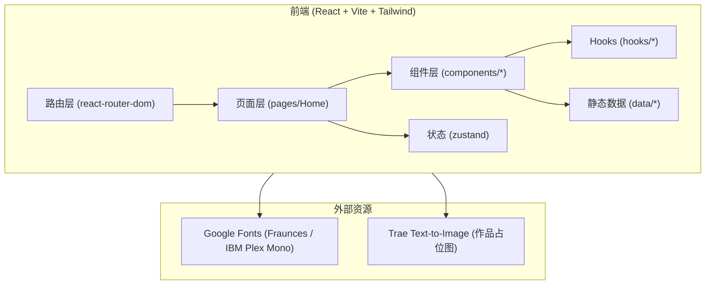

# 技术架构 — AE 创意工作室官网

## 1. 架构设计



无后端、无数据库。所有内容(作品、服务、团队、客户)以 TypeScript 常量定义在 `src/data/` 目录下,首页组件直接 import 渲染。

## 2. 技术描述

- **前端框架**:React@18 + TypeScript
- **构建工具**:Vite@5
- **样式系统**:TailwindCSS@3(配合 CSS 变量定义主题色与字体)
- **路由**:react-router-dom@6(单页 Home + `/work/:slug` 案例详情)
- **状态管理**:zustand(用于全局 UI 状态:当前 section、导航是否收缩、案例详情是否打开)
- **图标**:lucide-react
- **动效**:纯 CSS @keyframes + `IntersectionObserver` 自定义 hook,无 Framer Motion 依赖
- **字体**:Google Fonts 的 `Fraunces` (variable) + `IBM Plex Mono`
- **图像**:通过 `https://trae-api-cn.mchost.guru/api/ide/v1/text_to_image?prompt=...&image_size=...` 动态生成作品缩略图,首屏 LCP 友好
- **初始化模板**:`react-ts`(`pnpm create vite-init@latest . --template react-ts --force`)

## 3. 路由定义

| 路由 | 用途 |
|------|------|
| `/` | Home 主页面(包含 Hero、Work、Services、Manifesto、Studio、Clients、Contact) |
| `/work/:slug` | 作品案例详情页(也可由首页模态打开,URL 同步) |
| `*` | 重定向至 `/` |

## 4. 组件结构

```
src/
├── pages/
│   └── Home.tsx                  # 主页容器,串联所有 section
├── components/
│   ├── Nav.tsx                   # 顶部固定导航
│   ├── Hero.tsx                  # 首屏
│   ├── Work.tsx                  # 作品集网格
│   ├── CaseStudy.tsx             # 案例详情(模态 + 路由双模式)
│   ├── Services.tsx              # 服务列表
│   ├── Manifesto.tsx             # 宣言
│   ├── Studio.tsx                # 团队
│   ├── Clients.tsx               # 客户 logo 墙
│   ├── Contact.tsx               # 联系
│   ├── Marquee.tsx               # 通用无限滚动条
│   ├── SectionLabel.tsx          # 通用 section 编号 + 标签
│   └── ui/
│       ├── Button.tsx            # 方角按钮
│       └── Tag.tsx               # 标签
├── hooks/
│   ├── useReveal.ts              # 元素进入视口渐入
│   └── useActiveSection.ts       # 当前 section 检测(基于 IntersectionObserver)
├── store/
│   └── ui.ts                     # zustand UI 状态
├── data/
│   ├── works.ts                  # 作品 mock 数据
│   ├── services.ts               # 服务数据
│   ├── studio.ts                 # 团队数据
│   └── clients.ts                # 客户数据
├── lib/
│   ├── images.ts                 # 图像生成 prompt & url 工具
│   └── slug.ts                   # slug 工具
├── App.tsx
├── main.tsx
└── index.css                     # Tailwind 入口 + 主题变量
```

## 5. 数据模型

所有数据为前端常量,无后端持久化。

### 5.1 Work(作品)

```ts
type Work = {
  slug: string
  title: string
  client: string
  year: number
  category: 'Brand' | 'Motion' | 'Visual' | 'Campaign'
  coverPrompt: string   // 用于 text_to_image
  summary: string
  scope: string[]
  tags: string[]
}
```

### 5.2 Service(服务)

```ts
type Service = {
  index: string   // '01' | '02' | ...
  title: string
  description: string
  deliverables: string[]
}
```

### 5.3 StudioMember(团队成员)

```ts
type StudioMember = {
  name: string
  role: string
  signature: string  // 手写感短语
  accent: string     // 强调色
}
```

### 5.4 Client(客户)

```ts
type Client = {
  name: string
  industry: string
}
```

## 6. 设计令牌(CSS 变量)

```css
:root {
  --bg: #0A0A0A;
  --fg: #F2EFE9;
  --muted: #8A8780;
  --accent: #D7FF3A;       /* 电光绿 */
  --alert: #FF4D2E;        /* 警示橙 */
  --line: #1F1F1F;
  --font-display: 'Fraunces', 'Times New Roman', serif;
  --font-mono: 'IBM Plex Mono', 'Menlo', monospace;
}
```

## 7. 性能与可访问性

- 字体使用 `font-display: swap` 与 `preconnect`
- 图像使用 `loading="lazy"` 与明确 `width/height`
- 所有交互元素具备 `:focus-visible` 可见焦点环
- 颜色对比度满足 WCAG AA(米白 on 近黑 ≥ 13:1,荧光绿 on 近黑 ≈ 14:1)
- 尊重 `prefers-reduced-motion: reduce`,自动降级动效

## 8. 构建与运行

```bash
pnpm install
pnpm dev      # 本地开发,默认 http://localhost:5173
pnpm build    # 生产构建
pnpm preview  # 预览构建产物
```
