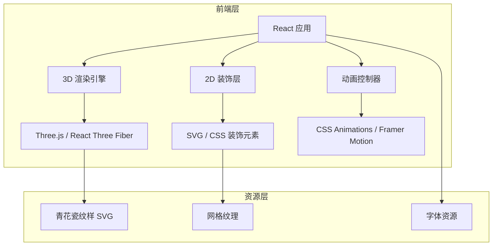

## 1. 架构设计

## 2. 技术说明

- 前端：React@18 + TypeScript + Tailwind CSS@3 + Vite
- 3D 渲染：Three.js + @react-three/fiber + @react-three/drei
- 动画：CSS Animations + @react-three/fiber 动画系统
- 初始化工具：vite-init
- 后端：无
- 数据库：无

## 3. 路由定义

| 路由 | 用途 |
|------|------|
| / | 海报主页面，展示完整交互式数字海报 |

## 4. API 定义

无后端 API，纯前端展示项目。

## 5. 服务器架构图

无服务器端。

## 6. 数据模型

无数据库，所有视觉元素通过代码和静态资源实现。
