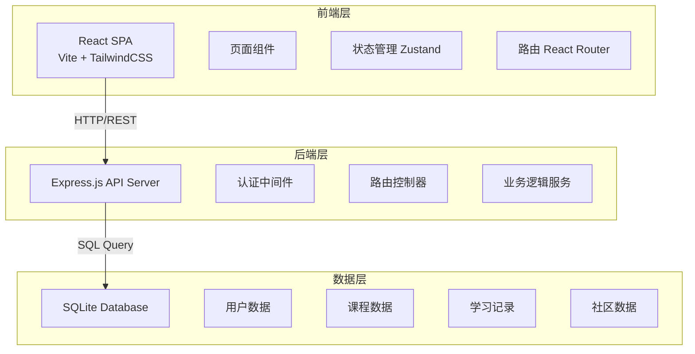
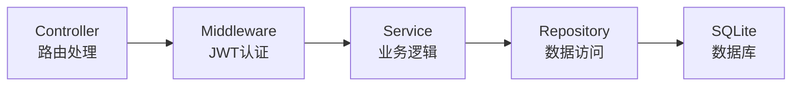
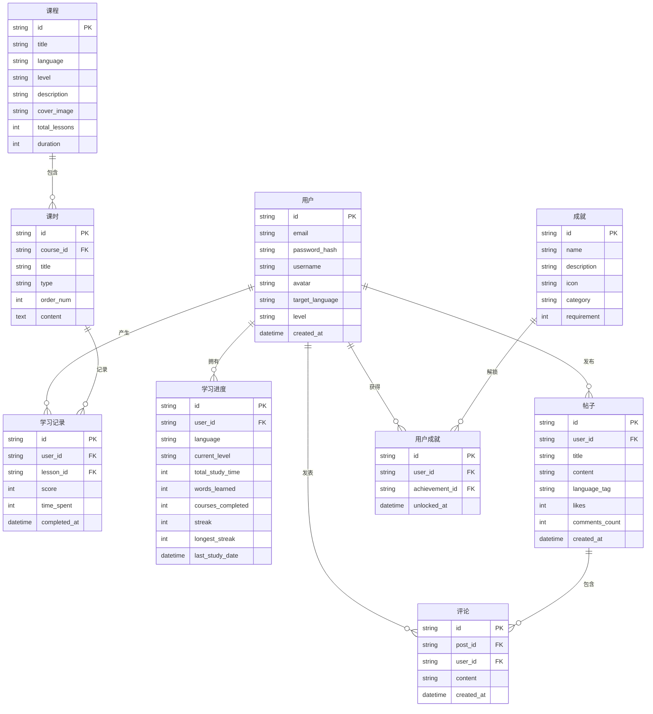

## 1. 架构设计



## 2. 技术说明

- 前端：React@18 + TailwindCSS@3 + Vite + Zustand
- 初始化工具：vite-init
- 后端：Express@4 + TypeScript（ESM格式）
- 数据库：SQLite（开发阶段使用本地文件数据库）
- 认证：JWT Token 认证
- 状态管理：Zustand

## 3. 路由定义

| 路由 | 用途 |
|------|------|
| `/` | 首页，品牌展示、语言选择、学习概览 |
| `/login` | 登录页面 |
| `/register` | 注册页面 |
| `/courses` | 课程中心，分级课程浏览 |
| `/courses/:id` | 课程详情页 |
| `/learn/:courseId` | 学习互动页，四大学习模块 |
| `/progress` | 学习进度追踪页 |
| `/community` | 社区交流页 |
| `/achievements` | 成就中心页 |

## 4. API定义

### 4.1 认证相关

```
POST   /api/auth/register    注册
POST   /api/auth/login       登录
GET    /api/auth/me          获取当前用户信息
```

**请求/响应类型：**

```typescript
interface RegisterRequest {
  email: string;
  password: string;
  username: string;
}

interface LoginRequest {
  email: string;
  password: string;
}

interface AuthResponse {
  token: string;
  user: {
    id: string;
    email: string;
    username: string;
    avatar: string;
    targetLanguage: string;
    level: string;
  };
}
```

### 4.2 课程相关

```
GET    /api/courses           获取课程列表（支持语言、等级筛选）
GET    /api/courses/:id       获取课程详情
GET    /api/courses/:id/lessons  获取课程下课时列表
```

```typescript
interface Course {
  id: string;
  title: string;
  language: 'en' | 'ja' | 'ko';
  level: 'A1' | 'A2' | 'B1' | 'B2' | 'C1' | 'C2';
  description: string;
  coverImage: string;
  totalLessons: number;
  duration: number;
}

interface Lesson {
  id: string;
  courseId: string;
  title: string;
  type: 'vocabulary' | 'grammar' | 'speaking' | 'listening';
  order: number;
  content: LessonContent;
}

interface LessonContent {
  vocabulary?: VocabularyItem[];
  grammar?: GrammarExercise[];
  speaking?: SpeakingItem[];
  listening?: ListeningItem[];
}
```

### 4.3 学习进度相关

```
GET    /api/progress                    获取用户总体学习进度
POST   /api/progress/lesson             提交课时学习结果
GET    /api/progress/calendar           获取学习日历数据
GET    /api/progress/stats              获取学习统计数据
```

```typescript
interface UserProgress {
  userId: string;
  language: string;
  currentLevel: string;
  totalStudyTime: number;
  wordsLearned: number;
  coursesCompleted: number;
  streak: number;
  weeklyMinutes: number[];
}

interface LessonResult {
  lessonId: string;
  score: number;
  timeSpent: number;
  answers: Answer[];
}
```

### 4.4 社区相关

```
GET    /api/community/posts             获取帖子列表
POST   /api/community/posts             发布帖子
GET    /api/community/posts/:id         获取帖子详情
POST   /api/community/posts/:id/comments  发表评论
POST   /api/community/posts/:id/like    点赞
```

### 4.5 成就相关

```
GET    /api/achievements                获取所有成就及用户解锁状态
GET    /api/achievements/leaderboard    获取排行榜
```

```typescript
interface Achievement {
  id: string;
  name: string;
  description: string;
  icon: string;
  category: 'study' | 'social' | 'streak' | 'mastery';
  requirement: number;
  unlocked: boolean;
  unlockedAt?: string;
}
```

## 5. 服务器架构图



## 6. 数据模型

### 6.1 数据模型定义



### 6.2 数据定义语言

```sql
CREATE TABLE users (
  id TEXT PRIMARY KEY,
  email TEXT UNIQUE NOT NULL,
  password_hash TEXT NOT NULL,
  username TEXT NOT NULL,
  avatar TEXT DEFAULT '',
  target_language TEXT DEFAULT 'en',
  level TEXT DEFAULT 'A1',
  created_at DATETIME DEFAULT CURRENT_TIMESTAMP
);

CREATE TABLE courses (
  id TEXT PRIMARY KEY,
  title TEXT NOT NULL,
  language TEXT NOT NULL,
  level TEXT NOT NULL,
  description TEXT,
  cover_image TEXT,
  total_lessons INTEGER DEFAULT 0,
  duration INTEGER DEFAULT 0
);

CREATE TABLE lessons (
  id TEXT PRIMARY KEY,
  course_id TEXT NOT NULL REFERENCES courses(id),
  title TEXT NOT NULL,
  type TEXT NOT NULL,
  order_num INTEGER DEFAULT 0,
  content TEXT NOT NULL
);

CREATE TABLE study_records (
  id TEXT PRIMARY KEY,
  user_id TEXT NOT NULL REFERENCES users(id),
  lesson_id TEXT NOT NULL REFERENCES lessons(id),
  score INTEGER DEFAULT 0,
  time_spent INTEGER DEFAULT 0,
  completed_at DATETIME DEFAULT CURRENT_TIMESTAMP
);

CREATE TABLE user_progress (
  id TEXT PRIMARY KEY,
  user_id TEXT UNIQUE NOT NULL REFERENCES users(id),
  language TEXT DEFAULT 'en',
  current_level TEXT DEFAULT 'A1',
  total_study_time INTEGER DEFAULT 0,
  words_learned INTEGER DEFAULT 0,
  courses_completed INTEGER DEFAULT 0,
  streak INTEGER DEFAULT 0,
  longest_streak INTEGER DEFAULT 0,
  last_study_date DATE
);

CREATE TABLE posts (
  id TEXT PRIMARY KEY,
  user_id TEXT NOT NULL REFERENCES users(id),
  title TEXT NOT NULL,
  content TEXT NOT NULL,
  language_tag TEXT,
  likes INTEGER DEFAULT 0,
  comments_count INTEGER DEFAULT 0,
  created_at DATETIME DEFAULT CURRENT_TIMESTAMP
);

CREATE TABLE comments (
  id TEXT PRIMARY KEY,
  post_id TEXT NOT NULL REFERENCES posts(id),
  user_id TEXT NOT NULL REFERENCES users(id),
  content TEXT NOT NULL,
  created_at DATETIME DEFAULT CURRENT_TIMESTAMP
);

CREATE TABLE achievements (
  id TEXT PRIMARY KEY,
  name TEXT NOT NULL,
  description TEXT,
  icon TEXT,
  category TEXT NOT NULL,
  requirement INTEGER DEFAULT 0
);

CREATE TABLE user_achievements (
  id TEXT PRIMARY KEY,
  user_id TEXT NOT NULL REFERENCES users(id),
  achievement_id TEXT NOT NULL REFERENCES achievements(id),
  unlocked_at DATETIME DEFAULT CURRENT_TIMESTAMP,
  UNIQUE(user_id, achievement_id)
);

CREATE INDEX idx_lessons_course ON lessons(course_id);
CREATE INDEX idx_study_records_user ON study_records(user_id);
CREATE INDEX idx_study_records_lesson ON study_records(lesson_id);
CREATE INDEX idx_posts_user ON posts(user_id);
CREATE INDEX idx_comments_post ON comments(post_id);
CREATE INDEX idx_user_achievements_user ON user_achievements(user_id);
```
