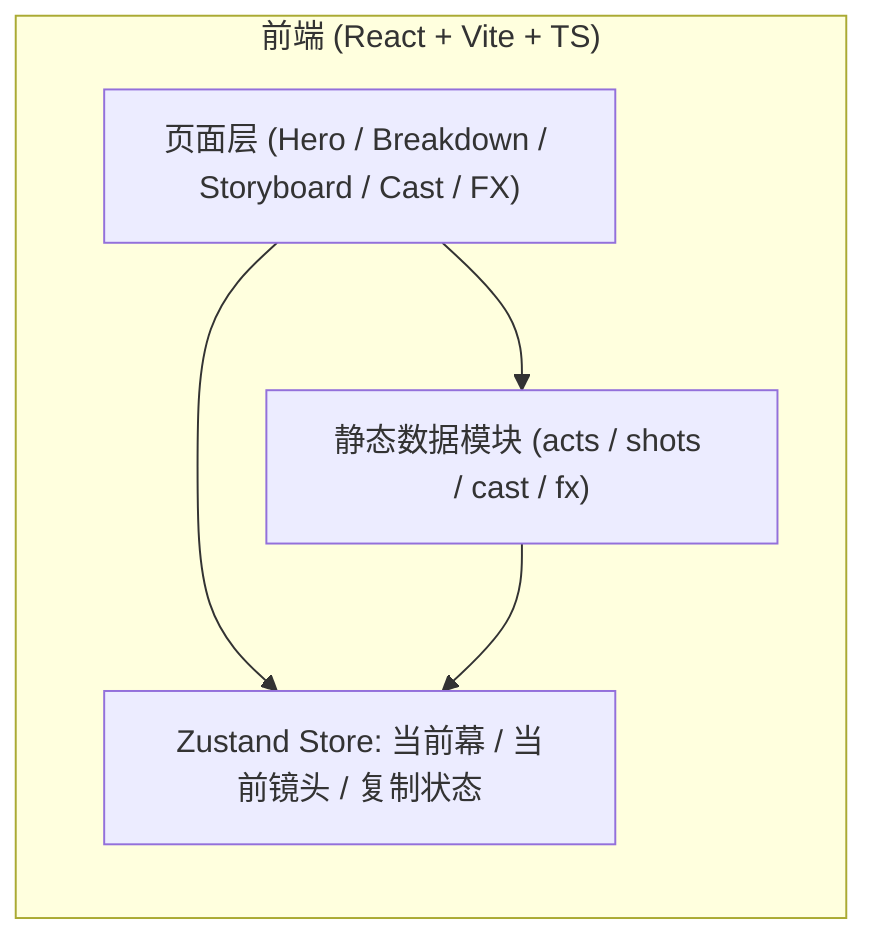

# 燕云长卷 · 技术架构

## 1. 架构设计



本期为纯前端演示项目：剧本、人物、镜头、提示词均以 TypeScript 常量组织在 `src/data` 中，运行期不依赖后端。

## 2. 技术选型

- 前端：React 18 + TypeScript + Vite
- 路由：react-router-dom
- 状态管理：zustand
- 样式：Tailwind CSS 3（自定义宣纸 / 朱砂 / 战旗金色板）
- 图标：lucide-react
- 动效：纯 CSS / SVG / Framer Motion（视口入场）
- 后端：无
- 数据库：无
- 静态资源：宣纸纹理与远山为内联 SVG + CSS 渐变；角色立绘由调用方提供的 image_to_image 提示词驱动，本期不下载图片

## 3. 路由定义

| 路由 | 用途 |
|------|------|
| `/` | 卷首 + 剧本拆解台（默认） |
| `/storyboard` | 分镜表横滚视图 |
| `/cast` | 角色设计卷轴 |
| `/fx` | 特殊效果画中画 |
| `/#act-1` 等锚点 | 跨页跳转至指定幕 / 镜头 |

## 4. 数据结构

```ts
type Act = {
  id: string
  index: number
  title: string
  year: string
  summary: string
  body: string
  tone: string
  keyWords: string[]
  shots: string[] // 关联 shot id
}

type Shot = {
  id: string
  actId: string
  number: string
  shotType: '大远景' | '远景' | '全景' | '中景' | '近景' | '特写' | '主观'
  movement: string
  duration: number
  summary: string
  visualCn: string
  promptEn: string
  music: string
}

type Cast = {
  id: string
  name: string
  role: string
  faction: '宋' | '辽' | '北汉'
  appearance: string
  costume: string
  weapon: string
  signature: string
  promptEn: string
}

type Fx = {
  id: string
  name: string
  hint: string
  tech: string // 'css' | 'svg' | 'canvas'
}
```

## 5. 数据准备

- `src/data/acts.ts`：5 幕（引子 / 高粱河之败 / 七年酝酿 / 雍熙北伐 / 史诗落幕）
- `src/data/shots.ts`：≥ 18 个镜头，覆盖两次北伐 + 杨业殉国 + 澶渊之盟
- `src/data/cast.ts`：8 位关键人物
- `src/data/fx.ts`：4 个 HTML 动效（驴车漂移 / 岐沟关溃败 / 陈家谷伏击 / 澶渊之盟）

## 6. 性能与无障碍

- 首屏只渲染卷首 + 第一幕，其余通过 IntersectionObserver 延迟入场
- 所有动效尊重 `prefers-reduced-motion`
- 颜色对比度满足 WCAG AA
- 关键按钮均带 ARIA label

## 7. 目录结构

```
src/
  components/
    layout/         # TopNav, ScrollRail, SideDock
    hero/           # ScrollHero
    breakdown/      # ActCard, ActExpand, ScriptLine
    storyboard/     # ShotCard, ShotTrack
    cast/           # CastCard, CastScroll
    fx/             # FxStage, FxDonkeyDash, FxQigou, FxChenjia, FxChanyuan
    common/         # Seal, InkDivider, BrushTitle
  data/             # acts / shots / cast / fx
  hooks/            # useActiveSection, useCopy
  pages/            # Home / Storyboard / Cast / Fx
  store/            # useWorkbenchStore
  styles/           # tailwind.css, scroll.css
```
