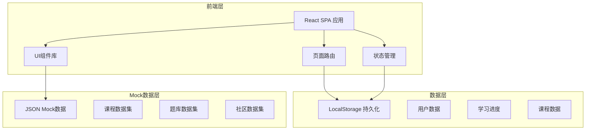
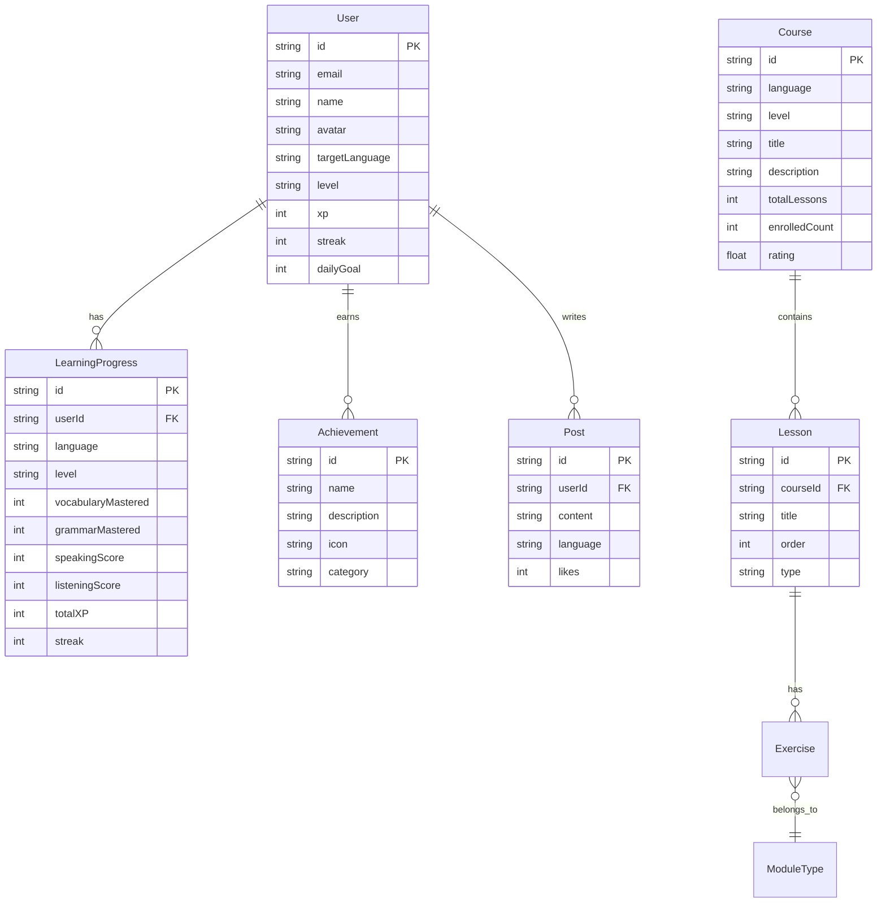

## 1. 架构设计



## 2. 技术说明

- **前端框架**：React@18 + TypeScript
- **样式方案**：Tailwind CSS@3
- **构建工具**：Vite
- **路由**：React Router@6
- **状态管理**：Zustand（轻量级状态管理）
- **图表库**：Recharts（雷达图、统计图表）
- **动画库**：Framer Motion
- **图标库**：Lucide React
- **后端**：无（纯前端，使用 LocalStorage + Mock 数据模拟）
- **数据库**：无（使用 JSON 文件作为 Mock 数据源）

## 3. 路由定义

| 路由 | 用途 |
|------|------|
| `/` | 首页 - 语言选择、进度概览、每日推荐 |
| `/courses` | 课程中心 - 分级课程浏览与筛选 |
| `/courses/:id` | 课程详情 - 课程大纲与介绍 |
| `/learn/:moduleId` | 学习空间 - 四大互动学习模块 |
| `/dashboard` | 学习仪表盘 - 进度追踪与统计 |
| `/community` | 社区广场 - 动态、讨论、伙伴匹配 |
| `/achievements` | 成就中心 - 徽章、等级、排行榜 |
| `/profile` | 个人中心 - 信息与偏好设置 |
| `/auth` | 注册登录页面 |

## 4. API定义

本项目为纯前端应用，不涉及后端API。所有数据通过以下方式管理：

### 4.1 数据服务层接口

```typescript
interface UserService {
  register(data: RegisterData): User;
  login(email: string, password: string): User | null;
  getCurrentUser(): User | null;
  updateProfile(data: Partial<User>): User;
}

interface CourseService {
  getCourses(filters: CourseFilters): Course[];
  getCourseById(id: string): CourseDetail;
  getRecommendedCourses(): Course[];
}

interface ProgressService {
  getProgress(userId: string, language: Language): LearningProgress;
  updateProgress(data: ProgressUpdate): LearningProgress;
  getStreak(userId: string): StreakInfo;
  getStatistics(userId: string, range: DateRange): LearningStats;
}

interface AchievementService {
  getAchievements(userId: string): Achievement[];
  unlockAchievement(userId: string, achievementId: string): Achievement;
  getLeaderboard(type: 'weekly' | 'monthly'): LeaderboardEntry[];
}

interface CommunityService {
  getPosts(filters: PostFilters): Post[];
  createPost(data: CreatePostData): Post;
  getTopics(language?: Language): Topic[];
}
```

### 4.2 核心数据类型

```typescript
type Language = 'en' | 'ja' | 'ko';
type Level = 'A1' | 'A2' | 'B1' | 'B2' | 'C1' | 'C2';
type ModuleType = 'vocabulary' | 'grammar' | 'speaking' | 'listening';

interface User {
  id: string;
  email: string;
  name: string;
  avatar: string;
  targetLanguage: Language;
  level: Level;
  xp: number;
  streak: number;
  dailyGoal: number;
  createdAt: string;
}

interface Course {
  id: string;
  language: Language;
  level: Level;
  title: string;
  description: string;
  coverImage: string;
  totalLessons: number;
  enrolledCount: number;
  rating: number;
}

interface LearningProgress {
  userId: string;
  language: Language;
  level: Level;
  completedLessons: string[];
  vocabularyMastered: number;
  grammarMastered: number;
  speakingScore: number;
  listeningScore: number;
  totalXP: number;
  streak: number;
  lastStudyDate: string;
}

interface Achievement {
  id: string;
  name: string;
  description: string;
  icon: string;
  unlocked: boolean;
  unlockedAt?: string;
  category: 'learning' | 'streak' | 'social' | 'special';
}
```

## 5. 服务器架构图

不涉及后端服务器

## 6. 数据模型

### 6.1 数据模型定义



### 6.2 数据存储方案

使用 LocalStorage 存储用户状态，JSON 文件提供 Mock 数据：

- `localStorage:lingua_user` — 当前登录用户信息
- `localStorage:lingua_progress` — 学习进度数据
- `localStorage:lingua_achievements` — 成就解锁状态
- `src/data/courses.json` — 课程与课时 Mock 数据
- `src/data/exercises.json` — 练习题库 Mock 数据
- `src/data/community.json` — 社区动态 Mock 数据
- `src/data/achievements.json` — 成就定义 Mock 数据
