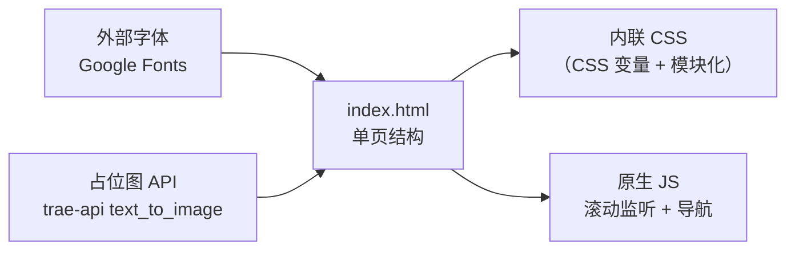

## 1. 架构设计

单页静态站点，纯前端，无后端。



## 2. 技术说明

- **前端**：纯 HTML + 内联 CSS（CSS 变量组织）+ 原生 JavaScript
- **初始化方式**：手动创建 `index.html` 单文件（不引入 Vite/构建工具，保证可双击直接打开）
- **后端**：无
- **数据库**：无
- **字体**：Google Fonts 远程引入 `Black Ops One`、`Special Elite`、`IBM Plex Serif`、`JetBrains Mono`
- **图片**：分镜插图使用 `https://trae-api-cn.mchost.guru/api/ide/v1/text_to_image` 占位 API

## 3. 路由定义

无路由（单页），通过锚点 `/#shot-01` ... `/#shot-15` + 顶部进度条/右侧目录跳转。

| 锚点 | 内容 |
|------|------|
| #hero | 标题幕 |
| #shot-01 ~ #shot-15 | 15 个分镜 |
| #notes | 创作说明 |
| #archive | 数据档案 |
| #epilogue | 尾幕 |

## 4. 资源结构

```
/workspace
├── index.html          # 单文件主页（HTML + 内联 CSS + JS）
├── README.md
└── .trae/documents/
    ├── PRD.md
    └── 技术架构.md
```

## 5. 关键实现

- **CSS 变量**：统一管理颜色、字体、间距
- **滚动进度条**：监听 `scroll`，更新顶部 4px 进度条宽度
- **当前镜号高亮**：IntersectionObserver 监听分镜进入视口，更新右侧目录
- **分镜插图占位**：每个分镜调用 `text_to_image` 接口，prompt 描述对应画面
- **无障碍**：语义化 `<section>` / `<article>`，尊重 `prefers-reduced-motion`

## 6. 数据模型

无持久化数据。所有分镜内容在 HTML 中以结构化数组形式内联。
