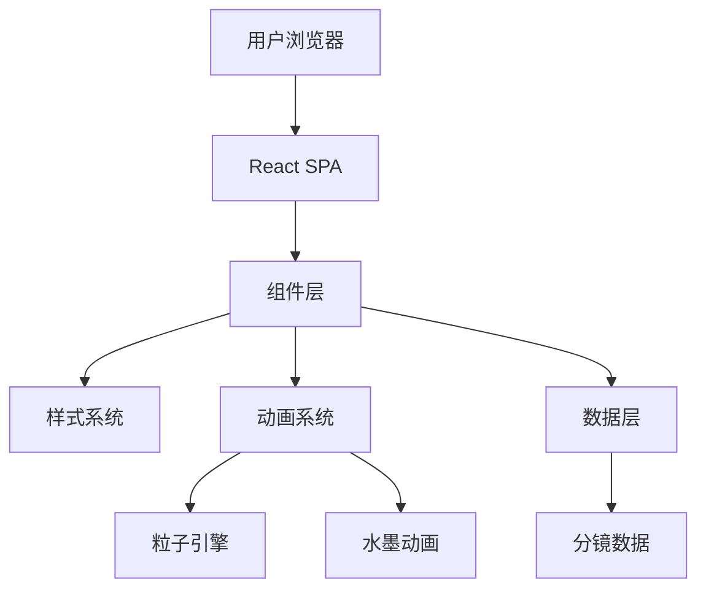
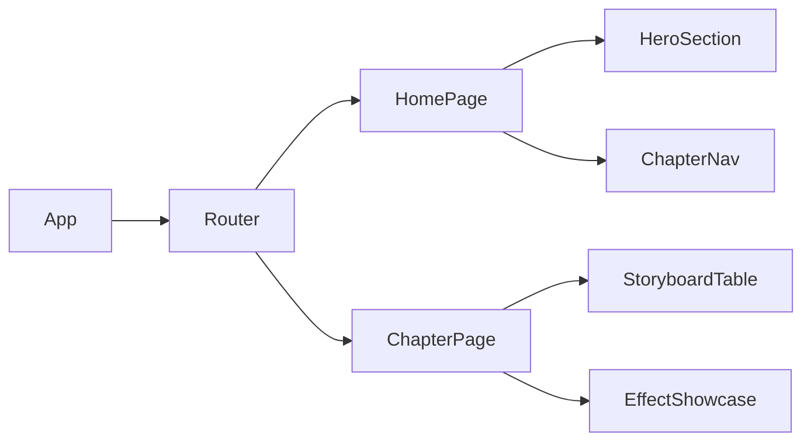

# IMAX影视分镜展示系统 - 技术架构文档

## 1. 架构设计

### 1.1 系统架构图



### 1.2 前端架构



## 2. 技术栈

### 2.1 核心技术
- **框架**: React 18.2+
- **构建工具**: Vite 5.0+
- **路由**: React Router DOM 6.0+
- **样式**: CSS3 + CSS Variables
- **动画**: CSS Animations + Framer Motion
- **字体**: Google Fonts (Noto Serif SC, Noto Sans SC, Ma Shan Zheng)

### 2.2 项目初始化
```bash
npm create vite@latest imax-storyboard -- --template react
cd imax-storyboard
npm install
npm install react-router-dom framer-motion
```

## 3. 路由定义

| 路由 | 页面名称 | 功能描述 |
|------|----------|----------|
| `/` | 首页 | 开场动画 + 章节导航 |
| `/chapter/:id` | 章节页 | 分镜表格展示 |

## 4. 组件结构

### 4.1 页面组件
```
src/
├── pages/
│   ├── HomePage.jsx          # 首页
│   └── ChapterPage.jsx       # 章节分镜页
├── components/
│   ├── HeroSection.jsx       # 英雄区
│   ├── ChapterNav.jsx        # 章节导航
│   ├── StoryboardTable.jsx   # 分镜表格
│   ├── EffectShowcase.jsx    # 特效展示
│   └── ParticleBackground.jsx # 粒子背景
├── data/
│   └── storyboardData.js    # 分镜数据
├── styles/
│   ├── variables.css         # CSS变量
│   └── animations.css       # 动画定义
└── App.jsx                   # 应用入口
```

## 5. CSS变量系统

```css
:root {
  /* 色彩系统 */
  --color-void: #0a0a0f;           /* 宇宙深空 */
  --color-ink: #2a2a35;            /* 水墨灰 */
  --color-gold: #d4af37;            /* 神圣金 */
  --color-fire: #ff6b35;            /* 能量橙 */
  --color-star: #e8e8f0;            /* 星光白 */
  --color-blood: #8b0000;          /* 血红 */

  /* 字体系统 */
  --font-display: 'Ma Shan Zheng', serif;
  --font-heading: 'Noto Serif SC', serif;
  --font-body: 'Noto Sans SC', sans-serif;

  /* 间距系统 */
  --spacing-xs: 0.5rem;
  --spacing-sm: 1rem;
  --spacing-md: 2rem;
  --spacing-lg: 4rem;
  --spacing-xl: 8rem;

  /* 过渡 */
  --transition-smooth: all 0.3s cubic-bezier(0.4, 0, 0.2, 1);
  --transition-bounce: all 0.5s cubic-bezier(0.68, -0.55, 0.265, 1.55);
}
```

## 6. 动画系统

### 6.1 粒子动画
- Canvas 2D 渲染
- 200+ 粒子对象
- 缓慢漂浮 + 发光效果
- 响应窗口大小变化

### 6.2 水墨动画
- CSS Keyframes
- 模糊扩散效果
- 渐变过渡
- 透明度变化

### 6.3 页面切换
- Framer Motion 过渡
- 滑入/淡出效果
- 交错出现动画

## 7. 性能优化

### 7.1 资源优化
- 图片懒加载
- 字体预加载
- CSS 代码分割
- 动画 will-change 优化

### 7.2 渲染优化
- React.memo 组件缓存
- useMemo/useCallback hooks
- CSS 动画替代 JS 动画
- requestAnimationFrame 节流

### 7.3 性能指标
- Lighthouse Performance Score > 90
- First Contentful Paint < 1.5s
- Largest Contentful Paint < 2.5s
- Cumulative Layout Shift < 0.1

## 8. 可访问性

### 8.1 键盘导航
- Tab 键导航
- Enter 键确认
- Escape 键返回
- 方向键章节切换

### 8.2 ARIA 支持
- 语义化 HTML 标签
- ARIA 标签
- 角色属性定义
- 焦点管理

## 9. 浏览器兼容

### 9.1 目标浏览器
- Chrome 90+
- Firefox 88+
- Safari 14+
- Edge 90+

### 9.2 渐进增强
- 基础功能支持所有浏览器
- CSS Grid/Flexbox 降级
- CSS 变量降级
- 动画优雅降级

## 10. 数据结构

### 10.1 分镜数据结构
```javascript
{
  id: 1,                          // 镜号
  scene: "大全景",                 // 景别
  camera: "地面仰拍→急速拉升",      // 运镜
  content: "IMAX渲染...",          // 画面内容
  effects: "低频嗡鸣",             // 特效描述
  sound: "大地震颤"                // 音效描述
}
```

### 10.2 章节数据结构
```javascript
{
  id: 1,                          // 章节ID
  title: "第一幕：觉醒",            // 章节标题
  duration: "15秒",               // 时长
  shots: [...],                   // 分镜数组
  theme: "觉醒主题"               // 主题描述
}
```

## 11. 目录结构

```
imax-storyboard/
├── public/
│   └── favicon.ico
├── src/
│   ├── assets/
│   │   └── (静态资源)
│   ├── components/
│   │   ├── HeroSection.jsx
│   │   ├── ChapterNav.jsx
│   │   ├── StoryboardTable.jsx
│   │   ├── EffectShowcase.jsx
│   │   ├── ParticleBackground.jsx
│   │   └── BackButton.jsx
│   ├── data/
│   │   └── storyboardData.js
│   ├── pages/
│   │   ├── HomePage.jsx
│   │   └── ChapterPage.jsx
│   ├── styles/
│   │   ├── variables.css
│   │   ├── base.css
│   │   ├── animations.css
│   │   └── components.css
│   ├── App.jsx
│   ├── main.jsx
│   └── index.css
├── index.html
├── package.json
├── vite.config.js
└── README.md
```

## 12. 开发规范

### 12.1 命名规范
- 组件名: PascalCase (HeroSection.jsx)
- 样式类: kebab-case (.hero-section)
- 变量名: camelCase (const isActive)
- 常量: UPPER_SNAKE_CASE (API_BASE_URL)

### 12.2 代码格式
- 使用 ESLint
- Prettier 格式化
- 2 空格缩进
- 单引号字符串
- 分号结尾

### 12.3 Git 提交规范
- feat: 新功能
- fix: 修复bug
- style: 样式调整
- refactor: 重构
- docs: 文档更新
