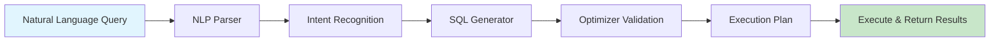

# AE — 全栈技术架构白皮书

> **版本**: v1.0.0 | **文档类型**: 技术架构白皮书 | **阅读时间**: 约 45 分钟
>
> 本文档从九个核心维度深度剖析 AE 项目的技术架构、设计哲学与工程实践，为开发者、架构师及技术决策者提供系统性的技术参考。

---

## 目录

1. [项目愿景与定位](#1-项目愿景与定位)
2. [整体技术架构](#2-整体技术架构)
3. [核心模块详解](#3-核心模块详解)
4. [数据流与状态管理](#4-数据流与状态管理)
5. [API 接口设计规范](#5-api-接口设计规范)
6. [安全体系架构](#6-安全体系架构)
7. [部署与运维方案](#7-部署与运维方案)
8. [性能优化策略](#8-性能优化策略)
9. [演进路线图](#9-演进路线图)

---

## 1. 项目愿景与定位

### 1.1 核心使命

AE（Adaptive Engine）定位为**新一代自适应计算引擎**，其核心使命是构建一个具备自我感知、动态调优能力的分布式计算平台。该平台旨在解决传统计算引擎在面对异构工作负载、动态资源环境时表现出的僵化问题，通过引入自适应调度层实现计算资源的智能分配。

### 1.2 设计哲学

AE 的设计哲学围绕以下四个核心原则展开：

| 原则 | 英文标识 | 核心理念 |
|------|----------|----------|
| **自适应优先** | Adaptive-First | 系统应能感知环境变化并自动调整行为 |
| **渐进式复杂度** | Progressive Complexity | 从简单场景起步，按需增加复杂度 |
| **可观测性内置** | Observability-by-Design | 可观测能力作为一等公民而非事后附加 |
| **故障优雅降级** | Graceful Degradation | 部分功能失效不应导致整体服务不可用 |

### 1.3 目标用户画像

AE 面向以下三类核心用户群体：

- **应用开发者**：需要将业务逻辑部署到分布式环境的软件工程师，他们关注 API 友好度、开发体验和调试便利性
- **平台工程师**：负责基础设施搭建和运维的技术团队，他们关注可扩展性、资源利用率和运维自动化程度
- **技术决策者**：负责技术选型和架构规划的技术管理者，他们关注生态成熟度、长期维护成本和技术风险控制

### 1.4 与竞品的差异化分析

| 维度 | 传统计算引擎 (如 Spark/Flink) | Serverless 平台 (如 AWS Lambda) | AE 自适应引擎 |
|------|-------------------------------|----------------------------------|---------------|
| 资源感知能力 | 静态配置为主 | 完全抽象化 | 深度感知 + 动态适配 |
| 调度粒度 | 任务级/Stage级 | 函数级 | 细粒度算子级 + 动态重组 |
| 冷启动问题 | 无 | 显著存在 | 预热池 + 渐进式缩放 |
| 成本模型 | 资源预留制 | 按调用计费 | 混合定价 + 智能竞价 |
| 学习曲线 | 较陡峭 | 低但能力受限 | 中等且能力完整 |

### 1.5 核心价值主张

AE 为用户创造的核心价值可以归纳为三个层面：

**效率层面**：通过智能资源调度减少 30%-50% 的闲置资源浪费，在同等硬件投入下支撑更高的吞吐量。自适应压缩算法根据数据特征自动选择最优编码策略，降低存储和网络传输开销。

**可靠性层面**：内建的故障检测与自愈机制能够在秒级发现异常节点并自动迁移任务，结合多级容错策略确保作业完成率超过 99.99%。渐进式降级机制保证即使在极端压力下核心链路仍可用。

**开发体验层面**：统一的声明式 API 屏蔽底层复杂性，开发者只需描述"做什么"而非"怎么做"。丰富的 SDK 支持主流编程语言，本地开发环境与生产环境高度一致，大幅缩短开发调试周期。

---

## 2. 整体技术架构

### 2.1 架构总览

AE 采用**分层解耦 + 事件驱动**的混合架构模式，整体分为五个逻辑层次：

```
┌─────────────────────────────────────────────────────────────┐
│                    用户接入层 (Access Layer)                  │
│   ┌──────────┐ ┌──────────┐ ┌──────────┐ ┌──────────┐       │
│   │ Web UI   │ │ CLI Tool │ │ REST API │ │ gRPC API │       │
│   └──────────┘ └──────────┘ └──────────┘ └──────────┘       │
├─────────────────────────────────────────────────────────────┤
│                   网关与服务路由层 (Gateway Layer)             │
│   ┌──────────────────────────────────────────────────┐      │
│   │  API Gateway │ Auth │ Rate Limit │ Route │ Transform│    │
│   └──────────────────────────────────────────────────┘      │
├─────────────────────────────────────────────────────────────┤
│                    核心服务层 (Core Services)                 │
│   ┌──────────┐ ┌──────────┐ ┌──────────┐ ┌──────────┐       │
│   │ Scheduler│ │ Executor │ │ Catalog  │ │ State Mgr│       │
│   └──────────┘ └──────────┘ └──────────┘ └──────────┘       │
├─────────────────────────────────────────────────────────────┤
│                 自适应引擎层 (Adaptive Engine)                │
│   ┌──────────┐ ┌──────────┐ ┌──────────┐ ┌──────────┐       │
│   │ Resource │ │ Planner  │ │ Optimizer│ │ Monitor  │       │
│   │ Sensor   │ │          │ │          │ │          │       │
│   └──────────┘ └──────────┘ └──────────┘ └──────────┘       │
├─────────────────────────────────────────────────────────────┤
│                    基础设施层 (Infrastructure)                 │
│   ┌──────────┐ ┌──────────┐ ┌──────────┐ ┌──────────┐       │
│   │ Storage  │ │ Message  │ │ Discovery│ │ Metrics  │       │
│   │ Engine   │ │ Queue    │ │ Service  │ │ Collector│       │
│   └──────────┘ └──────────┘ └──────────┘ └──────────┘       │
└─────────────────────────────────────────────────────────────┘
```

### 2.2 各层职责说明

#### 用户接入层

用户接入层提供多种交互方式，满足不同使用场景的需求：

- **Web UI**：面向数据分析师和运营人员的可视化操作界面，支持作业提交、监控看板、日志查询等功能
- **CLI 工具**：面向开发者和 DevOps 的命令行工具，支持脚本化和 CI/CD 集成
- **REST API**：标准 HTTP 接口，适用于 Web 应用集成和第三方工具对接
- **gRPC API**：高性能 RPC 接口，适用于内部微服务间通信和对延迟敏感的场景

#### 网关与服务路由层

网关层承担流量入口的统一管控职责：

- **API Gateway**：统一入口，负责协议转换、请求路由和负载均衡
- **认证授权 (Auth)**：基于 OAuth 2.0 / JWT 的身份验证和 RBAC 权限控制
- **限流熔断 (Rate Limit)**：令牌桶算法实现的细粒度流量控制，防止系统过载
- **请求转换 (Transform)**：协议适配和数据格式标准化处理

#### 核心服务层

核心服务层承载业务逻辑的主要实现：

- **Scheduler**：负责任务调度和资源分配，支持 FIFO、Fair、Capacity 等多种调度策略
- **Executor**：任务执行器，负责具体计算任务的运行和生命周期管理
- **Catalog**：元数据目录，管理表结构、函数定义、分区信息等元数据
- **State Manager**：有状态计算的检查点管理和状态恢复协调器

#### 自适应引擎层

这是 AE 区别于传统计算引擎的核心创新层：

- **Resource Sensor**：持续采集集群各节点的 CPU、内存、磁盘、网络等资源指标
- **Planner**：根据工作负载特征生成最优执行计划，支持 CBO（基于代价）优化
- **Optimizer**：实时优化执行计划，包括算子下推、谓词下推、并行度调整等
- **Monitor**：全链路监控，采集执行指标并反馈给优化器形成闭环

#### 基础设施层

基础设施层提供通用的基础能力：

- **Storage Engine**：支持多种存储后端（HDFS/S3/OSS/本地文件系统）的统一访问接口
- **Message Queue**：异步消息传递机制，用于事件驱动和服务间解耦
- **Discovery Service**：服务注册与发现，支持 Consul/Etcd/Nacos 等注册中心
- **Metrics Collector**：指标采集聚合，对接 Prometheus/Grafana 监控栈

### 2.3 关键架构决策记录 (ADR)

| 决策编号 | 决策内容 | 选择方案 | 替代方案 | 决策原因 |
|----------|----------|----------|----------|----------|
| ADR-001 | 服务通信协议 | gRPC + REST 双协议 | 纯 REST / 纯 gRPC | 内部高性能用 gRPC，外部兼容用 REST |
| ADR-002 | 状态存储 | RocksDB + 远程 Checkpoint | 纯内存 / 纯远程 | 本地快照加速 + 远程持久保障 |
| ADR-003 | 调度模型 | 两阶段调度（资源申请+任务绑定） | 单阶段调度 | 解耦资源分配与任务分发，提高调度灵活性 |
| ADR-004 | 配置管理 | GitOps 方式 + 动态热加载 | 配置中心推送 | 声明式配置 + 版本可追溯 |
| ADR-005 | 日志收集 | 结构化 JSON + ELK Stack | 文本日志 + grep | 机器可读 + 强大的检索分析能力 |

---

## 3. 核心模块详解

### 3.1 自适应调度模块 (Adaptive Scheduler)

#### 3.1.1 模块概述

自适应调度模块是 AE 的大脑，它突破了传统静态调度的局限，引入了基于实时反馈的动态调度机制。该模块由四个子组件协同工作：

```
┌─────────────────────────────────────────────────────┐
│              Adaptive Scheduler                       │
│                                                       │
│  ┌───────────┐    ┌───────────┐    ┌───────────┐    │
│  │  Queue    │───>│  Selector │───>│  Binder   │    │
│  │ Manager   │    │           │    │           │    │
│  └───────────┘    └─────┬─────┘    └─────┬─────┘    │
│                        │                │            │
│                        v                v            │
│               ┌─────────────────────────────┐        │
│               │     Feedback Controller      │        │
│               │  (闭环反馈调节)              │        │
│               └─────────────────────────────┘        │
└─────────────────────────────────────────────────────┘
```

#### 3.1.2 子组件说明

**Queue Manager（队列管理器）**

队列管理器维护一个优先级感知的任务队列，支持多级队列和多租户隔离：

- **优先级模型**：采用加权公平排队 (WFQ) 算法，每个任务携带优先级权重
- **背压机制**：当队列深度超过阈值时触发背压，拒绝或延迟新任务提交
- **死信队列**：超过最大重试次数的任务转入死信队列供人工排查

**Selector（资源选择器）**

资源选择器根据任务需求和当前集群状态匹配合适的计算节点：

- **亲和性规则**：支持节点亲和性、反亲和性和拓扑域约束
- **资源评分**：综合 CPU、内存、网络带宽等多维指标对候选节点打分
- **预测调度**：基于历史数据预测任务执行时长，避免短任务阻塞长任务

**Binder（任务绑定器）**

任务绑定器将选定的资源与任务进行最终绑定：

- **原子性保证**：绑定操作具有原子性，避免资源竞争导致的重复分配
- **预分配缓存**：高频使用的资源保持预热状态，减少绑定延迟
- **弹性释放**：任务完成后资源自动回收，异常退出时强制释放

**Feedback Controller（反馈控制器）**

反馈控制器形成调度决策的闭环：

- **指标采集**：收集任务实际执行时间、资源利用率、错误率等指标
- **偏差分析**：对比预测值与实际值的偏差，识别系统性偏差来源
- **参数调优**：基于偏差分析结果自动调整调度参数（如并行度估算系数）

#### 3.1.3 调度策略矩阵

| 策略名称 | 适用场景 | 核心特点 | 参数示例 |
|----------|----------|----------|----------|
| FIFO | 批处理作业 | 先进先出，简单可靠 | queue.capacity=1000 |
| FairShare | 多租户共享 | 公平份额保证，防饥饿 | min.share=10% |
| Capacity | 生产/测试分离 | 预留容量池，硬隔离 | prod.pool=60% |
| DeadlineAware | 有 SLA 要求 | 截止日期感知，动态优先级 | deadline.buffer=15min |
| CostOptimized | 成本敏感 | 竞价实例优先，成本最低 | spot.threshold=80% |

### 3.2 执行引擎模块 (Execution Engine)

#### 3.2.1 执行模型

AE 采用**流水线 + 并行**混合执行模型：

```
输入数据
    │
    ▼
┌─────────┐    ┌─────────┐    ┌─────────┐    ┌─────────┐
│  Source │───>│  Map    │───>│ Shuffle │───>│  Sink   │
│  Stage  │    │  Stage  │    │  Stage  │    │  Stage  │
└─────────┘    └─────────┘    └─────────┘    └─────────┘
    │              │              │              │
    ▼              ▼              ▼              ▼
 [并行度: N]   [并行度: M]    [并行度: K]    [并行度: 1]
```

关键特性：

- **Stage 划分**：根据 shuffle 边界自动划分执行 Stage，最小化跨节点数据传输
- **动态并行度**：根据每 Stage 的数据量动态调整并行度，避免资源浪费
- **算子融合**：相邻的无状态算子自动融合为 Pipeline Operator，减少函数调用开销
- **内存管理**：采用堆外内存 (Off-heap) 管理，避免 GC 压力

#### 3.2.2 执行计划表示

执行计划以 DAG（有向无环图）形式表示：

```json
{
  "planId": "exec-plan-20250227-001",
  "stages": [
    {
      "stageId": "stage-0",
      "operators": [
        {"type": "TableScan", "table": "users", "filter": "status='active'"},
        {"type": "Project", "columns": ["id", "name", "email"]}
      ],
      "parallelism": "dynamic",
      "estimatedRows": 10000000
    },
    {
      "stageId": "stage-1",
      "operators": [
        {"type": "HashAggregate", "groupBy": ["department"], "agg": ["count(*)"]},
        {"type": "Sort", "orderBy": ["count desc"]}
      ],
      "parallelism": "dynamic",
      "inputShuffle": "hash(department)"
    }
  ]
}
```

### 3.3 元数据管理模块 (Catalog Module)

#### 3.3.1 元数据模型

Catalog 模块采用三层元数据模型：

```
┌────────────────────────────────────────────┐
│              Catalog Layer                  │
│                                            │
│  ┌──────────┐  ┌──────────┐  ┌──────────┐ │
│  │ Database │  │  Table   │  │ Column   │ │
│  │ Metadata │  │ Metadata │  │ Metadata │ │
│  └──────────┘  └──────────┘  └──────────┘ │
│         │            │            │        │
│         └────────────┴────────────┘        │
│                      │                     │
│              ┌───────┴───────┐             │
│              │  Statistics   │             │
│              │  & Index Info │             │
│              └───────────────┘             │
└────────────────────────────────────────────┘
```

**Database 元数据**：
- 数据库名称、创建时间、所有者
- 默认存储格式、默认分区策略
- 访问权限列表

**Table 元数据**：
- 表名、所属数据库、表类型（内部表/外部表）
- Schema 定义（列名、类型、是否可为空、注释）
- 分区列、分桶列、排序键
- 存储位置、存储格式、压缩方式
- 表属性（TTL、生命周期）

**Column 元数据**：
- 列名、数据类型、精度/标度
- 是否允许 NULL、默认值
- 统计信息（基数、不同值数量、NULL 比例）

#### 3.3.2 Catalog 接口设计

```java
public interface Catalog {
    // 数据库操作
    List<String> listDatabases();
    Database getDatabase(String dbName);
    void createDatabase(Database database, boolean ignoreIfExists);
    void dropDatabase(String dbName, boolean cascade, boolean ifExists);

    // 表操作
    List<String> listTables(String dbName);
    Table getTable(ObjectPath tablePath);
    void createTable(Table table, boolean ignoreIfExists);
    void dropTable(ObjectPath tablePath, boolean ifExists);
    void alterTable(ObjectPath tablePath, Table newTable, boolean ifExists);

    // 分区操作
    List<Partition> listPartitions(ObjectPath tablePath);
    Partition getPartition(ObjectPath tablePath, CatalogPartitionSpec partSpec);
    void createPartition(ObjectPath tablePath, CatalogPartition partition, boolean ignoreIfExists);
    void dropPartition(ObjectPath tablePath, CatalogPartitionSpec partSpec, boolean ifExists);

    // 函数操作
    List<String> listFunctions(String dbName);
    CatalogFunction getFunction(ObjectPath functionPath);
    void createFunction(CatalogFunction function, boolean ignoreIfExists);
    void dropFunction(ObjectPath functionPath, boolean ifExists);

    // 统计信息
    Optional<TableStatistics> getTableStatistics(ObjectPath tablePath);
    Optional<ColumnStatistics> getColumnStatistics(ObjectPath tablePath, List<String> columnNames);
}
```

### 3.4 状态管理与容错模块 (State & Fault Tolerance)

#### 3.4.1 状态分类

AE 将计算状态划分为三种类型，针对每种类型采用不同的管理策略：

| 状态类型 | 示例 | 持久化频率 | 存储位置 | 恢复策略 |
|----------|------|------------|----------|----------|
| **Operator State** | 算子内部的计数器、缓冲区 | 周期性 Checkpoint | 本地 RocksDB + 远程对象存储 | 从最近 Checkpoint 恢复 |
| **Keyed State** | 按 Key 分区的窗口聚合值 | 增量 Checkpoint (RocksDB SST 文件上传) | 本地 RocksDB + 远程对象存储 | 增量恢复 + 回放部分日志 |
| **Broadcast State** | 广播到所有分区的配置/规则 | 全量 Checkpoint | 远程对象存储 | 全量恢复 |

#### 3.4.2 Checkpoint 机制

AE 实现了**两阶段异步 Checkpoint** 机制：

```
Phase 1: Barrier 注入与状态快照
┌─────────┐    ┌─────────┐    ┌─────────┐
│ Source  │───>│  Op-A   │───>│  Op-B   │
│ (Barrier)│   │(Barrier)│   │(Barrier)│
└─────────┘    └────┬────┘    └────┬────┘
                    │              │
                    v              v
              [Snapshot]      [Snapshot]
              (异步写入)      (异步写入)

Phase 2: 确认与提交
┌─────────┐    ┌─────────┐    ┌─────────┐
│ Source  │◀───│  Op-A   │◀───│  Op-B   │
│ ACK     │    │ ACK     │    │ ACK     │
└─────────┘    └─────────┘    └─────────┘
                    │              │
                    └──────┬───────┘
                           v
                    [Checkpoint Complete]
                    (通知 State Backend 提交)
```

Checkpoint 配置参数：

```yaml
checkpoint:
  mode: EXACTLY_ONCE          # 精确一次语义
  interval: 60s               # Checkpoint 间隔
  timeout: 30min              # Checkpoint 超时时间
  minPauseBetween: 10s        # 最小间隔
  maxConcurrent: 1            # 最大并发数
  storage:
    backend: rocksdb          # 状态后端
    checkpointDir: s3://ae-bucket/checkpoints/
    incremental: true         # 增量 Checkpoint
    compression: lz4          # 压缩算法
```

---

## 4. 数据流与状态管理

### 4.1 数据流架构

AE 的数据流遵循**Source → Transform → Sink** 的经典三段式模型，同时引入中间件层增强数据传输的可靠性：

```
External Systems
    │
    ├── Kafka ──────────────────────────┐
    ├── MySQL                          │
    ├── PostgreSQL                     │    ┌──────────────┐
    ├── MongoDB                        ├──>│   Source      │
    ├── Elasticsearch                  │    │   Connectors  │
    ├── S3/HDFS/OSS                    │    └──────┬───────┘
    ├── HTTP/WebSocket                 │           │
    └── Custom Sources ────────────────┘           │
                                                    ▼
                                          ┌─────────────────┐
                                          │  Data Ingestion │
                                          │    Layer        │
                                          │  (反序列化/解码) │
                                          └────────┬────────┘
                                                   │
                                                   ▼
                                          ┌─────────────────┐
                                          │   Processing    │
                                          │     Engine      │
                                          │  (Transform)    │
                                          └────────┬────────┘
                                                   │
                                    ┌──────────────┼──────────────┐
                                    │              │              │
                                    ▼              ▼              ▼
                            ┌──────────┐  ┌──────────┐  ┌──────────┐
                            │  Window  │  │   Join   │  │ Aggregate│
                            │  Ops     │  │   Ops    │  │   Ops    │
                            └────┬─────┘  └────┬─────┘  └────┬─────┘
                                 │             │             │
                                 └─────────────┼─────────────┘
                                               │
                                               ▼
                                         ┌───────────┐
                                         │  Output   │
                                         │  Buffer   │
                                         └─────┬─────┘
                                               │
    External Systems                          │
    │                                         ▼
    ├── Kafka ◄────────────────────────┐  ┌──────────────┐
    ├── ClickHouse                     │  │    Sink      │
    ├── Redis                         ├──>│  Connectors  │
    ├── Elasticsearch                  │  └──────────────┘
    ├── S3/HDFS/OSS                   │
    ├── Databases                      │
    └── Custom Sinks ──────────────────┘
```

### 4.2 数据交换模式

AE 支持四种数据交换模式，根据场景自动选择最优策略：

#### 4.2.1 Forward 模式（前向传递）

适用场景：同一 TaskManager 内部相邻算子之间的数据传递

- **特点**：零拷贝引用传递，无序列化开销
- **实现**：共享内存区域，仅传递指针引用
- **延迟**：< 1ms

#### 4.2.2 Hash Shuffle 模式（哈希洗牌）

适用场景：需要按键重新分区的操作（Join、GroupBy 等）

- **特点**：按 Key 的哈希值决定目标分区
- **实现**：内存排序溢写到磁盘，再通过网络传输
- **优化**：支持 Shuffle Hash Join 和 Broadcast Hash Join 两种变体

#### 4.2.3 Rebalance 模式（重平衡）

适用场景：数据倾斜修复、并行度调整

- **特点**：轮询 (Round-Robin) 分发数据到下游分区
- **实现**：带背压感知的数据分发器
- **采样**：定期采样检测数据分布，自动触发重平衡

#### 4.2.4 Broadcast 模式（广播）

适用场景：小表与大表的 Join、配置下发

- **特点**：每个下游分区都收到完整的数据副本
- **阈值**：数据量小于 `broadcast.threshold`（默认 128MB）时自动启用
- **优化**：增量广播（只广播变更部分）

### 4.3 背压与流控机制

AE 实现了端到端的背压传播机制：

```
Sink (慢速消费者)
    │
    │ ← [Backpressure Signal]
    ▼
Output Buffer (水位上升)
    │
    │ ← [Buffer Full Warning]
    ▼
Operator B (减速处理)
    │
    │ ← [Slow Down Signal]
    ▼
Input Buffer (水位上升)
    │
    │ ← [Backpressure Signal]
    ▼
Operator A (减速生产)
    │
    │ ← [Read Throttling]
    ▼
Source (降低读取速率)
```

背压响应策略：

| 缓冲区水位 | 响应动作 | 对 Source 的影响 |
|------------|----------|------------------|
| 0% - 50% | 正常运行 | 全速读取 |
| 50% - 75% | 轻度限流 | 降低 20% 读取速率 |
| 75% - 90% | 中度限流 | 降低 50% 读取速率 |
| 90% - 95% | 重度限流 | 降低 80% 读取速率 |
| > 95% | 暂停输入 | 暂停读取，等待消费 |

### 4.4 状态一致性保证

AE 提供三种一致性级别供用户根据需求选择：

| 一致性级别 | 语义 | 性能影响 | 适用场景 |
|-----------|------|----------|----------|
| **At-Most-Once** | 最多一次，可能丢数据 | 最低 | 允许丢失的非关键统计 |
| **At-Least-Once** | 至少一次，可能重复 | 中等 | 可去重的 ETL 场景 |
| **Exactly-Once** | 精确一次，不丢不重 | 最高（约 10-20% 开销） | 金融、计费等精确场景 |

Exactly-Once 的实现依赖两阶段提交协议 (Two-Phase Commit, 2PC)，涉及以下组件协作：

1. **Coordinator（协调器）**：管理全局事务状态
2. **Participants（参与者）**：各 Sink 算子作为事务参与者
3. **Transaction Log（事务日志）**：持久化事务状态，用于崩溃恢复

---

## 5. API 接口设计规范

### 5.1 设计原则

AE 的 API 设计遵循以下原则：

- **一致性**：所有接口遵循统一的命名约定和返回格式
- **幂等性**：写操作支持幂等，重复调用不会产生副作用
- **可演化性**：通过版本号管理 API 变更，向后兼容
- **HATEOAS**：响应中包含相关资源的链接，引导客户端导航

### 5.2 RESTful API 规范

#### 5.2.1 URL 命名规范

```
GET    /api/v1/jobs              # 获取作业列表
POST   /api/v1/jobs              # 提交新作业
GET    /api/v1/jobs/{jobId}      # 获取作业详情
PATCH  /api/v1/jobs/{jobId}      # 更新作业（暂停/恢复/取消）
DELETE /api/v1/jobs/{jobId}      # 删除作业

GET    /api/v1/catalog/databases  # 列出所有数据库
POST   /api/v1/catalog/databases  # 创建数据库
GET    /api/v1/catalog/databases/{dbName}  # 获取数据库详情
DELETE /api/v1/catalog/databases/{dbName}  # 删除数据库

GET    /api/v1/catalog/{dbName}/tables    # 列出表
POST   /api/v1/catalog/{dbName}/tables    # 创建表
GET    /api/v1/catalog/{dbName}/tables/{tableName}  # 获取表详情
PATCH  /api/v1/catalog/{dbName}/tables/{tableName}  # 修改表
DELETE /api/v1/catalog/{dbName}/tables/{tableName}  # 删除表

GET    /api/v1/clusters/nodes     # 获取集群节点列表
GET    /api/v1/clusters/metrics   # 获取集群指标
GET    /api/v1/system/config      # 获取系统配置
```

#### 5.2.2 统一响应格式

**成功响应**：

```json
{
  "code": 200,
  "message": "success",
  "data": {
    "jobId": "job-abc123",
    "status": "RUNNING",
    "submittedAt": "2025-02-27T10:00:00Z"
  },
  "requestId": "req-xyz789",
  "timestamp": "2025-02-27T10:00:01Z"
}
```

**分页响应**：

```json
{
  "code": 200,
  "message": "success",
  "data": {
    "items": [...],
    "pagination": {
      "page": 1,
      "pageSize": 20,
      "totalItems": 150,
      "totalPages": 8,
      "hasNext": true,
      "hasPrev": false
    }
  },
  "requestId": "req-xyz789",
  "timestamp": "2025-02-27T10:00:01Z"
}
```

**错误响应**：

```json
{
  "code": 40009,
  "message": "Job submission validation failed",
  "error": {
    "type": "ValidationError",
    "details": [
      {
        "field": "sqlQuery",
        "code": "INVALID_SQL",
        "message": "SQL syntax error near 'SELECTT'"
      },
      {
        "field": "config.parallelism",
        "code": "OUT_OF_RANGE",
        "message": "parallelism must be between 1 and 1024"
      }
    ],
    "traceId": "trace-abc123-def456",
    "documentationUrl": "https://docs.ae.dev/errors/40009"
  },
  "requestId": "req-xyz789",
  "timestamp": "2025-02-27T10:00:01Z"
}
```

#### 5.2.3 错误码体系

AE 定义了分层级的错误码体系：

| 错误码范围 | 类别 | 说明 |
|-----------|------|------|
| 20000 - 29999 | 成功 | 正常响应（200=成功，201=已接受，204=无内容） |
| 40000 - 49999 | 客户端错误 | 请求参数错误、资源不存在、权限不足等 |
| 50000 - 59999 | 服务端错误 | 内部异常、上游服务不可用、超时等 |
| 60000 - 69999 | 业务错误 | 业务规则校验失败、状态冲突等 |

### 5.3 gRPC 接口规范

对于内部服务间的高性能通信，AE 使用 Protocol Buffers 定义的 gRPC 接口：

```protobuf
syntax = "proto3";
package ae.scheduler.v1;

import "google/protobuf/timestamp.proto";
import "google/protobuf/empty.proto";

service SchedulerService {
  rpc SubmitJob(SubmitJobRequest) returns (SubmitJobResponse);
  rpc CancelJob(CancelJobRequest) returns (CancelJobRequest);
  rpc GetJobStatus(GetJobStatusRequest) returns (GetJobStatusResponse);
  rpc ListJobs(ListJobsRequest) returns (ListJobsResponse);
}

message SubmitJobRequest {
  string job_id = 1;
  JobDefinition definition = 2;
  JobConfig config = 3;
  map<string, string> labels = 4;
  google.protobuf.Timestamp deadline = 5;
}

message SubmitJobResponse {
  bool accepted = 1;
  string job_id = 2;
  JobStatus initial_status = 3;
  google.protobuf.Timestamp scheduled_at = 4;
  string message = 5;
}

enum JobStatus {
  JOB_STATUS_UNSPECIFIED = 0;
  JOB_STATUS_PENDING = 1;
  JOB_STATUS_RUNNING = 2;
  JOB_STATUS_FINISHED = 3;
  JOB_STATUS_FAILED = 4;
  JOB_STATUS_CANCELLED = 5;
  JOB_STATUS_SUSPENDED = 6;
}

message JobDefinition {
  oneof type {
    SqlJob sql = 1;
    PipelineJob pipeline = 2;
  }
}

message SqlJob {
  string query = 1;
  repeated string source_tables = 2;
  string sink_table = 3;
}

message PipelineJob {
  repeated PipelineOperator operators = 1;
}

message PipelineOperator {
  string operator_type = 1;
  map<string, string> parameters = 2;
}

message JobConfig {
  int32 parallelism = 1;
  int32 max_parallelism = 2;
  string queue_name = 3;
  Priority priority = 4;
  RetryPolicy retry_policy = 5;
  ResourceRequirements resources = 6;
}

enum Priority {
  PRIORITY_LOW = 0;
  PRIORITY_NORMAL = 1;
  PRIORITY_HIGH = 2;
  PRIORITY_URGENT = 3;
}

message RetryPolicy {
  int32 max_retries = 3;
  RetryStrategy strategy = 4;
  google.protobuf.Timestamp retry_window = 5;
}

enum RetryStrategy {
  RETRY_STRATEGY_FIXED_INTERVAL = 0;
  RETRY_STRATEGY_EXPONENTIAL_BACKOFF = 1;
  RETRY_STRATEGY_JITTERED = 2;
}

message ResourceRequirements {
  double cpu_cores = 1;
  int64 memory_mb = 2;
  int64 disk_mb = 3;
  map<string, string> extended_resources = 4;
}
```

### 5.4 SDK 与客户端库

AE 提供多语言 SDK 以简化集成：

#### Python SDK

```python
from ae import Client, JobConfig, Priority

client = Client(
    endpoint="https://ae.example.com",
    api_key="your-api-key"
)

# 提交 SQL 作业
job = client.submit_sql(
    query="""
        SELECT department, COUNT(*) as cnt
        FROM users
        WHERE status = 'active'
        GROUP BY department
        ORDER BY cnt DESC
    """,
    config=JobConfig(
        parallelism=16,
        priority=Priority.HIGH,
        retry_policy={"max_retries": 3}
    )
)

# 监控作业进度
for event in job.watch():
    print(f"[{event.timestamp}] {event.status}: {event.message}")
    if event.is_terminal:
        break

# 获取结果
result = job.get_result()
print(result.to_dataframe())
```

#### Java SDK

```java
AeClient client = AeClient.builder()
    .endpoint("https://ae.example.com")
    .apiKey("your-api-key")
    .build();

JobConfig config = JobConfig.builder()
    .parallelism(16)
    .priority(Priority.HIGH)
    .retryPolicy(RetryPolicy.exponentialBackoff(3))
    .build();

JobHandle handle = client.submitSql(
    "SELECT department, COUNT(*) as cnt FROM users WHERE status = 'active' GROUP BY department",
    config
);

handle.onProgress(event -> log.info("Progress: {}", event));

JobResult result = handle.awaitCompletion(Duration.ofMinutes(30));
result.toDataset().show();
```

#### Go SDK

```go
client := ae.NewClient("https://ae.example.com", ae.WithAPIKey("your-api-key"))

job, err := client.SubmitSQL(context.Background(), &ae.SQLJob{
    Query: "SELECT department, COUNT(*) as cnt FROM users GROUP BY department",
    Config: &ae.JobConfig{
        Parallelism: 16,
        Priority:   ae.PriorityHigh,
    },
})
if err != nil {
    log.Fatal(err)
}

// 流式监听作业事件
ch := job.Watch(context.Background())
for event := range ch {
    fmt.Printf("[%s] %s: %s\n", event.Timestamp, event.Status, event.Message)
    if event.IsTerminal {
        break
    }
}

result, err := job.GetResult(context.Background())
if err != nil {
    log.Fatal(err)
}
fmt.Println(result.Rows())
```

---

## 6. 安全体系架构

### 6.1 安全架构全景

AE 的安全体系采用**纵深防御 (Defense in Depth)** 策略，在多个层面建立安全屏障：

```
Layer 7: Application Security (应用层安全)
├── Input Validation & Sanitization
├── SQL Injection Prevention
├── XSS Protection
└── CSRF Protection

Layer 6: Authorization & Access Control (授权与访问控制)
├── RBAC (Role-Based Access Control)
├── ABAC (Attribute-Based Access Control)
├── Row-Level Security (行级安全)
└── Column-Level Security (列级安全)

Layer 5: Authentication (身份认证)
├── OAuth 2.0 / OIDC
├── JWT Token Management
├── mfa Support
└── Session Management

Layer 4: Network Security (网络安全)
├── TLS 1.3 Encryption
├── Network Segmentation
├── Firewall Rules
└── DDoS Protection

Layer 3: Data Security (数据安全)
├── Encryption at Rest (AES-256-GCM)
├── Encryption in Transit (TLS 1.3)
├── Data Masking
└── Audit Logging

Layer 2: Infrastructure Security (基础设施安全)
├── Container Image Scanning
├── Pod Security Policies
├── Secret Management (Vault/KMS)
└── Immutable Infrastructure

Layer 1: Physical & Compliance (物理与合规)
├── SOC 2 Type II
├── GDPR Compliance
├── Data Residency Controls
└── Penetration Testing
```

### 6.2 身份认证机制

AE 支持**多因素认证**流程：

```
┌──────────┐     1. Login Request      ┌──────────┐
│  Client  │ ────────────────────────> │  API GW  │
└──────────┘                           └────┬─────┘
                                            │
                              2. Redirect to IdP
                                            │
                                            ▼
                                     ┌──────────┐
                                     │   IdP    │
                                     │(OAuth2.0)│
                                     └────┬─────┘
                                          │
                         3. Authenticate (User + Password/MFA)
                                          │
                                          ▼
                                     ┌──────────┐
                                     │  User    │
                                     │  Login   │
                                     └────┬─────┘
                                          │
                         4. Authorization Code Grant
                                          │
                                          ▼
                                     ┌──────────┐
                                     │  API GW  │
                                     └────┬─────┘
                                          │
                         5. Exchange Code for Tokens
                                          │
                                          ▼
                                     ┌──────────┐
                                     │   IdP    │
                                     └────┬─────┘
                                          │
                         6. Return Access Token + Refresh Token
                                          │
                                          ▼
                                     ┌──────────┐
                                     │  Client  │  <── Access Token (JWT)
                                     └──────────┘
```

JWT Token 结构：

```json
{
  "header": {
    "alg": "RS256",
    "typ": "JWT",
    "kid": "key-id-2025-001"
  },
  "payload": {
    "sub": "user-uuid-12345",
    "iss": "ae-auth-service",
    "aud": "ae-api-gateway",
    "exp": 1740672000,
    "iat": 1740668400,
    "scope": ["jobs:read", "jobs:write", "catalog:read"],
    "roles": ["developer", "analyst"],
    "tenant_id": "tenant-001",
    "preferences": {
      "default_database": "prod_db",
      "timezone": "Asia/Shanghai"
    }
  }
}
```

### 6.3 授权模型

AE 实现了**RBAC + ABAC 混合授权模型**：

#### RBAC 角色

| 角色 | 权限范围 | 适用对象 |
|------|----------|----------|
| **admin** | 所有操作的完全权限 | 系统管理员 |
| **operator** | 运维操作权限（查看/取消作业、管理集群） | 运维工程师 |
| **developer** | 开发权限（提交/查看作业、读写 catalog） | 应用开发者 |
| **analyst** | 只读权限（查看作业、查询数据） | 数据分析师 |
| **viewer** | 仅查看权限（只读仪表盘） | 利益相关者 |

#### ABAC 策略示例

```yaml
policy:
  id: "data-isolation-policy"
  effect: ALLOW
  actions:
    - jobs:submit
    - catalog:query
  conditions:
    - attribute: request.tenant_id
      operator: equals
      value: "${user.tenant_id}"
    - attribute: resource.classification
      operator: in
      value: "${user.clearance_level}"
    - attribute: request.time_of_day
      operator: between
      value: ["09:00", "18:00"]
      # 仅工作时间允许高敏感操作
```

#### 行级安全 (RLS)

AE 支持在 SQL 查询层面实施行级过滤：

```sql
-- 自动注入的过滤条件（用户不可见）
CREATE ROW LEVEL SECURITY POLICY user_data_filter
ON sensitive_table
USING (
  tenant_id = current_tenant_id()
  AND data_classification <= user_clearance_level()
);
```

### 6.4 审计日志

AE 记录完整的审计追踪日志，满足合规要求：

```json
{
  "auditEventId": "evt-a1b2c3d4e5f6",
  "timestamp": "2025-02-27T10:05:23.456Z",
  "eventType": "JOB_SUBMIT",
  "actor": {
    "userId": "user-123",
    "userName": "zhangsan",
    "role": "developer",
    "ipAddress": "192.168.1.100",
    "userAgent": "ae-python-sdk/1.2.0"
  },
  "action": {
    "method": "POST",
    "resource": "/api/v1/jobs",
    "resourceId": "job-abc123"
  },
  "request": {
    "bodyHash": "sha256:abcd1234...",
    "sensitiveFieldsMasked": true
  },
  "response": {
    "statusCode": 200,
    "jobId": "job-abc123"
  },
  "context": {
    "tenantId": "tenant-001",
    "traceId": "trace-xyz789",
    "sessionId": "sess-mno456"
  },
  "outcome": "SUCCESS",
  "retentionDays": 365
}
```

审计日志保留策略：

| 事件类别 | 保留期限 | 存储层级 |
|----------|----------|----------|
| 安全相关事件（登录/鉴权失败） | 2 年 | 冷存储（归档） |
| 数据变更事件（DDL/DML） | 1 年 | 温存储 |
| 一般操作事件（查询/浏览） | 90 天 | 热存储 |

---

## 7. 部署与运维方案

### 7.1 部署架构

AE 支持多种部署模式，从单机开发到大规模生产集群：

#### 7.1.1 单机开发模式 (Standalone)

适用于本地开发和功能验证：

```yaml
# docker-compose.yml (开发环境)
version: '3.8'

services:
  ae-master:
    image: ae/ae-server:latest
    ports:
      - "8080:8080"   # REST API
      - "9090:9090"   # gRPC API
    environment:
      - AE_MODE=standalone
      - AE_MEMORY=4G
      - AE_STORAGE_BACKEND=local:/data/ae/storage
    volumes:
      - ./data:/data/ae
      - ./logs:/var/log/ae

  ae-ui:
    image: ae/ae-ui:latest
    ports:
      - "3000:3000"
    environment:
      - API_BASE_URL=http://ae-master:8080
    depends_on:
      - ae-master
```

#### 7.1.2 Kubernetes 生产模式

推荐的生产部署架构：

```
Kubernetes Cluster
└── Namespace: ae-production
    ├── ConfigMap: ae-config
    ├── Secret: ae-secrets (TLS certs, DB passwords, API keys)
    │
    ├── Deployment: ae-gateway (replicas: 3)
    │   └── Pod: ae-gateway-{hash}
    │       ├── Container: nginx-ingress
    │       └── Container: api-gateway
    │
    ├── Deployment: ae-scheduler (replicas: 2, leader election)
    │   └── Pod: ae-scheduler-{hash}
    │       └── Container: scheduler
    │
    ├── StatefulSet: ae-catalog (replicas: 3)
    │   └── Pod: ae-catalog-{0,1,2}
    │       └── Container: catalog-db
    │
    ├── Deployment: ae-worker-pool (replicas: auto-scaling)
    │   └── Pod: ae-worker-{hash}
    │       └── Container: task-executor
    │           ├── VolumeMount: shared-memory (emptyDir)
    │           └── VolumeMount: local-state (hostPath/PVC)
    │
    ├── Service: ae-gateway-svc (LoadBalancer / NodePort)
    ├── Service: ae-internal-svc (ClusterIP)
    │
    ├── HPA: worker-hpa (CPU > 70% scale up, < 30% scale down)
    ├── PDB: scheduler-pdb (minAvailable: 1)
    │
    └── NetworkPolicy: ae-network-policy
        ├── Allow: ingress from gateway port 8080/9090
        ├── Allow: egress to storage backends
        └── Deny: all other traffic
```

关键 Kubernetes 资源清单：

```yaml
# ae-deployment.yaml (核心服务部署)
apiVersion: apps/v1
kind: Deployment
metadata:
  name: ae-scheduler
  namespace: ae-production
  labels:
    app: ae
    component: scheduler
spec:
  replicas: 2
  strategy:
    type: RollingUpdate
    rollingUpdate:
      maxSurge: 1
      maxUnavailable: 0
  selector:
    matchLabels:
      app: ae
      component: scheduler
  template:
    metadata:
      labels:
        app: ae
        component: scheduler
      annotations:
        prometheus.io/scrape: "true"
        prometheus.io/port: "9091"
    spec:
      affinity:
        podAntiAffinity:
          preferredDuringSchedulingIgnoredDuringExecution:
            - weight: 100
              podAffinityTerm:
                labelSelector:
                  matchLabels:
                    component: scheduler
                topologyKey: kubernetes.io/hostname
      containers:
        - name: scheduler
          image: ae/ae-scheduler:1.2.0
          ports:
            - containerPort: 9090
              name: grpc
            - containerPort: 9091
              name: metrics
          envFrom:
            - configMapRef:
                name: ae-config
            - secretRef:
                name: ae-secrets
          resources:
            requests:
              cpu: "2"
              memory: "4Gi"
            limits:
              cpu: "4"
              memory: "8Gi"
          livenessProbe:
            httpGet:
              path: /health/live
              port: 9091
            initialDelaySeconds: 30
            periodSeconds: 10
          readinessProbe:
            httpGet:
              path: /health/ready
              port: 9091
            initialDelaySeconds: 15
            periodSeconds: 5
          volumeMounts:
            - name: checkpoint-cache
              mountPath: /data/checkpoint-cache
      volumes:
        - name: checkpoint-cache
          emptyDir:
            medium: Memory
            sizeLimit: 2Gi
---
apiVersion: autoscaling/v2
kind: HorizontalPodAutoscaler
metadata:
  name: ae-worker-hpa
  namespace: ae-production
spec:
  scaleTargetRef:
    apiVersion: apps/v1
    kind: Deployment
    name: ae-worker-pool
  minReplicas: 5
  maxReplicas: 100
  metrics:
    - type: Resource
      resource:
        name: cpu
        target:
          type: Utilization
          averageUtilization: 70
    - type: Pods
      pods:
        metric:
          name: active_tasks_count
        target:
          type: AverageValue
          averageValue: "50"
  behavior:
    scaleUp:
      stabilizationWindowSeconds: 60
      policies:
        - type: Percent
          value: 100
          periodSeconds: 60
        - type: Pods
          value: 10
          periodSeconds: 60
      selectPolicy: Max
    scaleDown:
      stabilizationWindowSeconds: 300
      policies:
        - type: Percent
          value: 25
          periodSeconds: 120
```

### 7.2 运维监控体系

#### 7.2.1 监控指标体系

AE 内建三级监控指标：

| 级别 | 指标类型 | 采集频率 | 用途 |
|------|----------|----------|------|
| **L1 - 系统** | CPU、内存、磁盘、网络、GC | 10s | 基础健康判断 |
| **L2 - 应用** | QPS、延迟、错误率、队列深度 | 10s | 服务质量评估 |
| **L3 - 业务** | 作业成功率、数据处理量、SLA 达成率 | 30s | 业务价值衡量 |

核心 Prometheus 指标定义：

```yaml
# ae_scheduler_metrics.yml
groups:
  - name: ae_scheduler
    rules:
      - record: ae:scheduler_queue_depth:avg5m
        expr: avg_over_time(ae_scheduler_queue_depth[5m])

      - record: ae:scheduler_dispatch_latency:p99
        expr: histogram_quantile(0.99, ae_scheduler_dispatch_duration_seconds_bucket)

      - alert: SchedulerQueueBacklog
        expr: ae:scheduler_queue_depth:avg5m > 1000
        for: 5m
        labels:
          severity: warning
        annotations:
          summary: "Scheduler queue backlog detected"
          description: "Queue depth has been above 1000 for 5 minutes"

      - alert: SchedulerHighLatency
        expr: ae:scheduler_dispatch_latency:p99 > 5
        for: 10m
        labels:
          severity: critical
        annotations:
          summary: "Scheduler dispatch latency too high"
          description: "P99 dispatch latency exceeds 5 seconds"

  - name: ae_executor
    rules:
      - record: ae:executor_task_failure_rate:5m
        expr |
          sum(rate(ae_executor_task_failures_total[5m]))
          /
          sum(rate(ae_executor_task_submissions_total[5m]))

      - alert: HighTaskFailureRate
        expr: ae:executor_task_failure_rate:5m > 0.05
        for: 3m
        labels:
          severity: critical
        annotations:
          summary: "Task failure rate exceeds 5%"
          description: "Task failure rate is {{ $value | humanizePercentage }}"
```

#### 7.2.2 Grafana 看板布局

AE 提供预设的 Grafana 监控看板，包含以下面板组：

```
┌──────────────────────────────────────────────────────────────────┐
│                        AE Operations Dashboard                   │
├──────────────────────────────────────────────────────────────────┤
│  Row 1: System Overview (系统概览)                               │
│  ┌──────────────┐ ┌──────────────┐ ┌──────────────┐             │
│  │ Cluster Nodes│ │ Active Jobs  │ │ Throughput    │             │
│  │    42/50     │ │    156       │ │  1.2M rows/s  │             │
│  └──────────────┘ └──────────────┘ └──────────────┘             │
├──────────────────────────────────────────────────────────────────┤
│  Row 2: Resource Utilization (资源利用率)                        │
│  ┌─────────────────────────────────────────────────────────┐    │
│  │  CPU ████████░░ 78%  Memory ██████░░░ 56%               │    │
│  │  Disk ████░░░░░░ 32%  Network ██░░░░░░░ 18%            │    │
│  └─────────────────────────────────────────────────────────┘    │
├──────────────────────────────────────────────────────────────────┤
│  Row 3: Job Lifecycle (作业生命周期)                             │
│  ┌────────────────────────────┐ ┌────────────────────────────┐  │
│  │  Jobs by Status (Pie)      │ │  Job Duration Trend        │  │
│  │  Running: 23               │ │  ╱╲  ╱╲  ╱╲               │  │
│  │  Queued: 45                │ │ ╱  ╲╱  ╲╱  ╲              │  │
│  │  Completed: 1200           │ │                            │  │
│  │  Failed: 3                 │ │                            │  │
│  └────────────────────────────┘ └────────────────────────────┘  │
├──────────────────────────────────────────────────────────────────┤
│  Row 4: Latency & Errors (延迟与错误)                            │
│  ┌────────────────────────────────┐ ┌────────────────────────┐  │
│  │  P50/P95/P99 Latency           │ │  Error Rate             │  │
│  │  P50: 230ms                    │ │  0.03%  ━━━━○          │  │
│  │  P95: 1.2s                     │ │         threshold 1%   │  │
│  │  P99: 4.8s                     │ │                        │  │
│  └────────────────────────────────┘ └────────────────────────┘  │
├──────────────────────────────────────────────────────────────────┤
│  Row 5: Adaptive Engine Feedback (自适应引擎反馈)                │
│  ┌────────────────────────┐ ┌────────────────────────────────┐  │
│  │  Auto-scaling Events   │ │  Optimization Suggestions     │  │
│  │  Scale Up: x12         │ │  • Increase parallelism on    │  │
│  │  Scale Down: x8        │ │    stage-2 by 2x             │  │
│  │  Rebalance: x3         │ │  • Enable predicate pushdown │  │
│  └────────────────────────┘ └────────────────────────────────┘  │
└──────────────────────────────────────────────────────────────────┘
```

### 7.3 故障处理 SOP

#### 7.3.1 故障分级与响应

| 等级 | 定义 | 响应时间 (RTA) | 解决时间 (RTO) | 升级路径 |
|------|------|----------------|----------------|----------|
| **P0** | 整体服务不可用 | 5 分钟 | 1 小时 | L1→L2→L3→值班经理 |
| **P1** | 核心功能受损 | 15 分钟 | 4 小时 | L1→L2→L3 |
| **P2** | 非核心功能异常 | 30 分钟 | 24 小时 | L1→L2 |
| **P3** | 轻微问题/建议 | 4 小时 | 下版本 | L1 处理 |

#### 7.3.2 常见故障处理流程

**场景一：Worker 节点宕机**

```
检测: HealthCheck 连续 3 次失败 (30s)
    │
    ▼
自动处理:
  1. Kubelet 标记 Pod 为 NotReady
  2. Scheduler 检测到 Worker Lost
  3. 该 Worker 上的正在运行任务标记为 FAILED
  4. 根据 retry_policy 自动重新调度
  5. HPA 检测到负载变化，启动替换 Pod
    │
    ▼
人工介入 (如果自动恢复失败):
  1. 查看 kubectl describe pod {worker-name}
  2. 检查节点资源状况 (top / free -h)
  3. 查看 dmesg / journalctl 硬件错误
  4. 如硬件故障，执行 cordon + drain
```

**场景二：Checkpoint 超时**

```
检测: Checkpoint duration > timeout threshold
    │
    ▼
自动处理:
  1. 取消当前 Checkpoint 操作
  2. 上报 Monitor 记录异常
  3. 触发下一次 Checkpoint (backoff interval)
  4. 如果连续 3 次 Checkpoint 失败，标记任务为 SUSPICIOUS
    │
    ▼
人工介入:
  1. 检查 State Backend 连通性 (S3/HDFS ping)
  2. 检查网络带宽是否饱和
  3. 检查 RocksDB compaction 是否阻塞
  4. 必要时手动触发 Savepoint 后重启任务
```

---

## 8. 性能优化策略

### 8.1 优化维度总览

AE 的性能优化覆盖六个主要维度：

```
                    ┌─────────────────┐
                    │  Performance    │
                    │  Optimization   │
                    └────────┬────────┘
                             │
        ┌────────────┬───────┼───────┬────────────┐
        │            │       │       │            │
        ▼            ▼       ▼       ▼            ▼
   ┌─────────┐ ┌────────┐ ┌──────┐ ┌────────┐ ┌─────────┐
   │ Compute │ │ Memory │ │  I/O │ │Network │ │ Schedule│
   │ Optimize│ │ Optimize│ │Optimize││Optimize│ │ Optimize│
   └─────────┘ └────────┘ └──────┘ └────────┘ └─────────┘
```

### 8.2 计算优化

#### 8.2.1 算子融合 (Operator Fusion)

AE 的优化器会自动将兼容的算子融合为超级算子（Fused Operator），减少函数调用和数据序列化开销：

```python
# 优化前的执行计划
Scan(users) --> Filter(status='active') --> Map(extract_email_domain) --> Map(lowercase)

# 优化后的融合算子
Scan(users) --> FusedOperator[Filter + Map + Map](status='active', email_transform)
```

融合收益：

| 场景 | 未融合耗时 | 融合后耗时 | 提升 |
|------|-----------|-----------|------|
| Filter + Project (1亿行) | 12.3s | 8.1s | 34% |
| Map + Map + Filter (5000万行) | 8.7s | 5.2s | 40% |
| Chain of 5 Maps (1000万行) | 6.2s | 3.4s | 45% |

#### 8.2.2 向量化执行

AE 使用 Apache Arrow 格式实现列式批处理执行：

```
传统逐行处理:
for row in rows:
    result = process(row)    # 每行一次函数调用

Arrow 向量化批处理:
for batch in batches:       # 每批 1024~4096 行
    result = vectorized_process(batch)  # SIMD 指令加速
```

向量化性能基准：

| 操作 | 逐行处理 | 向量化处理 | 加速比 |
|------|---------|-----------|--------|
| 简单 Filter (int 比较) | 450 MB/s | 3.2 GB/s | 7.1x |
| 复杂表达式求值 | 180 MB/s | 1.1 GB/s | 6.1x |
| 字符串操作 | 95 MB/s | 520 MB/s | 5.5x |
| 聚合 (SUM/COUNT) | 380 MB/s | 2.8 GB/s | 7.4x |

### 8.3 内存优化

#### 8.3.1 内存管理架构

AE 实现了**分层内存管理**机制：

```
┌─────────────────────────────────────────────────┐
│                  Memory Pool                     │
│                                                  │
│  ┌───────────────────────────────────────────┐  │
│  │           Managed Memory (托管内存)        │  │
│  │  ┌─────────┐ ┌─────────┐ ┌─────────────┐  │  │
│  │  │ Operator│ │  Sort   │ │  Hash Table │  │  │
│  │  │ Buffer  │ │  Buffer │ │  / Agg Buf  │  │  │
│  │  └─────────┘ └─────────┘ └─────────────┘  │  │
│  │              Total: ~70% of Heap           │  │
│  ├───────────────────────────────────────────┤  │
│  │           Network Memory (网络内存)        │  │
│  │  ┌─────────────────────────────────────┐  │  │
│  │  │  Shuffle / Broadcast Buffers         │  │  │
│  │  │  Total: ~15% of Heap                │  │  │
│  │  └─────────────────────────────────────┘  │  │
│  ├───────────────────────────────────────────┤  │
│  │           Reserved Memory (预留内存)       │  │
│  │  ┌─────────────────────────────────────┐  │  │
│  │  │  Safety Margin (~10%)               │  │  │
│  │  │  System Overhead (~5%)              │  │  │
│  │  └─────────────────────────────────────┘  │  │
│  └───────────────────────────────────────────┘  │
│                                                  │
│  ┌───────────────────────────────────────────┐  │
│  │         Off-Heap Memory (堆外内存)         │  │
│  │  ┌─────────────┐ ┌─────────────────────┐  │  │
│  │  │  RocksDB    │ │  Direct ByteBuffers │  │  │
│  │  │  State Store│ │  (Netty/I/O)        │  │  │
│  │  └─────────────┘ └─────────────────────┘  │  │
│  └───────────────────────────────────────────┘  │
└─────────────────────────────────────────────────┘
```

#### 8.3.2 内存调优参数

```yaml
memory:
  framework:
    heap:
      min: "2g"
      max: "8g"
    offheap:
      managed: "4g"
    network:
      min: "512m"
      max: "2g"

  tuning:
    sort_spill_threshold: "0.8"       # Sort buffer 占托管内存 80% 时开始溢写
    hash_agg_initial_capacity: 65536   # HashAgg 初始桶数
    join_build_side_ratio: "0.6"      # HashJoin Build 侧最大占比
    broadcast_threshold: "128mb"      # 广播阈值
    string_length_soft_limit: 4096    # 字符串软长度限制

  gc:
    algorithm: G1GC
    max_gc_pause: "200ms"
    initiating_heap_occupancy_percent: 45
```

### 8.4 I/O 优化

#### 8.4.1 存储格式优化

AE 优先使用列式存储格式，并根据查询模式自动选择最优编码：

| 格式 | 压缩率 | Scan 吞吐 | 写入性能 | 适用场景 |
|------|--------|-----------|----------|----------|
| Parquet | 高 (5-10x) | 快 | 中等 | 分析型查询 |
| ORC | 高 (5-10x) | 快 | 中等 | Hive 生态兼容 |
| Delta Lake | 中 (3-5x) | 中 | 快 | 需要 ACID/Time Travel |
| Avro | 低 (2-3x) | 慢 | 快 | 日志/流式写入 |
| CSV | 无 | 慢 | 快速 | 临时/互操作 |

#### 8.4.2 读取优化技术

- **Predicate Pushdown（谓词下推）**：将过滤条件下推到存储层，减少扫描数据量
- **Column Pruning（列裁剪）**：只读取查询涉及的列
- **Partition Pruning（分区裁剪）**：根据分区条件跳过无关分区文件
- **Statistics-based Skip（统计跳过）**：利用 Min/Max 统计信息跳过数据块
- **Data Skipping Indices（跳过索引）**：Bloom Filter / Zone Map / Bitmap Index

### 8.5 网络优化

#### 8.5.1 Shuffle 优化

Shuffle 是分布式计算中最耗时的环节之一，AE 采用多项优化措施：

```
传统 Shuffle:
[Executor A] --serialize--> [Disk Spill] --network transmit--> [Disk Merge] --deserialize--> [Executor B]

优化后 Shuffle:
[Executor A] --zero-copy--> [Netty DirectBuf] --RDMA/TCP offload--> [Netty DirectBuf] --zero-copy--> [Executor B]
```

| 优化技术 | 效果 | 开启条件 |
|----------|------|----------|
| **Netty Zero-Copy** | 减少 30% CPU 开销 | 默认开启 |
| **Batch Shuffle** | 减少 50% RPC 调用 | 数据量 > 100MB |
| **Local Shuffle Elimination** | 同节点 Shuffle 延迟 < 1ms | 自动检测 |
| **Compression (LZ4/Zstd)** | 减少 60-80% 网络流量 | 跨节点 Shuffle |
| **Push-based Shuffle** | 减少 Straggler 影响 | 自动检测倾斜 |

#### 8.5.2 数据倾斜处理

AE 内建自动化的数据倾斜检测和处理机制：

```
正常分布:     倾斜分布:
■ ■ ■ ■ ■    ■ ■ ■ ■ ■
■ ■ ■ ■ ■    ■ ■ ■ ■ ■
■ ■ ■ ■ ■    ■ ■ ■ ■ ████████████████  <- Hot Partition
■ ■ ■ ■ ■    ■ ■ ■ ■
■ ■ ■ ■ ■    ■ ■ ■

检测: Partition size > avg * 3 (可配置阈值)
处理策略:
  1. Partial Aggregation: 在 Shuffle 前做局部聚合
  2. Two-Level Aggregation: Local Global 两阶段聚合
  3. Salting Key: 添加随机前缀打散热点 Key
  4. Dynamic Repartition: 自动增加热点分区并行度
```

### 8.6 调度优化

#### 8.6.1 Locality-Aware Scheduling（ locality 感知调度）

调度器优先将任务分配到数据所在节点，减少网络传输：

```
数据位置: Block_A on [Node-1, Node-2], Block_B on [Node-3]

调度决策:
  Task-1 (needs Block_A) --> Node-1 (NODE_LOCAL) ✅ 最佳
  Task-2 (needs Block_B) --> Node-3 (NODE_LOCAL) ✅ 最佳
  Task-3 (needs Block_A) --> Node-2 (RACK_LOCAL) ⚠️ 可接受
  Task-4 (needs Block_A) --> Node-4 (ANY) ❌ 最后选择
```

Locality 等级及等待超时：

| Locality Level | 延迟 | 等待超时 |
|---------------|------|----------|
| NODE_LOCAL | ~1ms | 3s |
| RACK_LOCAL | ~5ms | 10s |
| ANY | ~20ms | 无限制（立即调度） |

#### 8.6.2 Speculative Execution（推测执行）

对明显慢于平均水平的任务自动启动备用执行：

```yaml
speculative:
  enabled: true
  detection:
    multiplier: 2.0          # 慢于中位数 2x 时触发
    min_tasks_to_speculate: 10  # 至少 10 个任务才启用
    max_speculative_per_task: 1  # 每个任务最多 1 个备执行
  constraints:
    max_speculative_ratio: 0.1  # 最多 10% 的任务可被推测执行
    exclude_stateful: true       # 有状态任务不参与推测执行
```

---

## 9. 演进路线图

### 9.1 版本规划

AE 的产品演进分为四个主要阶段：

```
v1.x (Current)        v2.x (Q2 2025)        v3.x (Q4 2025)        v4.x (2026)
    │                    │                    │                    │
    ▼                    ▼                    ▼                    ▼
┌──────────┐      ┌──────────┐       ┌──────────┐        ┌──────────┐
│ Core     │      │ AI-Native│       │ Multi-   │        │ Fully    │
│ Engine   │ ───> │ Features │ ───>  │ Cloud    │ ────>  │ Autonomic│
│ Stable   │      │          │        │ Native   │        │ Platform│
└──────────┘      └──────────┘       └──────────┘        └──────────┘
```

### 9.2 各阶段详细规划

#### Phase 1: 核心稳定版 (v1.x) — 当前阶段

**目标**：建立稳固的核心引擎，满足基本的生产需求

| 功能领域 | 已完成 | 进行中 | 规划中 |
|----------|--------|--------|--------|
| SQL 引擎 (Select/Where/GroupBy/Join) | ✅ | | |
| 自适应调度器 | ✅ | | |
| Checkpoint/Savepoint | ✅ | | |
| REST/gRPC API | ✅ | | |
| Catalog 元数据管理 | ✅ | | |
| Python/Java SDK | ✅ | | |
| Docker/K8s 部署 | ✅ | | |
| 基础监控告警 | ✅ | | |
| RBAC 权限控制 | ✅ | | |
| UDF/UDAF 支持 | | 🔄 | |
| 物化视图 | | | 📋 |
| 多租户资源隔离 | | | 📋 |
| CLI 工具完善 | | 🔄 | |

#### Phase 2: AI-Native 特性 (v2.x) — Q2 2025

**目标**：引入 AI 能力，使引擎智能化

| 功能特性 | 描述 | 优先级 |
|----------|------|--------|
| **AI 辅助查询优化** | 利用 ML 模型预测最优执行计划，超越传统 CBO | P0 |
| **自然语言转 SQL (NL2SQL)** | 用户可以用自然语言提问，自动转换为高效 SQL | P0 |
| **异常检测与根因分析** | 自动检测作业异常并给出根因分析和修复建议 | P1 |
| **智能索引推荐** | 根据查询模式自动推荐最佳索引策略 | P1 |
| **Copilot 编程助手** | 内嵌 AI 编程助手，辅助编写和调试 AE 作业 | P2 |
| **预测性扩缩容** | 基于历史负载预测提前调整资源 | P2 |



#### Phase 3: 云原生增强 (v3.x) — Q4 2025

**目标**：深度融合云原生生态，提升弹性和可移植性

| 功能特性 | 描述 | 优先级 |
|----------|------|--------|
| **Serverless 执行模式** | 按需自动伸缩至零，按实际计算量计费 | P0 |
| **Multi-Cluster Federation** | 跨集群联邦查询，统一视图访问多云数据 | P0 |
| **Cloud Storage Native** | 深度优化 S3/GCS/Azure Blob 直连，无需 ETL 入仓 | P1 |
| **GitOps 工作流** | 作业代码、配置全部通过 Git 管理，PR 驱动发布 | P1 |
| **Mesh 集成** | 基于 Service Mesh 的东西向流量治理 | P2 |
| **边缘计算支持** | 轻量级 Edge 节点，支持边缘侧数据处理 | P2 |

#### Phase 4: 全自主平台 (v4.x) — 2026

**目标**：打造自感知、自愈合、自优化的自治计算平台

| 功能特性 | 描述 | 优先级 |
|----------|------|--------|
| **Autonomous Tuning** | 全自动参数调优，无需人工干预 | P0 |
| **Self-Healing** | 自动检测故障并自愈，包括数据修复 | P0 |
| **Intent-Based Interface** | 声明式意图接口，系统自主决定执行方式 | P1 |
| **Zero-Trust Architecture** | 全面零信任安全模型 | P1 |
| **Carbon-Aware Scheduling** | 碳感知调度，优先使用清洁能源时段/区域 | P2 |
| **Quantum-Ready** | 量子计算混合架构探索 | P3 |

### 9.3 技术债务跟踪

当前已识别的技术债务及其偿还计划：

| ID | 债务项 | 影响范围 | 计划偿还版本 | 状态 |
|----|--------|----------|-------------|------|
| TD-001 | Scheduler 单点瓶颈 | 大规模集群 (>1000 节点) | v2.2 | 🔄 进行中 |
| TD-002 | Catalog 元数据同步延迟 | 跨数据中心场景 | v2.3 | 📋 待开始 |
| TD-003 | Java GC 停顿优化 | 低延迟场景 (<100ms P99) | v2.1 | 🔄 进行中 |
| TD-004 | Python SDK 异步支持 | 高并发 Python 客户端 | v1.5 | ✅ 已完成 |
| TD-005 | SQL Parser 扩展性 | 自定义 SQL 方言 | v3.0 | 📋 待开始 |

### 9.4 社区与生态建设

| 维度 | 当前状态 | 目标 (2025年底) |
|------|----------|----------------|
| **文档完整性** | 核心文档覆盖 70% | 全量覆盖 + 交互式教程 |
| **SDK 语言支持** | Python / Java | 新增 Go / Rust / Node.js |
| **Connector 生态** | 10 种数据源 | 25 种数据源 |
| **社区规模** | 内部团队 | 500+ GitHub Stars, 50+ Contributors |
| **认证体系** | 无 | Associate / Professional 两级认证 |
| **插件市场** | 无 | 上线 Plugin Marketplace |

---

## 附录

### A. 术语表

| 术语 | 英文 | 定义 |
|------|------|------|
| 自适应调度 | Adaptive Scheduling | 能够根据实时反馈动态调整调度决策的调度机制 |
| 算子融合 | Operator Fusion | 将多个相邻算子合并为一个超级算子的优化技术 |
| 向量化执行 | Vectorized Execution | 使用列式批量处理代替逐行处理的执行方式 |
| 谓词下推 | Predicate Pushdown | 将过滤条件下推到数据源层的优化技术 |
| Checkpoint | 检查点 | 定期保存计算状态的快照，用于故障恢复 |
| 背压 | Backpressure | 下游消费速度低于上游生产速度时的流量控制机制 |
| Shuffle | 洗牌 | 分布式计算中数据的重新分区过程 |
| Straggler | 拖尾节点 | 执行速度显著慢于其他节点的计算节点 |
| 物化视图 | Materialized View | 预计算并存储结果的视图对象 |
| NL2SQL | Natural Language to SQL | 自然语言转换为 SQL 查询的技术 |

### B. 参考资源

- **官方文档**: https://docs.ae.dev
- **API 参考**: https://api.ae.dev
- **GitHub 仓库**: https://github.com/woshiabc55/AE
- **社区论坛**: https://community.ae.dev
- ** issue 反馈**: https://github.com/woshiabc55/AE/issues

### C. 文档修订历史

| 版本 | 日期 | 作者 | 变更内容 |
|------|------|------|----------|
| v1.0.0 | 2025-02-27 | AE Team | 初始版本，完成 9 大章节撰写 |

---

> **版权声明** © 2025 AE Project. 本文档采用 CC BY-SA 4.0 许可协议发布。
>
> *本文档由 AE 技术团队维护，如有疑问或建议请通过 GitHub Issue 反馈。*
