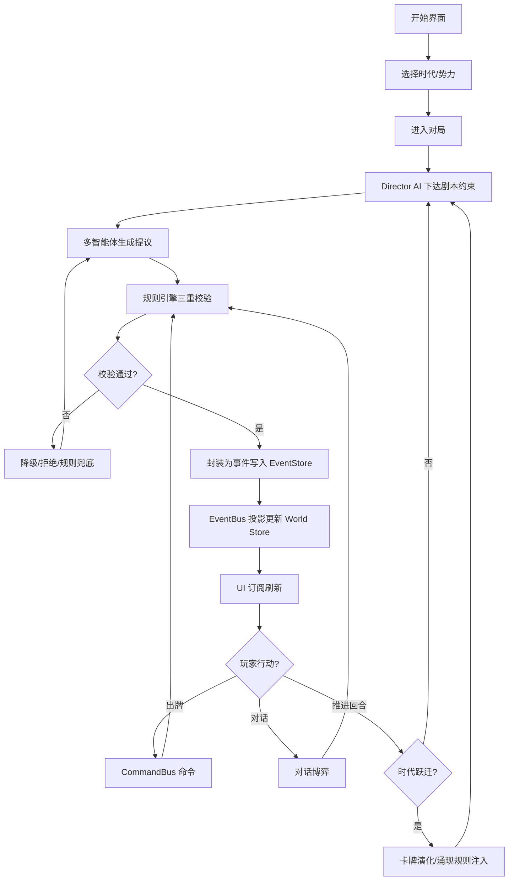

# AI 战略卡牌对话游戏 — 产品需求文档

## 1. 产品概述

一款 AI 驱动的历史推演卡牌对话游戏：玩家扮演历史势力，通过出牌（历史命题）与对话（博弈）在世界因果图谱上造史。AI 负责涌现（生成有创意的提议），规则引擎负责约束（裁决合法性），事件溯源负责演化（累积历史）。

- **目标用户**：偏好深度策略、历史叙事、AI 涌现玩法的硬核玩家与历史爱好者
- **产品价值**：每局历史不可复现却因果自洽；把"AI 生成内容"从不可控玄学升级为"涌现—约束—演化"的可度量工程系统

## 2. 核心功能

### 2.1 用户角色

| 角色 | 进入方式 | 核心权限 |
|------|----------|----------|
| 造史者（玩家） | 直接进入对局 | 出牌、对话选择、推进回合、查看因果图谱 |
| 观察者 | 只读模式 | 浏览历史因果图、卡牌图鉴、回放对局 |

### 2.2 功能模块

1. **开始界面**：新局、时代/势力选择、续局、设置（AI 配置/复杂度阈值）
2. **主游戏界面**：势力面板、手牌区、事件日志、回合控制、反馈回路指示
3. **对话界面**：NPC 心智博弈、信息不对称、对话选项分支
4. **因果图谱界面**：事件时间轴、因果链路、反事实推演、回放
5. **卡牌图鉴**：演化树、语义网络、历史原型注解

### 2.3 页面详情

| 页面 | 模块 | 功能描述 |
|------|------|----------|
| 开始界面 | 时代选择 | 选择起始时代（远古/古典/中世纪/近代），影响不确定性锥宽度 |
| 开始界面 | 势力选择 | 选择玩家势力，配置对手 AI 数量与强度 |
| 开始界面 | 续局 | 从 IndexedDB 读取存档快照列表 |
| 开始界面 | AI/复杂度配置 | 强/快模型分级、token 预算上限、反馈环告警阈值 |
| 主游戏界面 | 势力面板 | 展示军事/经济/文化/领土组件快照与文明熵 |
| 主游戏界面 | 手牌区 | 当前可出卡牌、卡牌演化提示、资源消耗预览 |
| 主游戏界面 | 事件日志 | 实时投影的事件流（含 causedBy 因果标记） |
| 主游戏界面 | 回合控制 | 推进回合、时代跃迁候选、必然/偶然事件提示 |
| 主游戏界面 | 反馈回路指示 | 活跃正/负/延迟回路可视化与告警 |
| 对话界面 | NPC 头像/人设 | persona、目标、心智模型可视化（玩家可见提示） |
| 对话界面 | 对话选项 | 导演约束下 AI 生成的分支选项 |
| 对话界面 | 信息不对称提示 | 标记玩家未知/NPC 隐瞒的信息 |
| 因果图谱界面 | 事件时间轴 | 按时代/回合排列的事件节点 |
| 因果图谱界面 | 因果链路图 | causedBy→enables 边的可交互图谱 |
| 因果图谱界面 | 反事实推演 | 假设移除某事件，展示影响传播范围 |
| 因果图谱界面 | 回放 | 从快照+增量事件重放历史 |
| 卡牌图鉴 | 演化树 | 卡牌 evolvesFrom/evolvesTo 谱系 |
| 卡牌图鉴 | 语义网络 | 克制/协同/对立关系图谱 |
| 卡牌图鉴 | 历史原型 | 每张卡对应的历史背景注解 |

## 3. 核心流程

玩家从开始界面选择时代与势力进入对局。每回合：Director AI 依据叙事张力曲线下达剧本约束 → 历史/卡牌/对话/对手智能体在约束下生成提议 → 规则引擎三重校验（合法性/因果一致性/反馈结构） → 通过部分封装为事件写入 EventStore → EventBus 投影更新 World Store → UI 订阅投影刷新。玩家通过出牌或对话选择发起命令，触发同样的"命令→裁决→事件→投影"链路。时代跃迁时卡牌演化树升级、涌现规则注入。

## 4. 用户界面设计

### 4.1 设计风格

**美学方向：历史编年史 / 暗黑学术档案（Dark Academia Chronicle）**

将"卡牌即历史命题"的哲学转化为视觉语言：仿佛在翻阅一卷被时间浸润的编年史册，但用现代信息架构承载复杂博弈。

- **主色**：墨黑 `#0E0B08`（羊皮纸焦痕）与陈年金 `#C9A24B`（鎏金印章）为主轴，辅以赭红 `#8B2E1F`（朱砂批注）与青铜绿 `#3E5C4D`（氧化铜锈）作为状态色
- **背景**：深墨黑底 + 极淡的羊皮纸噪点纹理 + 边缘的鎏金框线装饰，营造档案厚重感
- **字体**：标题用 Cormorant Garamond / Noto Serif SC（衬线、历史手稿感）；正文用 JetBrains Mono / Noto Sans Mono（编年史条目感，便于阅读数值与因果链）
- **按钮**：印章式——矩形带细微金边，悬停时金边流光，按压有"落印"动效
- **布局**：编年史册式——主区域如展开的双页书卷，左右分栏（势力面板 / 事件日志），顶部时代卷轴横幅
- **图标**：手绘印章风线性图标，避免通用 UI 图标库的扁平感
- **动效**：翻页过渡、卡牌"封缄—解封"动画、事件落定的"墨迹晕开"效果、因果链路绘制时的"金线延展"

### 4.2 页面设计概览

| 页面 | 模块 | UI 元素 |
|------|------|---------|
| 开始界面 | 时代卷轴 | 横向时代选择卷轴，每时代配羊皮纸纹理卡，悬停展开历史背景 |
| 开始界面 | 势力印章 | 势力以印章形式呈现，配色对应势力色，点击"落印"选定 |
| 开始界面 | 续局书架 | 存档以书脊形式陈列于书架，点击抽出展开 |
| 主游戏界面 | 时代横幅 | 顶部鎏金卷轴显示当前时代/回合/文明熵 |
| 主游戏界面 | 势力面板 | 左栏，每势力以印章+组件数值条呈现 |
| 主游戏界面 | 事件日志 | 右栏，编年史条目式滚动，含 causedBy 金线标记 |
| 主游戏界面 | 手牌区 | 底部扇形手牌，卡牌为羊皮纸卷轴+鎏金封缄 |
| 主游戏界面 | 回合控制 | 底部居中印章式按钮，时代跃迁候选以朱砂批注浮现 |
| 对话界面 | NPC 卷轴 | 左侧 NPC 立绘卷轴，右侧对话气泡羊皮纸条目 |
| 对话界面 | 选项分支 | 底部三/四选项，标注信息不对称图标 |
| 因果图谱界面 | 时间轴 | 顶部横向时代标尺，事件节点为金点 |
| 因果图谱界面 | 因果链路 | 中央力导向图，边为鎏金线，节点悬停展开详情 |
| 卡牌图鉴 | 演化树 | 左侧树状图，节点为缩略卡牌 |
| 卡牌图鉴 | 语义网络 | 右侧关系图，边标注克制/协同/对立 |

### 4.3 响应式

桌面优先（策略卡牌游戏的复杂信息密度需大屏承载）。平板自适应折叠侧栏为抽屉；移动端提供简化只读浏览模式（查看因果图谱与卡牌图鉴），核心对局建议桌面体验。

### 4.4 3D 场景指引

本游戏不使用 3D 场景。视觉重点在于 2D 羊皮纸质感、卡牌翻转动效与因果图谱的力导向图交互。
