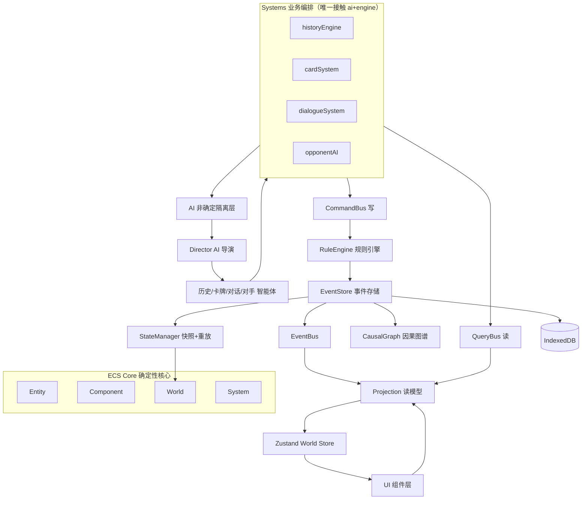

# AI 战略卡牌对话游戏 — 技术架构文档

## 1. 架构设计

采用 ECS（实体-组件-系统）建模游戏世界 + 事件溯源做演化留痕 + CQRS 分离命令与查询的三层融合架构。确定性引擎（ecs/engine）零 AI 依赖可单测，AI 作为非确定隔离层只产提议，业务系统是两者唯一交汇点。



**边界纪律**：`ecs/`、`engine/` 纯确定、零 AI 依赖、可单测；`ai/` 不直接写状态，只产提议；`systems/` 是 ai 与 engine 的唯一交汇点；`projection/` 只读，不触发命令；`components/` 只订阅 projection/store。

## 2. 技术说明

- **前端框架**：React@18 + TypeScript + Vite
- **初始化工具**：vite-init（react-ts 模板）
- **后端**：无后端，纯客户端应用
- **状态管理**：Zustand（World Store，UI 订阅投影）
- **样式**：Tailwind CSS@3（原子化样式）
- **动画**：Framer Motion（卡牌翻封、墨迹晕开、金线延展）
- **持久化**：IndexedDB（idb 库）—— EventStore 事件日志、World 快照、因果图谱
- **契约校验**：Zod（AI 输出契约 + 运行时校验，新增）
- **ID 生成**：nanoid（实体/事件 ID，新增）
- **图算法**：轻量自实现（因果图操作简单，避免引入重依赖）
- **AI 接入**：fetch → LLM API（结构化输出 / tool calling），支持强/快/纯规则三级降级

## 3. 路由定义

| 路由 | 用途 |
|-------|---------|
| `/` | 开始界面：新局、时代/势力选择、续局、设置 |
| `/game` | 主游戏界面：势力面板、手牌、事件日志、回合控制 |
| `/game/dialogue` | 对话界面：NPC 心智博弈（可作主界面叠加层） |
| `/chronicle` | 因果图谱界面：事件时间轴、因果链路、反事实推演、回放 |
| `/codex` | 卡牌图鉴：演化树、语义网络、历史原型注解 |

## 4. API 定义

无后端 API。AI 智能体通过统一 AIService 调用 LLM，所有请求/响应由 Zod schema 约束。

```typescript
// 三级 AI 调用契约
interface AIRequest<T> {
  task: AITask;
  input: unknown;
  schema: ZodSchema<T>;             // 结构化契约
  causalContext?: CausalHook[];    // 因果感知
  directorConstraints?: DirectorDirective; // 导演约束
  fallback: T;                       // 降级默认值
  tier: 'strong' | 'fast' | 'rule'; // 强模型/快模型/纯规则兜底
}

interface AITrace {
  traceId: string;
  tier: 'strong' | 'fast' | 'rule';
  tokens: number;
  usedFallback: boolean;
  reasoning?: string;               // 可解释性
  directorDirective?: string;       // 该次调用受导演的什么约束
}

// Director AI 输出：剧本约束（元规则）
interface DirectorDirective {
  tensionTarget: number;            // 本回合叙事张力目标
  theme: string;                    // 贯穿主题
  pacing: 'tense' | 'release' | 'build';
  budgetAllocation: { strong: number; fast: number }; // token 预算分配
}

// 历史 AI 输出
interface HistoryAdvance {
  macro: { trend: Trend[]; nextEraCandidate?: Era };
  meso: { contingencies: Contingency[] };
  narrativeSeed: string;
  causalHooks: CausalHook[];
}
```

## 5. 服务端架构图

无后端服务。所有逻辑在客户端运行，确定性引擎与 AI 隔离层通过 systems 编排。

## 6. 数据模型

### 6.1 数据模型定义

```mermaid
erDiagram
    ENTITY ||--o{ COMPONENT : has
    ENTITY ||--o{ MEMORY_C : carries
    COMPONENT ||--|{ MILITARY_C : "is-a"
    COMPONENT ||--|{ ECONOMIC_C : "is-a"
    COMPONENT ||--|{ CULTURAL_C : "is-a"
    COMPONENT ||--|{ TERRITORY_C : "is-a"
    COMPONENT ||--|{ FACTION_C : "is-a"

    GAME_EVENT ||--|{ COMPONENT_DELTA : contains
    GAME_EVENT ||--o| AI_TRACE : "optional"
    GAME_EVENT ||--o| GAME_EVENT : "causedBy"
    GAME_EVENT ||--o{ GAME_EVENT : "enables"

    CAUSAL_GRAPH ||--{{ GAME_EVENT : "nodes"
    CAUSAL_GRAPH ||--{{ GAME_EVENT : "edges"

    FEEDBACK_LOOP ||--o{ ENTITY : "participants"
    RULE_ENGINE ||--o{ FEEDBACK_LOOP : "evaluates"

    CARD_TEMPLATE ||--o| CARD_TEMPLATE : "evolvesFrom/To"
    CARD_TEMPLATE ||--o{ SEMANTIC_EDGE : "semanticEdges"

    NPC_MODEL ||--|| MEMORY_C : has
    NPC_MODEL ||--o{ GOAL : has
    NPC_MODEL ||--o{ SECRET : has
    NPC_MODEL ||--o{ BELIEF : "theoryOfMind"

    WORLD_SNAPSHOT ||--|| ENTITY : "captures"
    EVENT_STORE ||--|| GAME_EVENT : "stores"
```

### 6.2 数据定义语言

```typescript
type EntityId = string;
type EventId = string;

// ===== ECS 组件 =====
interface FactionC { name: string; color: string; isPlayer: boolean; }
interface MilitaryC { troops: number; morale: number; techLevel: number; }
interface EconomicC { gold: number; food: number; tradeRoutes: string[]; }
interface CulturalC { prestige: number; ideas: string[]; }
interface TerritoryC { provinces: string[]; }
interface MemoryC { facts: Fact[]; summary: string; relationship: Map<EntityId, number>; }

// ===== 事件溯源 =====
interface GameEvent {
  id: EventId;
  type: EventType;
  turn: number; era: Era;
  source: 'player' | 'ai' | 'rule' | 'system';
  causedBy?: EventId;               // 因果图谱边
  entityDeltas: ComponentDelta[];  // 对 ECS 组件的结构化变更
  aiTrace?: AITrace;
}

interface ComponentDelta {
  entity: EntityId;
  component: 'MilitaryC' | 'EconomicC' | 'CulturalC' | 'TerritoryC' | 'MemoryC' | 'FactionC';
  patch: Record<string, unknown>;
}

// ===== 因果图谱 =====
interface CausalGraph {
  nodes: Map<EventId, GameEvent>;
  edges: Map<EventId, EventId[]>;   // causedBy → enables
}

// ===== 反馈回路 =====
interface FeedbackLoop {
  id: string;
  kind: 'reinforcing' | 'balancing' | 'delayed';
  participants: EntityId[];
  variables: string[];
  constraint: (graph: CausalGraph, state: World) => Verdict;
}

// ===== 卡牌 =====
interface CardTemplate {
  id: string; name: string; type: CardType; era: Era;
  cost: ResourceCost; effects: Effect[];
  evolvesFrom?: string;
  semanticEdges: SemanticEdge[];
  historicalRef?: string;
  flavor?: string;
}

// ===== NPC =====
interface NPCModel {
  id: EntityId;
  persona: Persona;
  goals: Goal[];
  secrets: Secret[];
  memory: MemoryC;
  theoryOfMind: Map<EntityId, Belief>;
}

// ===== 时代与文明熵 =====
type Era = 'ancient' | 'classical' | 'medieval' | 'modern';

interface FactionEntropy {
  entity: EntityId;
  entropy: number;                  // 文明复杂度，随历史单调增长
  collapsedAt?: number;             // 王朝周期重置点
}
```

### 6.3 IndexedDB 存储结构

- **`events`** store：主键 `id`，索引 `turn`、`era`、`source`、`causedBy` —— EventStore 唯一真相来源
- **`snapshots`** store：主键 `turn`，值 `{ turn, world, ts }` —— 定期快照
- **`causalGraph`** store：主键 `version`，值序列化的因果图谱
- **`saves`** store：主键 `saveId`，对局存档（快照引用 + 元数据）
- **`cards`** store：主键 `id`，卡牌模板缓存
- **`aiCache`** store：主键 hash(input+directive)，AI 调用结果缓存，附 aiTrace
