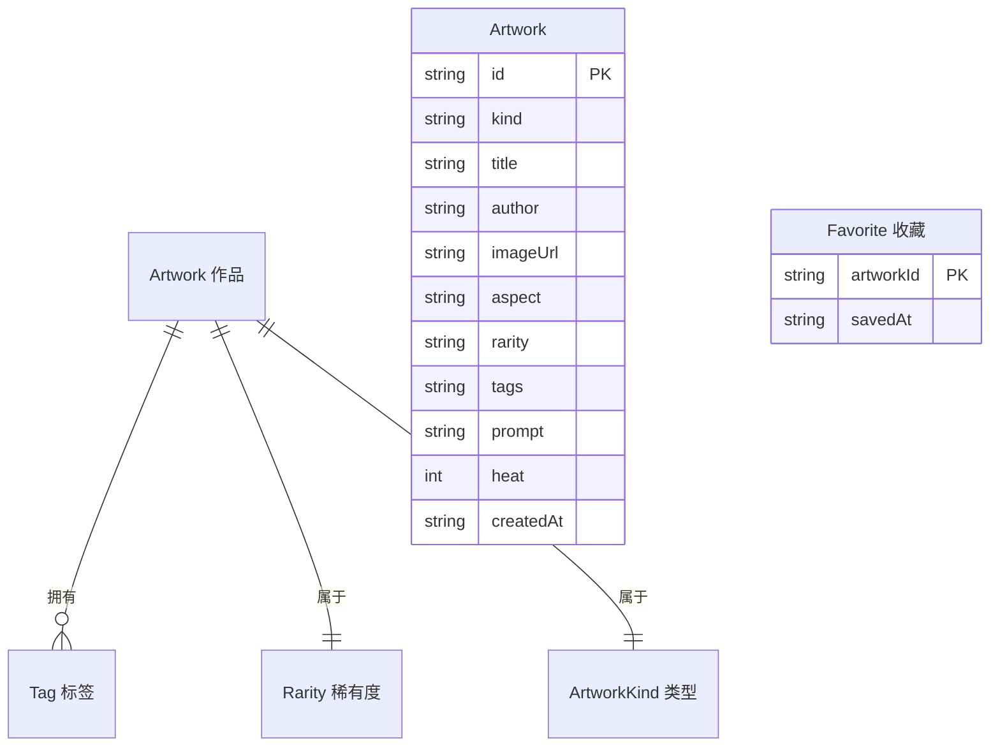

## 1. 架构设计

本项目为纯前端独立项目，无后端服务，作品数据以本地 TypeScript 数据集形式内置（模拟"聚合"后的策展结果）。

```mermaid
flowchart TD
    subgraph "前端层 Frontend"
        "A[页面路由 Router]" --> "B[聚合首页 Home]"
        "A" --> "C[卡牌馆 Cards]"
        "A" --> "D[场景馆 Scenes]"
        "A" --> "E[物品馆 Items]"
        "A" --> "F[详情抽屉 DetailDrawer]"
    end
    subgraph "数据层 Data"
        "G[内置作品数据集 artworks.ts]"
        "H[标签/分类/稀有度枚举]"
    end
    subgraph "状态层 State"
        "I[UI Store 筛选/抽屉]"
        "J[收藏 Store 本地收藏]"
    end
    "B" --> "G"
    "C" --> "G"
    "D" --> "G"
    "E" --> "G"
    "F" --> "G"
    "C" --> "I"
    "D" --> "I"
    "E" --> "I"
    "F" --> "I"
    "B" --> "J"
    "F" --> "J"
```

## 2. 技术说明
- 前端：React@18 + TypeScript + tailwindcss@3 + vite@6
- 初始化工具：手动搭建（vite react-ts 模板）
- 路由：react-router-dom@7
- 状态：zustand（UI 筛选状态 + 本地收藏，收藏持久化到 localStorage）
- 图标：lucide-react
- 后端：无
- 数据库：无（内置静态数据集；收藏使用 localStorage）
- 图片：作品图统一通过内置 text_to_image 接口生成（AI 生成图，契合"AI 二创"主题）

## 3. 路由定义
| 路由 | 用途 |
|------|------|
| `/` | 聚合首页：Hero、统计、精选轮播、分类入口、热门标签 |
| `/cards` | 卡牌馆：角色卡牌网格 + 多维筛选 |
| `/scenes` | 场景馆：场景壁纸瀑布流 + 沉浸查看 |
| `/items` | 物品馆：物品设计分类展示 |
| `/search` | 搜索结果页：跨分类关键词/标签筛选结果 |

（作品详情通过全局抽屉组件 DetailDrawer 覆盖展示，不单独占路由，由 store 控制开合与当前作品 ID。）

## 4. API 定义
无后端 API。作品数据为内置静态数据集，类型定义如下：

```typescript
// 作品类型
type ArtworkKind = 'card' | 'scene' | 'item';

// 稀有度
type Rarity = 'common' | 'rare' | 'epic' | 'legendary';

// 物品子类
type ItemCategory = 'weapon' | 'accessory' | 'prop' | 'vehicle';

interface Artwork {
  id: string;
  kind: ArtworkKind;
  title: string;            // 作品名
  author: string;           // 创作者
  imageUrl: string;         // AI 生成图地址
  aspect: 'portrait' | 'square' | 'landscape'; // 决定网格/瀑布流排版
  rarity: Rarity;
  tags: string[];           // 风格/主题标签
  prompt: string;           // 创作 Prompt 摘要
  heat: number;             // 热度（点赞量级）
  createdAt: string;        // 收录日期 ISO
  // 物品专属
  itemCategory?: ItemCategory;
  // 卡牌专属
  faction?: string;         // 阵营
  backInscription?: string; // 背刻文案
  // 场景专属
  mood?: string;            // 氛围
}
```

## 5. 服务端架构
无后端，略。

## 6. 数据模型

### 6.1 数据模型定义


### 6.2 数据定义语言
本项目无数据库，使用 TypeScript 内置数据集。初始化将内置约 36-48 件作品（卡牌/场景/物品各约 12-16 件），覆盖多种风格、稀有度与标签，以体现"搜集大量"的聚合感。收藏列表结构存于 localStorage：

```typescript
// localStorage key: "cc_favorites"
// value:
interface FavoriteRecord {
  artworkId: string;
  savedAt: string; // ISO
}
```
