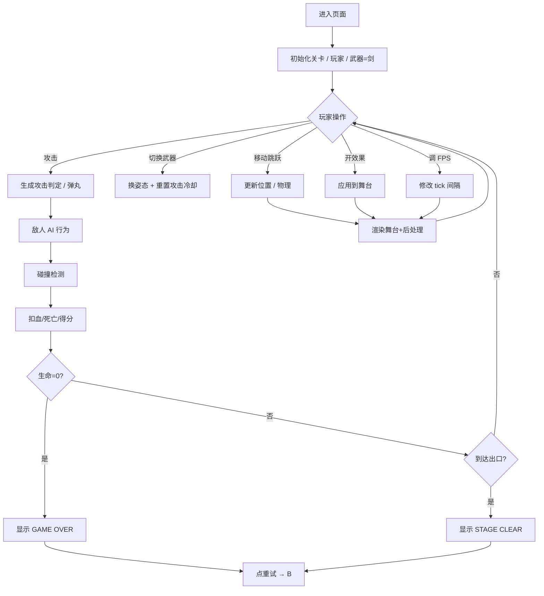

# 横版像素战斗模板 - 产品需求文档 (PRD)

## 1. 产品概述
横版像素战斗模板是一个开箱即用的 2D 横版动作战斗"骨架"项目:玩家操控一名像素战士在关卡里奔跑、跳跃、切换近/远程武器、与多种敌人战斗。模板提供完整可玩的最小循环(移动 / 跳跃 / 攻击 / 受击 / 死亡 / 胜利)与可视化效果控制台,可作为后续横版游戏的起点。

- 主要用途:作为横版像素战斗游戏模板;演示横版战斗的标准组件(平台、相机、碰撞箱、攻击判定、敌人 AI、武器切换);继续提供"图形数学效果"演示(像素化/波形扰动/贝叶抖动)。
- 目标用户:独立游戏开发者、像素游戏爱好者、动作游戏玩家。

## 2. 核心功能

### 2.1 用户角色
单角色"玩家"即可,无需账号。

| 角色 | 进入方式 | 核心权限 |
|------|----------|----------|
| 玩家 | 直接打开页面 | 操控角色战斗、切换武器、调节效果与帧率 |

### 2.2 功能模块
1. **战斗舞台(Stage)**:横版卷轴关卡,内置砖块地形、平台、宝箱、出口门。
2. **玩家角色**:剑士/弓箭手/法师三种姿态(武器决定姿态);移动、跳跃、攻击、闪避、受击、死亡动画。
3. **武器系统**:3 种武器可切换,每种独立动作与攻击判定框。
   - **剑(Sword)**:近战横扫,短攻击间隔。
   - **弓(Bow)**:远程箭矢,中等间隔。
   - **法杖(Staff)**:魔法弹,可穿透。
4. **敌人系统**:3 种敌人,各自血量、伤害、AI 行为。
   - **史莱姆(Slime)**:地面慢速巡逻,接触伤害。
   - **骷髅(Skeleton)**:地面巡逻 + 投掷骨头。
   - **蝙蝠(Bat)**:空中飞行,周期性俯冲。
5. **关卡系统**:1 个完整关卡,长度约 60 屏(可循环),终点为"出口门"。
6. **HUD**:
   - 生命值(心形,3 颗)
   - 能量条(攻击消耗)
   - 武器槽(当前武器 + 3 个武器格子)
   - 击杀数 / 得分
   - 帧率(FPS) + 关卡时间
7. **效果调节面板**:沿用上一版"实验场"的 4 种数学效果(像素化、波形、贝叶抖动、扫描线),参数可调。
8. **帧率控制台**:1–60 FPS,暂停/步进,慢动作,实测 FPS。

### 2.3 页面细节
| 页面/区域 | 模块 | 功能说明 |
|-----------|------|----------|
| 舞台 | 关卡层 | 横向卷轴,砖块/平台/宝箱/门 |
| 舞台 | 角色与敌人层 | 所有实体按精灵图渲染 |
| 舞台 | 弹丸层 | 箭/魔法弹/骨头 |
| 舞台 | 粒子层 | 命中/跳跃/死亡的粒子 |
| 舞台 | 滤镜层 | 全屏 Canvas 后处理(可选) |
| 状态栏 | 顶部条 | HUD 元素(心/能量/武器/分数) |
| 控制台 | 武器栏 | 3 个武器按钮 + 当前武器指示 |
| 控制台 | 角色控制 | 移动/跳跃/攻击/闪避的按键提示 |
| 控制台 | 效果面板 | 4 个 FX 卡片(开关+参数) |
| 控制台 | 帧率面板 | FPS 滑块、播放/暂停、慢动作 |
| 控制台 | 关卡操作 | 重启、回到起点 |
| 状态 | 暂停遮罩 | 半透明黑底,显示"PAUSED" |
| 状态 | 胜利遮罩 | 显示"STAGE CLEAR"与最终得分 |
| 状态 | 死亡遮罩 | 显示"GAME OVER"与重试按钮 |

## 3. 核心流程
1. 玩家打开页面 → 角色站立在关卡起点,默认装备"剑",3 颗心满血。
2. 玩家用 `A/D` 或 `←/→` 移动,`Space`/`W`/`↑` 跳跃,`J` 或鼠标左键攻击,`Shift` 闪避。
3. 玩家在 1-3 数字键或 `Q` 键切换武器,角色姿态随武器变化。
4. 玩家击败敌人获得分数,拾取爱心恢复 1 点生命;掉入坑洞损失 1 心。
5. 玩家到达"出口门"→ 显示 `STAGE CLEAR` 胜利界面,可重新开始。
6. 玩家生命归零 → 显示 `GAME OVER`,点重试回到关卡起点。
7. 任何时刻玩家可开/关效果、调整 FPS、慢动作。

## 4. 用户界面设计

### 4.1 设计风格
- 整体调性:**8-bit 街机 + 霓虹高亮**。黑底(#0a0815)衬荧光绿(#7cffb2)、品红(#ff3ea5)、琥珀(#ffb13b)。
- 屏幕呈现:4:3 像素舞台,内部 320×240,CSS 放大;四周带 CRT 扫描线 + 暗角。
- 字体:标题 `Press Start 2P`,正文 `VT323`。
- 按钮:3D 凸起方块,顶高光 2px、底阴影 2px、霓虹描边。
- 图标:全部手绘 16×16 像素 SVG(剑、弓、杖、心、宝箱、门)。

### 4.2 页面设计概述
| 区域 | 模块 | UI 元素 |
|------|------|---------|
| 舞台 | 关卡层 | 砖块/草/平台;视差远景;落日/月亮随主题 |
| 舞台 | 玩家层 | 16×16 像素战士,带阴影 |
| 舞台 | 敌人层 | 16×16 史莱姆/骷髅/蝙蝠 |
| 舞台 | 弹丸层 | 4×4 像素弹丸 |
| 状态栏 | 顶部条 | 左:3 颗心 + 能量条;中:分数;右:时间 + FPS |
| 控制台 | 武器栏 | 3 个武器格子,当前武器高亮发光 |
| 控制台 | 效果面板 | 与上一版相同的 FX 卡片(像素/波/抖动/扫描) |
| 控制台 | 帧率面板 | 滑块、暂停、慢动作 |
| 控制台 | 重启 | 大号红色"RESTART"按钮 |
| 暂停遮罩 | 中央 | "PAUSED" 巨字 + 操作提示 |
| 胜利遮罩 | 中央 | "STAGE CLEAR" + 得分 + 重启 |
| 死亡遮罩 | 中央 | "GAME OVER" + 重启 |

### 4.3 响应式
- 桌面优先(1280×800+)。舞台固定 4:3 比例,左右两侧铺控制台。
- 移动端(<900px)控制台折叠到舞台下方;提供屏幕虚拟方向键。

### 4.4 像素渲染指导
- 所有图像/精灵 `image-rendering: pixelated`。
- Canvas 后处理 `imageSmoothingEnabled = false`。
- 弹丸与粒子不使用抗锯齿;角色精灵每帧按整数缩放渲染。
