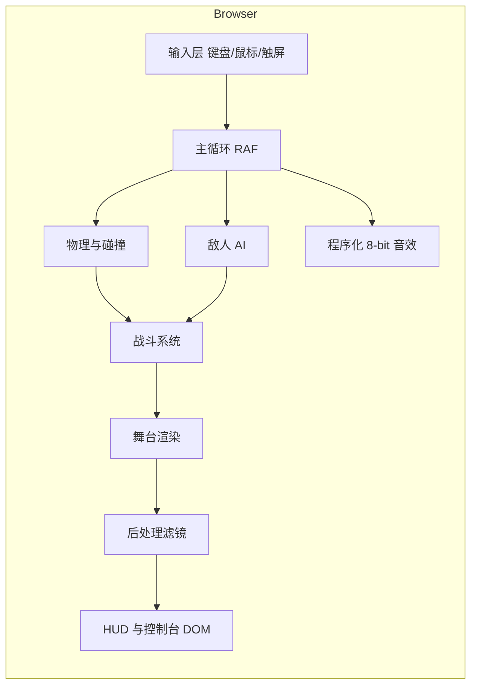

# 横版像素战斗模板 - 技术架构文档

## 1. 架构设计
纯前端单页 Web 应用,无后端,单文件 `index.html`(HTML + CSS + JS 全部内嵌),打开即玩。



## 2. 技术选型
- **前端**:原生 HTML + CSS + ES2020+ JavaScript,**零依赖、零打包**。
- **图形**:HTML5 Canvas 2D 上下文,固定 320×240 内部分辨率,DPR 取 `min(devicePixelRatio, 2)`。
- **字体**:Google Fonts `Press Start 2P` + `VT323`。
- **音频**:Web Audio API 程序化合成 8-bit 方波/三角波音效。
- **持久化**:`localStorage` 保存玩家上次的武器选择、FPS、效果设置与最高分。
- **理由**:横版战斗需要 60FPS 实时渲染 + 大量实体,Canvas 2D 最直接;无构建工具,模板分发只需 1 个 HTML 文件。

## 3. 渲染与主循环
```
requestAnimationFrame(now):
  dt = now - last
  accumulator += dt
  while accumulator >= 1000 / fps * slowmo:
    fixedUpdate()         // 物理、AI、动画 tick
    accumulator -= 1000 / fps * slowmo
  render(scene, fx)       // 一次性绘制
  drawHud()
```
- 物理与 AI 在 fixed update 推进(以 FPS 为步长),保证不同帧率行为一致。
- 渲染每帧一次,使用 alpha 混合的"运动模糊"近似(可选,默认关)。

## 4. 数据模型

### 4.1 关卡地图
```ts
// 16x16 砖块,关卡宽 100 屏 × 15 屏高
const TILE = 16;
const MAP_W = 160; // 砖块列数
const MAP_H = 15;  // 砖块行数
// tile: 0=空 1=草 2=土 3=石 4=平台 5=刺 6=门 7=宝箱
```

### 4.2 实体
```ts
type Entity = {
  id: string;
  x: number; y: number;   // 像素坐标
  vx: number; vy: number;
  w: number; h: number;
  type: 'player' | 'slime' | 'skeleton' | 'bat' | 'arrow' | 'magic' | 'bone' | 'particle' | 'pickup';
  hp: number; hpMax: number;
  state: 'idle' | 'walk' | 'jump' | 'attack' | 'hurt' | 'dead' | 'dodge';
  facing: 1 | -1;
  attackCd: number;
  data: any; // 实体类型相关数据
};
```

### 4.3 武器
```ts
type WeaponKey = 'sword' | 'bow' | 'staff';
interface WeaponDef {
  name: string;
  range: number;          // 攻击距离
  damage: number;
  cdMs: number;           // 攻击冷却
  proj?: { speed: number; lifeMs: number; piercing: boolean; sprite: string };
  sprite: string;         // 角色武器姿态前缀
  sfx: 'slash' | 'arrow' | 'magic';
}
```

## 5. 系统设计

### 5.1 物理与碰撞
- 砖块碰撞:轴向分离的 AABB-tile 检测(先 X 后 Y,避免卡角)。
- 实体碰撞:玩家攻击判定框与敌人 `hurtbox` 矩形相交即命中。
- 重力常数 `g = 0.45 px/frame²`,最大下落速度 `vyMax = 6 px/frame`。
- 跳跃初速度 `v0 = -8 px/frame`(≈ 1.3 屏高)。

### 5.2 战斗
- 玩家攻击时按当前武器在 `facing` 方向生成一个 0.15s 寿命的 `hitbox` 实体。
- 弹丸(箭/魔法/骨头)按 `speed` × 方向运动,寿命到或撞墙/敌人销毁。
- 命中扣血 + 击退(`vx = ±4`);敌人死亡时生成 6 颗像素粒子。
- 玩家受击有 0.6s 无敌闪烁。

### 5.3 敌人 AI
| 敌人 | 行为 |
|------|------|
| Slime | 在平台上来回巡逻,接触玩家扣 1 血 |
| Skeleton | 在地面巡逻,距离玩家 < 200 时投掷骨头(间隔 1.2s) |
| Bat | 在空中按 sin 摆动飞行,距离玩家 < 180 时俯冲 |

### 5.4 武器
| Weapon | Damage | CD | 范围 | 特效 |
|--------|--------|----|------|------|
| Sword  | 1 | 320ms | 24px | 横扫 3 帧,生成剑光拖尾 |
| Bow    | 1 | 480ms | 屏宽 | 飞行箭矢,命中消失 |
| Staff  | 1 | 600ms | 屏宽 | 魔法弹,可穿透最多 3 个敌人 |

### 5.5 相机
- 玩家 X 在屏幕 1/3 之前相机不动;超过则相机跟随。
- 相机不超过关卡左/右边界。
- 视差:远景 0.3×、中景 0.6×、近景 1×。

## 6. 效果算法(沿用 Pixel Hero Lab)
- **像素化 (Pixelation)**:down-scale → nearest up-scale。
- **波形扰动 (Wave)**:正弦重采样,`srcX = x + sin(y*f)*amp`。
- **贝叶抖动 (Bayer)**:8×8 Bayer 矩阵阈值化,LEVEL 控制色阶、PWR 控制抖动强度。
- **扫描线 (Scanline)**:偶数行 RGB 乘 (1 - strength*0.7)。
- **暗角 (Vignette)**:径向黑色 alpha 渐变(始终开启,弱)。

## 7. 性能预算
- 实体上限:玩家 + 12 敌人 + 30 弹丸 + 80 粒子。
- 单帧 60FPS 时:
  - 物理/碰撞 < 2ms
  - 渲染 < 3ms
  - 后处理(开启像素化) < 4ms
- 关闭所有效果时,目标单帧 < 6ms。

## 8. 文件结构
```
/workspace/pixel-combat
├── index.html                  # 单文件应用
├── README.md                   # 使用说明
└── .trae/documents/
    ├── PRD.md
    └── tech-architecture.md
```

## 9. 启动与本地预览
- 静态文件,无需构建。
- `cd /workspace/pixel-combat && python3 -m http.server 8001` 即可预览。
- 也可直接双击 `index.html` 在浏览器中打开。

## 10. 扩展指引
- 新增敌人:在 `ENEMY_DEFS` 中加一条配置,实现 `aiFn(enemy, world, dt)`。
- 新增武器:在 `WEAPON_DEFS` 中加一条;在 `Player` 中处理对应攻击输入。
- 新增关卡:把 `MAP_DATA` 替换为新关卡数组;调整 `GOAL_X`。
- 接入游戏手柄:在 `Input` 中加 `gamepad` 事件读取。
