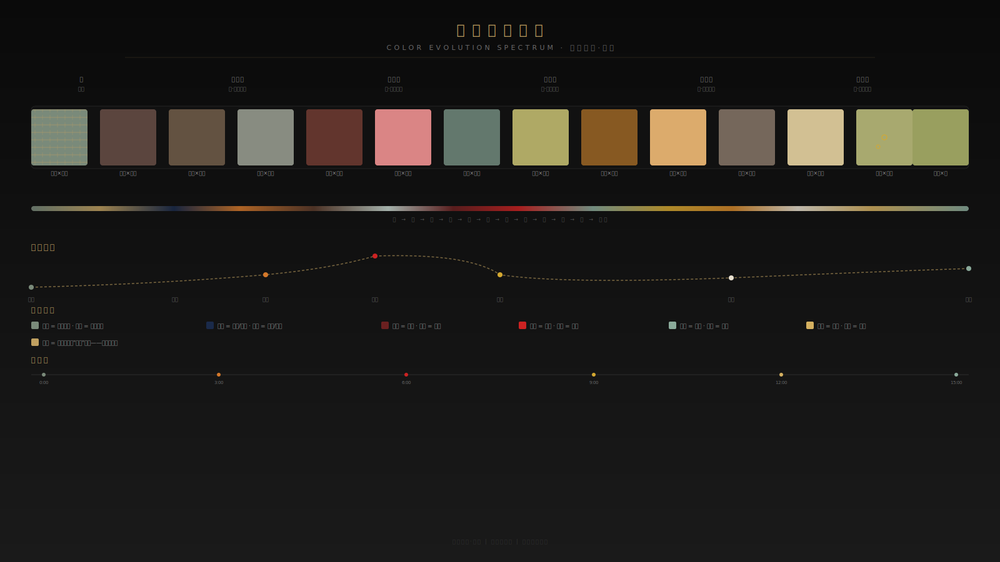

# 《窑火不息·追迹》设计元素可视化列表

---

## 一、设计元素总览

> 以下为所有设计元素的索引，每个元素对应一份 SVG 可视化框架图。

| 编号 | 设计元素 | 文件 | 说明 |
|:---|:---|:---|:---|
| DE-01 | 色彩演进总谱 | `01-color-evolution-spectrum.svg` | 14段色彩×情绪弧线×时间轴 |
| DE-02 | 五幕叙事结构 | `02-narrative-structure.svg` | 5幕×25镜×4层叙事×6种转场 |
| DE-03 | 破折号对话范式 | `03-dash-dialogue-paradigm.svg` | 12处破折号×技术参数×功能矩阵 |
| DE-04 | 视觉隐喻体系 | `04-visual-metaphor-system.svg` | 9大隐喻×核心母题「裂痕」 |
| DE-05 | AIGC创作流程 | `05-aigc-workflow.svg` | 6阶段管线×并行工作流×制作周期 |

---

## 二、设计元素详解

### DE-01 色彩演进总谱

**视觉结构**：
- 顶部：六幕标签（序→五幕）
- 中部：14段色彩渐变条（青灰→黑）
- 下部：情绪弧线（期待→爆发→顿悟→永恒）
- 底部：色彩语义图例 + 时间轴

**关键数据**：
- 14组色彩对（每组 = 主色 × 辅色）
- 6个情绪节点
- 色彩跨度：黑 → 冷 → 暖 → 炽 → 金 → 永恒

---

### DE-02 五幕叙事结构

**视觉结构**：
- 弧形叙事弧线（上升→顶峰→下降→回响）
- 5个幕卡片（含镜数、时长、色彩、核心隐喻）
- 4层叙事深度（表层→心理层→哲学层→文明层）
- 6种转场机制卡片
- 镜像结构（推泥→推碗，咔→咔回环）

**关键数据**：
- 序：12镜（73s）
- 一：2镜（55s）
- 二：4镜（100s）
- 三：2镜（60s）
- 四：2镜（75s）
- 五：3镜（55s + 字幕）

---

### DE-03 破折号对话范式

**视觉结构**：
- 顶部：核心公式「主体——动作——了」
- 中部：12张对话卡片（每卡含镜号、对白、功能、原理）
- 下部：技术参数（气声/停顿/混响/统计）

**关键数据**：
- 破折号对白：12处
- 省略号对白：3处
- 无对白镜：4镜
- 纯声音镜：3镜
- 停顿标准：1.5秒（最长达3秒）

---

### DE-04 视觉隐喻体系

**视觉结构**：
- 中心：核心母题「裂痕」圆形节点
- 四周：8个隐喻节点（神经网络/光的通道/时间的面部/推心/人形哥窑/情感蘑菇云/瓷上开片/修复勋章）
- 底部：黑场=宇宙子宫

**隐喻映射**：
- 裂纹 → 神经网络 → 时间地图
- 裂纹 → 光的通道 → 恩典入口
- 彝炉 → 时间的面部 → 三重预演
- 推泥 → 推心 → 爱在动作里
- 伤疤 → 人形哥窑 → 苦难地图
- 白烟 → 情感蘑菇云 → 毁灭的崇高化
- 泪痕 → 瓷上开片 → 另一只哥窑碗
- 锔钉 → 修复勋章 → 缺陷成为装饰
- 黑场 → 宇宙子宫 → 倾听者降格

---

### DE-05 AIGC 创作流程

**视觉结构**：
- 6个阶段卡片（文字→图像→动态→声音→剪辑→调色）
- 阶段间箭头连接
- 反馈迭代循环
- 4个并行工作流
- 预估制作周期

**关键数据**：
- 6阶段管线
- 4条并行轨道
- 预估8-10周制作周期

---

## 三、设计模板

### 3.1 分镜卡片模板

```
┌──────────────────────────────────────┐
│ 镜号 X-X │ 场景名称                  │
├──────────────────────────────────────┤
│ 时长：Xs                            │
│ 画面：______                        │
│ 景别：______                        │
│ 机位/运动：______                   │
│ 转场：______                        │
│ 光影：______                        │
│ 色彩：______                        │
│ 道具：______                        │
│ 演员/动作：______                   │
│ 对白：______                        │
│ 音效：______                        │
│ 音乐：______                        │
│ 情绪：______                        │
│ 哲学层：______                      │
│ 视觉隐喻：______                    │
│ AI提示词：______                    │
│ 备注：______                        │
└──────────────────────────────────────┘
```

### 3.2 场景设计模板

```
┌──────────────────────────────────────┐
│ 场景编号：S-XX                       │
│ 场景名称：______                     │
│ 所属幕次：______                     │
├──────────────────────────────────────┤
│ 环境描述：______                     │
│ 光照方案：______                     │
│ 色彩方案：______                     │
│ 道具清单：______                     │
│ 演员配置：______                     │
│ 特殊要求：______                     │
└──────────────────────────────────────┘
```

### 3.3 声音设计模板

```
┌──────────────────────────────────────┐
│ 声音事件编号：A-XX                   │
│ 对应镜号：______                     │
├──────────────────────────────────────┤
│ 声音类型：□旁白 □拟音 □环境 □音乐   │
│ 频率范围：______ Hz                  │
│ 动态范围：______ dB                  │
│ 混响参数：RT60=______s               │
│ 持续时间：______s                    │
│ 特殊处理：______                     │
└──────────────────────────────────────┘
```

---

## 四、SVG 文件使用说明

### 4.1 查看方式

```bash
# 浏览器直接打开
open 01-color-evolution-spectrum.svg

# 或嵌入 HTML


# 或使用 VS Code SVG 预览插件
code 01-color-evolution-spectrum.svg
```

### 4.2 编辑方式

所有 SVG 文件均为纯文本，可直接编辑：

```bash
# 修改颜色值
sed -i 's/#7a8a7a/#8aaa9a/g' 01-color-evolution-spectrum.svg

# 使用矢量编辑软件
inkscape 01-color-evolution-spectrum.svg
```

### 4.3 导出格式

```bash
# SVG → PNG (使用 Inkscape)
inkscape 01-color-evolution-spectrum.svg --export-type=png --export-dpi=300

# SVG → PDF
inkscape 01-color-evolution-spectrum.svg --export-type=pdf
```

---

## 五、文件依赖关系

```
适配分镜表.md (源文件)
  │
  ├── 01-color-evolution-spectrum.svg  ← 色彩演进总谱段落
  ├── 02-narrative-structure.svg       ← 五幕结构 + 镜号分布
  ├── 03-dash-dialogue-paradigm.svg    ← 对话优化总表
  ├── 04-visual-metaphor-system.svg    ← 视觉隐喻列
  └── 05-aigc-workflow.svg            ← 制作流程 + 参数模板
```

---

*文档版本：v1.0 | 制作日期：2026-06-24 | 项目：窑火不息·追迹*